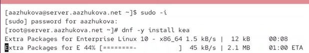
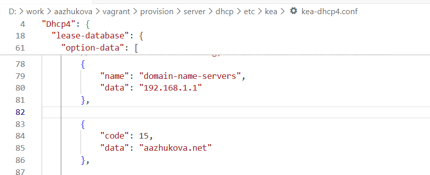
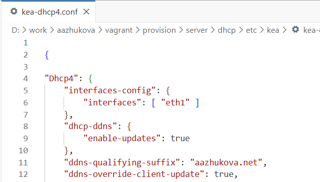
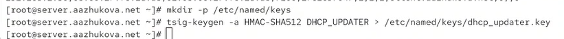
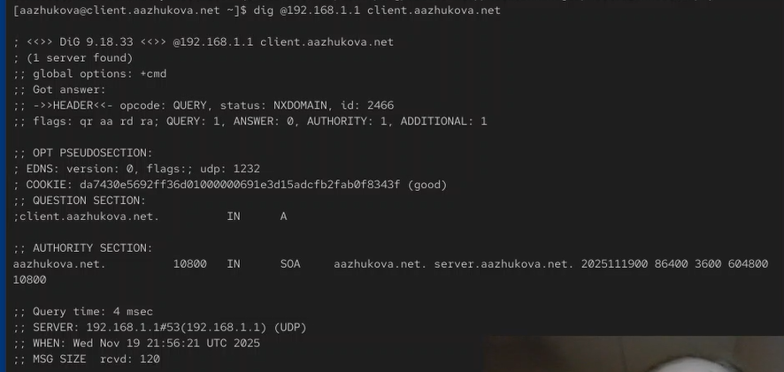
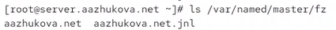

---
## Author
author:
  name: Жукова Арина Александровна
  degrees: студентка 3 курса
  orcid: 0000-0002-0877-7063
  email: 1132239120@rudn.ru
  affiliation:
    - name: Российский университет дружбы народов
      country: Российская Федерация
      postal-code: 117198
      city: Москва
      address: ул. Миклухо-Маклая, д. 6
## Title
title: Лабораторная работа №3
subtitle: Настройка DHCP-сервера
license: CC BY
date: today
date-format: "YYYY-MM-DD"
---

# Информация

## Докладчик

:::::::::::::: {.columns align=center}
::: {.column width="70%"}

  * Жукова Арина Александровна
  * студентка 3 курса
  * направление: Прикладная информатика
  * Российский университет дружбы народов им. П. Лумумбы
  * [1132239120@rudn.ru](mailto:1132239120@rudn.ru)

:::
::: {.column width="30%"}

:::
::::::::::::::

# Вводная часть

## Актуальность

- DHCP - критически важный протокол для автоматизации сетевых настроек
- Исключает ручное назначение IP-адресов, предотвращая конфликты
- Стандарт де-факто для корпоративных и домашних сетей
- Необходимый навык для сетевых администраторов и инженеров

## Объект и предмет исследования

- **Объект**: DHCP-сервер и его конфигурация
- **Предмет**: Процесс установки, настройки и интеграции DHCP-сервера с DNS

## Цели и задачи

**Цель**: Приобретение практических навыков по установке и конфигурированию DHCP-сервера.

**Задачи**:

1. Установить и настроить DHCP-сервер на виртуальной машине
2. Интегрировать DHCP с DNS для динамического обновления записей
3. Проверить корректность работы в виртуальной сети
4. Автоматизировать процесс настройки через Vagrant

## Материалы и методы

- Виртуальные машины (Server и Client)
- ПО: Kea DHCP Server, BIND9 DNS Server
- ОС: Linux (дистрибутив на основе RHEL)
- Инструменты: Vagrant для автоматизации, утилиты диагностики (ifconfig, dig)

# Установка и базовая настройка DHCP

## Установка DHCP-сервера

{width=80%}

- Команда: `dnf install -y kea`
- Установка пакета kea-dhcp4-server
- Автоматическое разрешение зависимостей

## Конфигурация DHCP-сервера

{width=80%}

- Настройка файла `/etc/kea/kea-dhcp4.conf`
- Определение подсети: 192.168.1.0/24
- Настройка DNS-серверов и доменного имени
- Назначение диапазона адресов: 192.168.1.30-192.168.1.100

## Привязка к сетевому интерфейсу

:::::::::::::: {.columns}
::: {.column width="50%"}

{width=80%}

:::
::: {.column width="50%"}

- Настройка привязки к интерфейсу eth1
- Изменение файла `/etc/sysconfig/kea-dhcp4-server`
- Указание интерфейса: `DHCPDARGS="eth1"`

:::
::::::::::::::

# Интеграция с DNS

## Настройка DNS-записей

:::::::::::::: {.columns}
::: {.column width="50%"}

**Прямая зона**

:::
::: {.column width="50%"}

**Обратная зона**

:::
::::::::::::::

- Добавление A-записи для DHCP-сервера
- Настройка PTR-записи для обратного разрешения
- Проверка: `nslookup dhcp.aazhukova.net`

## Настройка динамического обновления DNS (DDNS)

### Создание ключа TSIG

{width=80%}

- Генерация ключа: `tsig-keygen -a hmac-sha512 DHCP_UPDATER`
- Алгоритм: HMAC-SHA512
- Копирование ключа в `/etc/named/keys/`

## Настройка динамического обновления DNS (DDNS)

### Конфигурация BIND9 для DDNS

{width=80%}

- Разрешение обновления зоны в `named.conf`
- Настройка политик доступа
- Проверка конфигурации: `named-checkconf`

# Проверка работы DHCP

## Запуск клиента и проверка конфигурации

{width=80%}

- Запуск виртуальной машины client: `vagrant up client --provision`
- Настройка маршрутизации через скрипт provisioning

## Результаты работы DHCP

:::::::::::::: {.columns}
::: {.column width="50%"}

{width=80%}

:::
::: {.column width="50%"}

**Полученная конфигурация:**
- IP-адрес: 192.168.1.30/24
- Шлюз: 192.168.1.1
- DNS-серверы: 192.168.1.1
- Имя хоста: client.aazhukova.net

:::
::::::::::::::

## Мониторинг выданных адресов

{width=80%}

- Файл аренд: `/var/lib/kea/kea-leases4.csv`
- Формат: IP-адрес, MAC-адрес, время аренды, имя хоста
- Время аренды: 7200 секунд (2 часа)

# Динамическое обновление DNS

## Настройка интеграции Kea с DDNS

{width=80%}

- Конфигурационный файл: `/etc/kea/kea-dhcp-ddns.conf`
- Настройка прямого и обратного обновления зон
- Использование TSIG-ключей для аутентификации

## Проверка обновления DNS-записей

{width=80%}

- Автоматическое создание A- и PTR-записей
- Проверка: `dig @192.168.1.1 client.aazhukova.net`
- Файл журнала изменений: `aazhukova.net.jnl`

## Файл бинарных изменений зоны

{width=80%}

- Автоматическое ведение журнала изменений
- Расположение: `/var/named/master/fz/`
- Формат: бинарный, для эффективного обновления

# Автоматизация развертывания

## Скрипт автоматической настройки

{width=80%}

- Создание скрипта `/vagrant/provision/server/dhcp.sh`
- Включение всех этапов настройки
- Копирование конфигурационных файлов

## Интеграция с Vagrant

{width=80%}

- Модификация Vagrantfile для автоматического provisioning
- Запуск скрипта при создании виртуальной машины
- Обеспечение воспроизводимости настройки

# Результаты

## Достигнутые результаты

1. **Успешная установка и настройка DHCP-сервера**
   - Работающий Kea DHCP Server
   - Корректная выдача IP-адресов клиентам

2. **Интеграция DHCP с DNS**
   - Динамическое обновление DNS-записей
   - Автоматическое создание A- и PTR-записей

3. **Автоматизация процесса**
   - Скрипты для воспроизведения конфигурации
   - Интеграция с Vagrant для управления виртуальными машинами

4. **Верификация работы**
   - Проверка с помощью ifconfig, dig, nslookup
   - Мониторинг через файлы аренд и журналы

# Выводы

## Основные выводы

- Приобретены практические навыки установки и настройки DHCP-сервера Kea
- Освоена интеграция DHCP с DNS для динамического обновления записей
- Разработана автоматизированная система развертывания через Vagrant
- Проведена полная проверка работоспособности системы

