---
## Author
author:
  name: Жукова Арина Александровна
  degrees: 3rd year student
  orcid: 0000-0002-0877-7063
  email: 1132239120@rudn.ru
  affiliation:
    - name: Российский университет дружбы народов
      country: Российская Федерация
      postal-code: 117198
      city: Москва
      address: ул. Миклухо-Маклая, д. 6

## Title
title: "Лабораторная работа №3"
subtitle: "Настройка DHCP-сервера"
license: "CC BY"
---

# Цель работы

Приобретение практических навыков по установке и конфигурированию DHCP-сервера.

# Задание

1. Установите на виртуальной машине server DHCP-сервер.
2. Настройте виртуальную машину server в качестве DHCP-сервера для виртуальной внутренней сети.
3. Проверьте корректность работы DHCP-сервера в виртуальной внутренней сети путём запуска виртуальной машины client и применения соответствующих утилит диагностики.
4. Настройте обновление DNS-зоны при появлении в виртуальной внутренней сети новых узлов.
5. Проверьте корректность работы DHCP-сервера и обновления DNS-зоны в виртуальной внутренней сети путём запуска виртуальной машины client и применения соответствующих утилит диагностики.
6. Напишите скрипт для Vagrant, фиксирующий действия по установке и настройке DHCP-сервера во внутреннем окружении виртуальной машины server. Соответствующим образом внести изменения в Vagrantfile.

# Теоретическое введение

**Dynamic Host Configuration Protocol (DHCP)** — это сетевой протокол прикладного уровня, предназначенный для автоматизации процесса настройки сетевых параметров узлов в сетях TCP/IP. До появления DHCP администраторам приходилось вручную назначать IP-адреса каждому устройству, что было трудоёмким и prone to errors процессом.

**Историческая справка:**
DHCP был разработан как развитие более раннего протокола BOOTP (Bootstrap Protocol) и впервые стандартизирован в 1993 году в RFC 1531. Современная версия протокола определена в RFC 2131 (1997).

**Основные принципы работы:**
- Работает по модели "клиент-сервер"
- Использует UDP-порт 67 на сервере и 68 на клиенте
- Обеспечивает динамическое распределение IP-адресов из предварительно настроенного пула
- Включает механизм аренды адресов (lease time) с возможностью продления

**Ключевые преимущества:**
- Централизованное управление сетевыми настройками
- Минимизация конфликтов IP-адресов
- Упрощение добавления новых устройств в сеть
- Эффективное использование ограниченного пула IP-адресов

**Основной процесс получения адреса (DORA):**
1. **Discover** — клиент ищет доступные DHCP-серверы
2. **Offer** — сервер предлагает конфигурацию
3. **Request** — клиент подтверждает выбор
4. **Acknowledgment** — сервер подтверждает аренду

**DHCPv6** — адаптация протокола для IPv6-сетей, обеспечивающая назначение IPv6-адресов и префиксов, с дополнительными возможностями, такими как делегирование префиксов и улучшенная идентификация устройств через DUID (DHCP Unique Identifier).

Протокол DHCP стал фундаментальным компонентом современных сетей, обеспечивающим гибкое и масштабируемое управление сетевыми конфигурациями.

# Выполнение лабораторной работы

##  Установка DHCP-сервера

1. Переход в режим суперпользователя. Устанавливаю dhcp ([рис. @fig-001]).

{#fig-001 width=70%}

##  Конфигурирование DHCP-сервера

1. Необходимо сохранить конфигурационный файл ([рис. @fig-0011]).

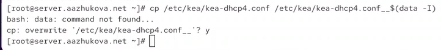{#fig-0011 width=70%}

2. Изменение файла kea-dhcp4.conf. Заменяю шаблон для domain-name, задаём собственную конфигурацию dhcp-сети, а также заменяем блок  
```
{
"name": "domain-name-servers",
"data": "192.0.2.1, 192.0.2.2"
},
``` ([рис. @fig-0012]).

{#fig-0012 width=70%}

3. Настраиваю привязку dhcpd к интерфейсу eth1 виртуальной машины server ([рис. @fig-0013]).

{#fig-0013 width=70%}

4. Проверяем  правильность конфигурационного файла ([рис. @fig-0014]).

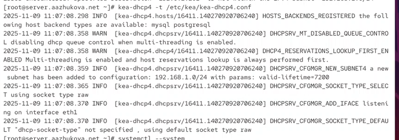{#fig-0014 width=70%}

5. Перезагружаю конфигурацию dhcpd и разрешаю загрузку DHCP-сервера при запуске виртуальной машины server ([рис. @fig-0015]).

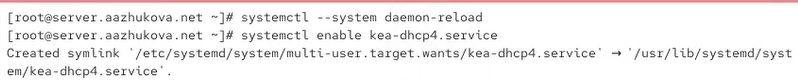{#fig-0015 width=70%}

6. Добавляем запись для DHCP-сервера в конце файла прямой DNS-зоны /var/named/master/fz/aazhukova.net ([рис. @fig-0016]).

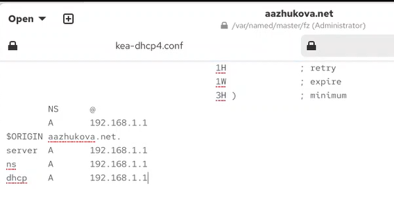{#fig-0016 width=70%}

и в конце файла обратной зоны /var/named/master/rz/192.168.1 ([рис. @fig-0017]).

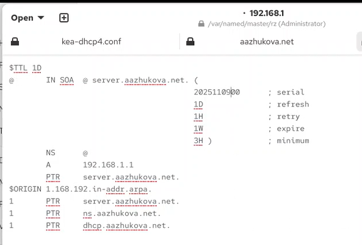{#fig-0017 width=70%}

7. Перезапускаем named, проверяем, что можно обратиться к DHCP-серверу по имени ([рис. @fig-0018]).

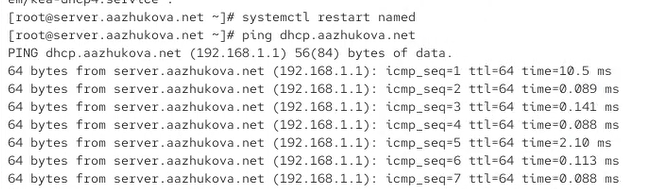{#fig-0018 width=70%}

8. Вносим  изменения в настройки межсетевого экрана узла server, разрешив работу с DHCP ([рис. @fig-0019]).

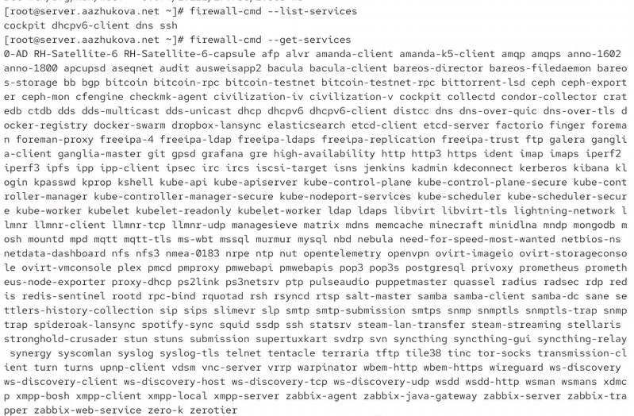{#fig-0019 width=70%}

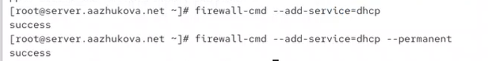{#fig-00191 width=70%}

9. Восстановливаем контекст безопасности в SELinux ([рис. @fig-00120]).

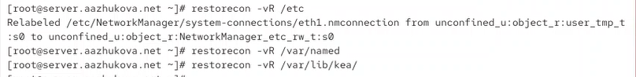{#fig-00120 width=70%}

10. В дополнительном терминале запускаем мониторинг, в основном рабочем терминале запускаем DHCP-сервер ([рис. @fig-00121]).

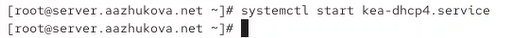{#fig-00121 width=70%}

Запуск прошёл без ошибок, поэтому переходим к следующему этапу.

## Анализ работы DHCP-сервера

1. Перед запуском виртуальной машины client в каталоге с проектом в вашей операционной системе в подкаталоге vagrant/provision/client создайте файл 01-routing.sh:

Открыв его на редактирование, пропишите в нём скрипт ([рис. @fig-020]).

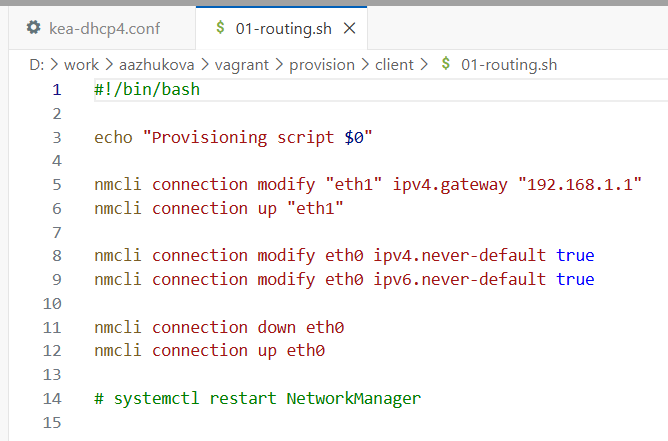{#fig-020 width=70%}

2. В Vagrantfile подключите этот скрипт в разделе конфигурации для клиента ([рис. @fig-021]).

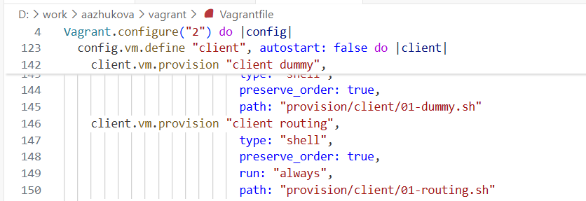{#fig-021 width=70%}

3. Зафиксируйте внесённые изменения для внутренних настроек виртуальной машины client и запустите её, введя в терминале:
vagrant up client --provision ([рис. @fig-022]).

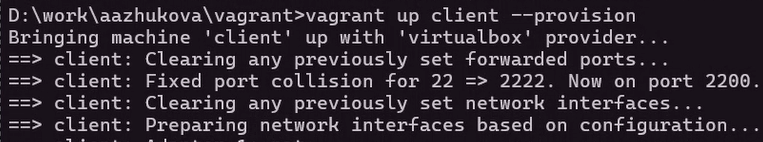{#fig-22 width=70%}

4. После загрузки виртуальной машины client вы можете увидеть на виртуальной машине server на терминале с мониторингом происходящих в системе процессов записи о подключении к виртуальной внутренней сети узла client и выдачи ему IP-адреса из соответствующего диапазона адресов. Также информацию о работе DHCP-сервера можно наблюдать в файле /var/lib/kea/kea-leases4.csv.

5. Войдите в систему виртуальной машины client под вашим пользователем и откройте терминал. В терминале введите
ifconfig ([рис. @fig-024]).

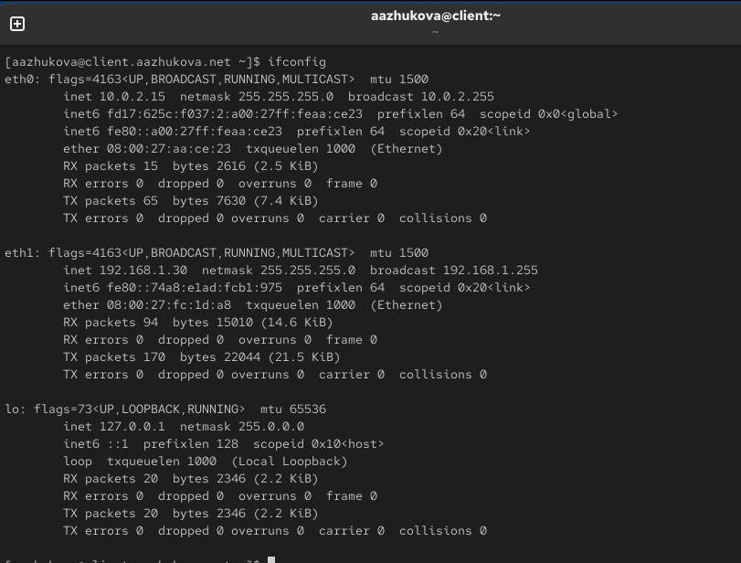{#fig-024 width=70%}

Пояснения: 

**Общая информация:**
Система: `aazhukovaeclient.aazhukova.net`
Отображены 3 сетевых интерфейса:

---

**1. Интерфейс eth0:**

**Интерфейс eth0:**
- **IPv4 адрес:** 10.0.2.15/24
- **IPv6 адреса:** 
  - fd17:625c:f037:2:a00:27ff:feaa:ce23 (global)
  - fe80::a00:27ff:feaa:ce23 (link-local)
- **MAC-адрес:** 08:00:27:aa:ce:23
- **Статус:** активен, работает без ошибок

---

**2. Интерфейс eth1:**

- **IPv4 адрес:** 192.168.1.30/24
- **IPv6 адрес:** fe80::74a8:e1ad:fcb1:975 (link-local)
- **MAC-адрес:** 08:00:27:fc:1d:a8
- **Статус:** активен, стабильная работа

---

**3. Интерфейс lo (loopback):**
- **IPv4 адрес:** 127.0.0.1/8
- **IPv6 адрес:** ::1
- **Назначение:** локальная петля для внутренних соединений

---

** Вывод:**
Система имеет корректную сетевую конфигурацию с двумя активными сетевыми интерфейсами, работающими в разных подсетях. Все интерфейсы функционируют без ошибок, статистика передачи данных показывает нормальную сетевую активность.

6. На машине server посмотрите список выданных адресов:
cat /var/lib/kea/kea-leases4.csv ([рис. @fig-025]).

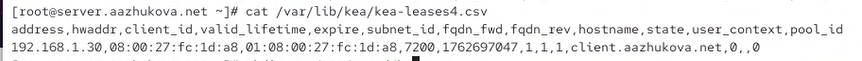{#fig-025 width=70%}

Комментарии:

**Файл:** `/var/lib/kea/kea-leases4.csv` - база данных арендованных адресов DHCP сервера Kea

**Содержание записи:**

- **IP-адрес:** 192.168.1.30
- **MAC-адрес клиента:** 08:00:27:fc:1d:a8
- **Client ID:** 01:08:00:27:fc:1d:a8
- **Время аренды:** 7200 секунд (2 часа)
- **Время истечения:** 1762697047 (Unix timestamp)
- **ID подсети:** 1
- **Имя хоста:** client.aazhukova.net
- **Состояние:** 0 (активная аренда)

## Настройка обновления DNS-зоны

Требуется настроить обновление DNS-зоны при появлении в виртуальной внутренней сети новых узлов.

1. Создадим ключ на сервере с Bind9 (на виртуальной машине server) ([рис. @fig-031]).

{#fig-031 width=70%}

2. Файл /etc/named/keys/dhcp_updater.key будет иметь следующий вид:

```
key "DHCP_UPDATER" {
algorithm hmac-sha512;
secret
↪ "psFFSGdUIwK36l1G82LOw15PuIH4W5uB8h/cw7F0XDsjniBbwm/59tM+V3ydcCs15VLpe2pxlUlggWi};
```

3. Поправим права доступа ([рис. @fig-032]).

{#fig-032 width=70%}

4. Подключим ключ в файле /etc/named.conf ([рис. @fig-033]).

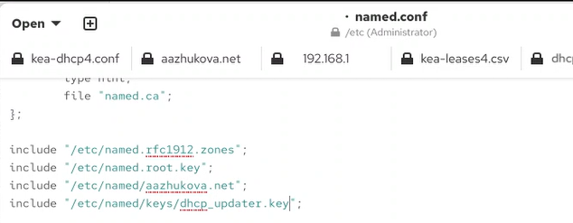{#fig-033 width=70%}

5. На виртуальной машине server под пользователем с правами суперпользователя отредактируйте файл /etc/named/aazhukova.net разрешив обновление зоны ([рис. @fig-034]).

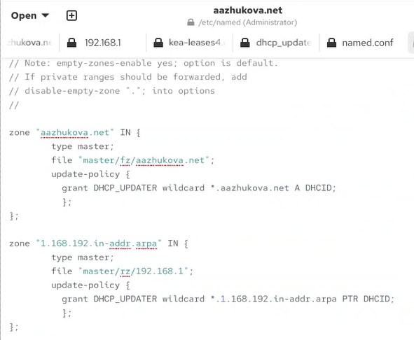{#fig-034 width=70%}

6. Сделаем проверку конфигурационного файла. Перезапустите DNS-сервер ([рис. @fig-035]).

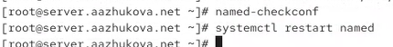{#fig-035 width=70%}

8. Сформируем ключ для Kea. Файл ключа назовём /etc/kea/tsig-keys.json ([рис. @fig-036]).

{#fig-036 width=70%}

9. Перенесём ключ на сервер Kea DHCP и перепишем его в формате json ([рис. @fig-037]).

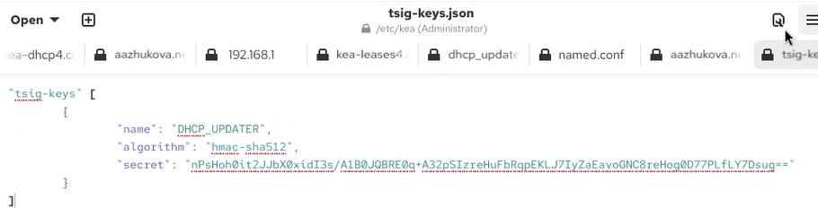{#fig-037 width=70%}

10. Сменим владельца. Поправим права доступа ([рис. @fig-038]).

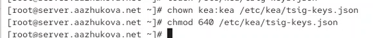{#fig-038 width=70%}

11. Настройка происходит в файле /etc/kea/kea-dhcp-ddns.conf 

```
{
	"DhcpDdns":
	{
		"ip-address": "127.0.0.1",
		"port": 53001,
		"control-socket": {
		        "socket-type": "unix",
		        "socket-name": "/run/kea/kea-ddns-ctrl-socket"
		},
		"tsig-keys": [
		{
			"name": "DHCP_UPDATER",
			"algorithm": "hmac-sha512",
			"secret": "sClFM8Y8WmeQQo2rfDL23OxDaEbD2WFqa08RpomXxUtdPvOJndJxHKxDc/yBeRhR2g9K6epLpaYO0IrHc5xI9A=="}
		],  
    
		"forward-ddns" : {
			"ddns-domains" : [
				{
					"name": "aazhukova.net.",
        				"key-name": "DHCP_UPDATER",
        				"dns-servers": [ 
        					{ "ip-address": "192.168.1.1" }
          				]
        			}
      			]
    		},
    		"reverse-ddns" : {
			"ddns-domains": [
        			{
          				"name": "1.168.192.in-addr.arpa.",
          				"key-name": "DHCP_UPDATER",
         				"dns-servers": [
           					{ "ip-address": "192.168.1.1"}
          				]
        			}
      			]
		},
    		"loggers": [
      			{
        	  		"name": "kea-dhcp-ddns",
        	  		"output-options": [
        	      			{
        	          			"output": "stdout",
        	          			"pattern": "%-5p %m\n"
        	     			} 
        	  		],
        	  		"severity": "INFO",
        	  		"debuglevel": 0
      			}
    		]
	}
}
```

13. Изменим владельца файла. Проверим файл на наличие возможных синтаксических ошибок. Запустим службу ddns ([рис. @fig-039]).

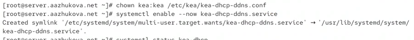{#fig-039 width=70%}

14. Проверим статус работы службы ([рис. @fig-0340]).

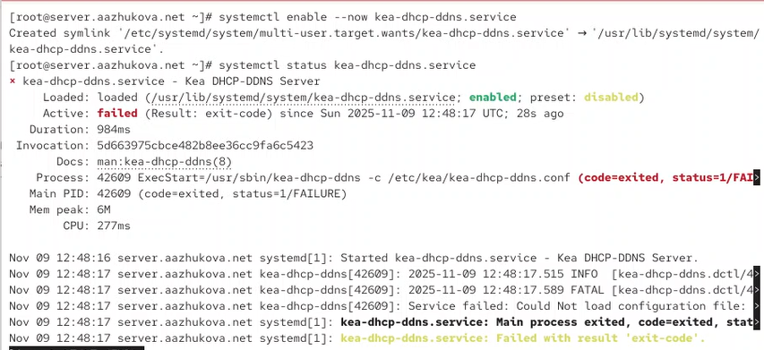{#fig-0340 width=70%}

15. Внесите изменения в конфигурационный файл /etc/kea/kea-dhcp4.conf, добавив в него разрешение на динамическое обновление DNS-записей с локального узла прямой и обратной зон ([рис. @fig-0341]).

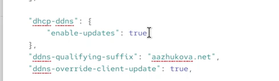{#fig-0341 width=70%}

16. Проверим файл на наличие возможных синтаксических ошибок. Перезапустите DHCP-сервер ([рис. @fig-0342]).

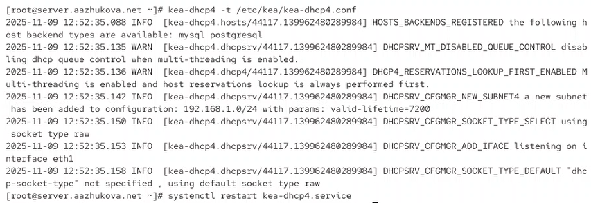{#fig-0342 width=70%}

17. Проверим статус ([рис. @fig-0343]).

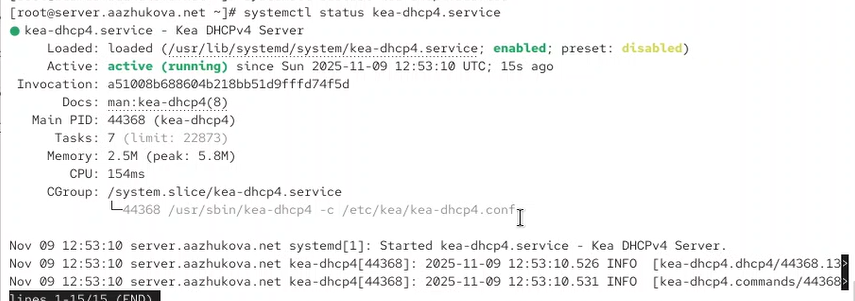{#fig-0343 width=70%}

18. На машине client переполучите адрес ([рис. @fig-0344]).

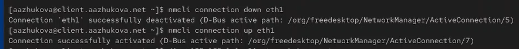{#fig-0344 width=70%}

19. В каталоге прямой DNS-зоны /var/named/master/fz должен появиться файл
user.net.jnl, в котором в бинарном файле автоматически вносятся изменения
записей зоны ([рис. @fig-0345]).

{#fig-0345 width=70%}

## Анализ работы DHCP-сервера после настройки обновления DNS-зоны

На виртуальной машине client под вашим пользователем откройте терминал и с помощью утилиты dig убедитесь в наличии DNS-записи о клиенте в прямой DNS-зоне ([рис. @fig-041]).

{#fig-041 width=70%}

## Внесение изменений в настройки внутреннего окружения виртуальной машины

1. На виртуальной машине server перейдите в каталог для внесения изменений
в настройки внутреннего окружения /vagrant/provision/server/, создайте в нём
каталог dhcp, в который поместите в соответствующие подкаталоги конфигурационные файлы DHCP ([рис. @fig-051]).

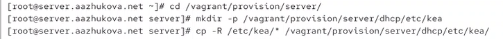{#fig-051 width=70%}

2. Замените конфигурационные файлы DNS-сервера([рис. @fig-052]).

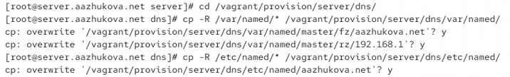{#fig-052 width=70%}

3. В каталоге /vagrant/provision/server создайте исполняемый файл dhcp.sh ([рис. @fig-053]).

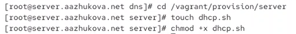{#fig-053 width=70%}

Открыв его на редактирование, пропишите в нём скрипт ([рис. @fig-054]).

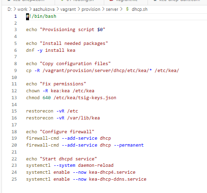{#fig-054 width=70%}

4. Для отработки созданного скрипта во время загрузки виртуальной машины server
в конфигурационном файле Vagrantfile необходимо добавить в разделе конфигурации для сервера ([рис. @fig-055]).

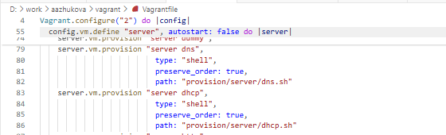{#fig-055 width=70%}

5. После этого виртуальные машины client и server можно выключить.

# Выводы

Во время выполнения лабораторной работы мною были приобретены практические навыки по установке и конфигурированию DHCP-сервера.

# Ответы на контрольные вопросы

**1. В каких файлах хранятся настройки сетевых подключений?**  
Настройки сетевых подключений в Linux-системах могут храниться в следующих файлах:  
- `/etc/network/interfaces` (в Debian-based системах);  
- `/etc/sysconfig/network-scripts/ifcfg-<интерфейс>` (в Red Hat-based системах);  
- `/etc/netplan/*.yaml` (в современных дистрибутивах, использующих NetPlan).  

**2. За что отвечает протокол DHCP?**  
Протокол DHCP отвечает за автоматическое назначение IP-адресов и других сетевых параметров (маска подсети, шлюз, DNS-серверы) узлам в сети TCP/IP. Это позволяет администраторам централизованно управлять настройками сети без необходимости ручной конфигурации каждого устройства.

**3. Поясните принцип работы протокола DHCP. Какими сообщениями обмениваются клиент и сервер, используя протокол DHCP?**  
Принцип работы DHCP включает четыре основных этапа:  
1. **DHCPDISCOVER** — клиент отправляет широковещательный запрос для поиска доступных DHCP-серверов.  
2. **DHCPOFFER** — сервер предлагает клиенту IP-адрес и другие параметры.  
3. **DHCPREQUEST** — клиент подтверждает принятие предложенного адреса.  
4. **DHCPACK** — сервер подтверждает выделение адреса и параметров.  

Дополнительные сообщения:  
- **DHCPNAK** — отказ сервера;  
- **DHCPDECLINE** — клиент сообщает, что адрес уже используется;  
- **DHCPRELEASE** — клиент освобождает адрес;  
- **DHCPINFORM** — запрос параметров без назначения адреса.  

**4. В каких файлах обычно находятся настройки DHCP-сервера? За что отвечает каждый из файлов?**  
Основные файлы DHCP-сервера:  
- **dhcpd.conf** — содержит конфигурационные параметры сервера (диапазоны адресов, шлюзы, DNS и т.д.).  
- **dhcpd.leases** — база данных, в которой хранится информация о выданных адресах и времени их аренды.  

**5. Что такое DDNS? Для чего применяется DDNS?**  
DDNS (Dynamic DNS) — технология, позволяющая автоматически обновлять DNS-записи в реальном времени при изменении IP-адреса узла. Она применяется для обеспечения постоянного доступа к устройствам с динамическими IP-адресами (например, домашние роутеры, серверы с меняющимися адресами).

**6. Какую информацию можно получить, используя утилиту ifconfig? Приведите примеры с использованием различных опций.**  
Утилита `ifconfig` отображает информацию о сетевых интерфейсах: IP-адрес, маску подсети, MAC-адрес, статистику пакетов.  
Примеры использования:  
- `ifconfig eth0` — информация о конкретном интерфейсе;  
- `ifconfig -a` — показать все интерфейсы, включая выключенные;  
- `ifconfig eth0 up` — включить интерфейс;  
- `ifconfig eth0 down` — выключить интерфейс.  

**7. Какую информацию можно получить, используя утилиту ping? Приведите примеры с использованием различных опций.**  
Утилита `ping` проверяет доступность узла в сети и измеряет время ответа.  
Примеры использования:  
- `ping 192.168.1.1` — непрерывная отправка пакетов;  
- `ping -c 4 google.com` — отправить 4 пакета;  
- `ping -s 1000 example.com` — отправка пакетов размером 1000 байт;  
- `ping -i 2 192.168.1.1` — установить интервал между пакетами в 2 секунды.


# Список литературы{.unnumbered}

::: {#refs}
:::

