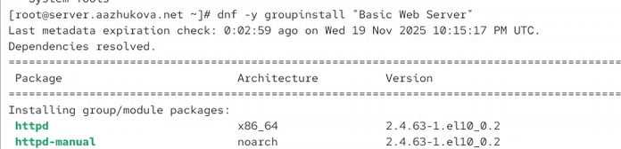
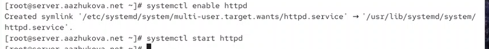
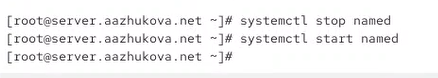
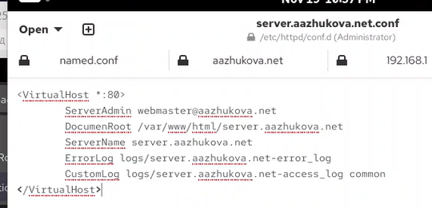
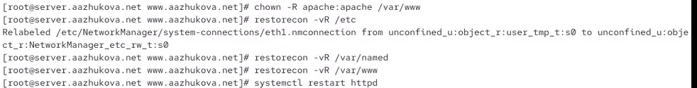
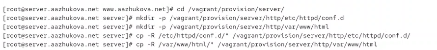
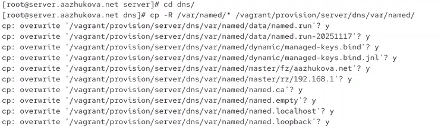
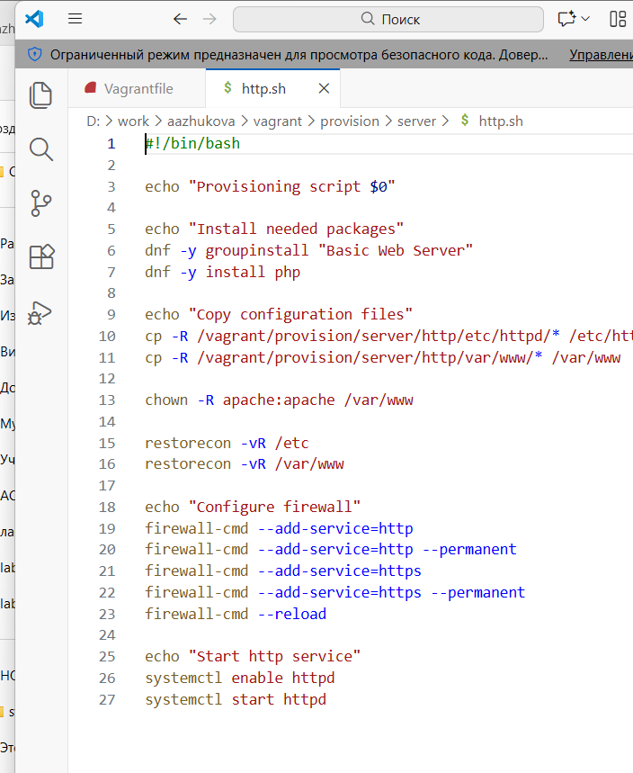

---
# Author
author:
  name: Жукова Арина Александровна
  degrees: студентка 3 курса
  orcid: 0000-0002-0877-7063
  email: 1132239120@rudn.ru
  affiliation:
    - name: Российский университет дружбы народов
      country: Российская Федерация
      postal-code: 117198
      city: Москва
      address: ул. Миклухо-Маклая, д. 6

# Title
title: Лабораторная работа №4
subtitle: Базовая настройка HTTP-сервера Apache
license: CC BY
date: today
date-format: "YYYY-MM-DD"
---

# Информация

## Докладчик

:::::::::::::: {.columns align=center}
::: {.column width="70%"}

  * Жукова Арина Александровна
  * студентка 3 курса
  * направление: Прикладная информатика
  * Российский университет дружбы народов им. П. Лумумбы
  * [1132239120@rudn.ru](mailto:1132239120@rudn.ru)

:::
::: {.column width="30%"}

:::
::::::::::::::

# Вводная часть

## Актуальность

- Веб-сервер Apache — один из самых популярных HTTP-серверов в мире
- Критически важный компонент современной веб-инфраструктуры
- Поддерживает более 30% всех веб-сайтов
- Необходимый навык для веб-разработчиков и системных администраторов

## Объект и предмет исследования

- **Объект**: HTTP-сервер Apache и его конфигурация
- **Предмет**: Процесс установки, базовой настройки и конфигурирования виртуального хостинга

## Цели и задачи

**Цель**: Приобретение практических навыков по установке и базовому конфигурированию HTTP-сервера Apache.

**Задачи**:

1. Установить и настроить HTTP-сервер Apache
2. Настроить виртуальный хостинг для нескольких доменов
3. Протестировать доступность веб-сервера в сети
4. Автоматизировать процесс развертывания через Vagrant

## Материалы и методы

- Виртуальные машины (Server и Client)
- ПО: Apache HTTP Server (httpd), BIND9 DNS Server
- ОС: Rocky Linux (дистрибутив на основе RHEL)
- Инструменты: Vagrant, systemd, firewalld, утилиты сетевой диагностики

# Установка HTTP-сервера

## Подготовка среды

- Запуск виртуальной машины server: `vagrant up server`
- Переход в режим суперпользователя
- Анализ доступных пакетных групп

## Установка веб-сервера

{width=80%}

- Команда: `dnf groupinstall -y "Basic Web Server"`
- Установка Apache версии 2.4.63 и сопутствующих компонентов
- Автоматическое разрешение зависимостей

# Базовая настройка HTTP-сервера

## Конфигурация firewall

:::::::::::::: {.columns}
::: {.column width="50%"}

**Просмотр текущих правил**
{width=90%}

:::
::: {.column width="50%"}

**Добавление HTTP-сервиса**
{width=90%}

:::
::::::::::::::

- Проверка текущей конфигурации: `firewall-cmd --list-all`
- Добавление службы HTTP: `firewall-cmd --add-service=http --permanent`
- Применение изменений: `firewall-cmd --reload`

## Запуск и активация службы

{width=80%}

- Включение в автозагрузку: `systemctl enable httpd`
- Запуск службы: `systemctl start httpd`
- Проверка статуса: `systemctl status httpd`

# Анализ работы HTTP-сервера

## Тестирование доступности

{width=80%}

- Запуск клиентской машины: `vagrant up client`
- Доступ к серверу по IP-адресу: 192.168.1.1
- Отображение тестовой страницы Apache по умолчанию

## Мониторинг логов

:::::::::::::: {.columns}
::: {.column width="50%"}

**Лог ошибок**
{width=90%}

- Файл: `/var/log/httpd/error_log`
- Содержит информацию о запуске и ошибках
- Успешный запуск Apache/2.4.63

:::
::: {.column width="50%"}

**Лог доступа**
{width=90%}

- Файл: `/var/log/httpd/access_log`
- Записи о запросах от клиентов
- Формат: IP-адрес, дата, запрос, код ответа

:::
::::::::::::::

# Настройка DNS для виртуального хостинга

## Подготовка DNS-сервера

{width=80%}

- Остановка DNS-сервера для внесения изменений
- Модификация файлов зон для добавления новых записей

## Добавление DNS-записей

:::::::::::::: {.columns}
::: {.column width="50%"}

**Прямая зона**
{width=90%}

- Добавление A-записи для www
- Доменное имя: `www.aazhukova.net`
- IP-адрес: `192.168.1.1`

:::
::: {.column width="50%"}

**Обратная зона**
{width=90%}

- Добавление PTR-записи
- IP-адрес: `192.168.1.1`
- Имя хоста: `www.aazhukova.net.`

:::
::::::::::::::

## Перезапуск DNS-сервера

{width=80%}

- Перезагрузка конфигурации: `systemctl restart named`
- Проверка статуса: `systemctl status named`
- Тестирование разрешения имен с клиентской машины

# Конфигурация виртуальных хостов

## Создание конфигурационных файлов

:::::::::::::: {.columns}
::: {.column width="50%"}

**Конфиг server.aazhukova.net**
{width=90%}

- Директива `<VirtualHost>`
- ServerName: server.aazhukova.net
- DocumentRoot: /var/www/html/server.aazhukova.net

:::
::: {.column width="50%"}

**Конфиг www.aazhukova.net**
{width=90%}

- ServerName: www.aazhukova.net
- DocumentRoot: /var/www/html/www.aazhukova.net
- Директива Directory для настроек доступа

:::
::::::::::::::

## Создание веб-контента

:::::::::::::: {.columns}
::: {.column width="50%"}

**Тестовая страница server.aazhukova.net**
{width=90%}

- Каталог: `/var/www/html/server.aazhukova.net`
- Файл: `index.html`
- Простая HTML-страница с идентификацией

:::
::: {.column width="50%"}

**Тестовая страница www.aazhukova.net**
{width=90%}

- Каталог: `/var/www/html/www.aazhukova.net`
- Отдельный контент для каждого виртуального хоста
- Возможность индивидуальной настройки

:::
::::::::::::::

## Настройка прав доступа и SELinux

{width=80%}

- Установка владельца: `chown -R apache:apache /var/www`
- Восстановление контекста SELinux: `restorecon -vR /var/www`
- Проверка прав доступа к файлам и каталогам

# Тестирование виртуального хостинга

## Проверка доступности

:::::::::::::: {.columns}
::: {.column width="50%"}

**server.aazhukova.net**
{width=90%}

- Успешный доступ через браузер
- Отображение соответствующего контента
- Подтверждение работы виртуального хоста

:::
::: {.column width="50%"}

**www.aazhukova.net**
{width=90%}

- Корректное разрешение DNS-имени
- Загрузка уникальной тестовой страницы
- Подтверждение изоляции виртуальных хостов

:::
::::::::::::::

## Перезагрузка Apache

- Перезапуск для применения изменений: `systemctl restart httpd`
- Проверка отсутствия ошибок в логах
- Тестирование доступности после перезапуска

# Автоматизация развертывания

## Сохранение конфигурационных файлов

:::::::::::::: {.columns}
::: {.column width="50%"}

**Конфигурация Apache**
{width=90%}

- Копирование файлов из `/etc/httpd/conf.d/`
- Сохранение структуры каталогов
- Резервное копирование веб-контента

:::
::: {.column width="50%"}

**Конфигурация DNS**
{width=90%}

- Копирование файлов зон
- Сохранение ключей и конфигурации
- Обеспечение воспроизводимости

:::
::::::::::::::

## Создание скрипта автоматизации

{width=80%}

- Создание скрипта `http.sh` в `/vagrant/provision/server/`
- Включение всех этапов установки и настройки
- Установка прав на выполнение: `chmod +x http.sh`

## Интеграция с Vagrant

{width=80%}

- Модификация Vagrantfile для вызова скрипта
- Настройка автоматического provisioning
- Обеспечение консистентности развертывания

# Результаты

## Достигнутые результаты

1. **Установка и базовая настройка Apache**
   - Успешная установка пакета "Basic Web Server"
   - Настройка firewall для HTTP-трафика
   - Корректный запуск службы httpd

2. **Настройка виртуального хостинга**
   - Создание двух виртуальных хостов
   - Интеграция с DNS-сервером
   - Изоляция контента для разных доменов

3. **Тестирование и верификация**
   - Проверка доступности через браузер
   - Анализ логов доступа и ошибок
   - Подтверждение корректной работы

4. **Автоматизация процесса**
   - Создание скрипта для воспроизведения конфигурации
   - Интеграция с Vagrant для управления виртуальными машинами
   - Сохранение конфигурационных файлов

# Выводы

## Основные выводы

- Приобретены практические навыки установки и базовой настройки HTTP-сервера Apache
- Освоена настройка виртуального хостинга для обслуживания нескольких доменов
- Получен опыт интеграции веб-сервера с DNS-инфраструктурой
- Разработана автоматизированная система развертывания через Vagrant
- Проведена полная проверка работоспособности системы, включая мониторинг логов

## Практическая значимость

- Навыки конфигурирования Apache востребованы в веб-разработке и системном администрировании
- Возможность обслуживания нескольких сайтов на одном сервере экономит ресурсы
- Автоматизация развертывания упрощает масштабирование и восстановление системы
- Полученный опыт может быть применен в реальных проектах развертывания веб-инфраструктуры

