---
# Author
author:
  name: Жукова Арина Александровна
  degrees: 3rd year student
  orcid: 0000-0002-0877-7063
  email: 1132239120@rudn.ru
  affiliation:
    - name: Российский университет дружбы народов
      country: Российская Федерация
      postal-code: 117198
      city: Москва
      address: ул. Миклухо-Маклая, д. 6

# Title
title: "Лабораторная работа №4"
subtitle: "Базовая настройка HTTP-сервера Apache"
license: "CC BY"
---

# Цель работы

Приобретение практических навыков по установке и базовому конфигурированию HTTP-сервера Apache.

# Задание

1. Установить необходимые для работы HTTP-сервера пакеты.
2. Запустить HTTP-сервер с базовой конфигурацией и проанализировать его работу.
3. Настроить виртуальный хостинг.
4. Написать скрипт для Vagrant, фиксирующий действия по установке и настройке HTTP-сервера во внутреннем окружении виртуальной машины server, и внести изменения в Vagrantfile.

# Выполнение лабораторной работы

## Установка HTTP-сервера

1. Загружена операционная система и выполнен переход в рабочий каталог проекта:

2. Запущена виртуальная машина `server`:

```bash
   vagrant up server
```

3. На виртуальной машине выполнен вход под пользователем и переход в режим суперпользователя.

4. Просмотр доступных групп пакетов:

   ```bash
   LANG=C yum groupList
   ```

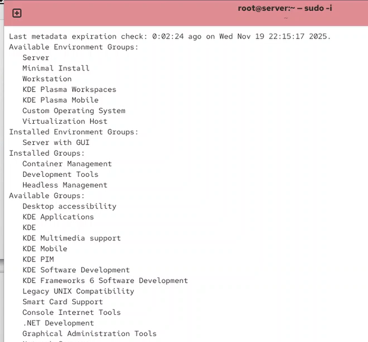{#fig-001 width=70%}

5. Установлен стандартный веб-сервер из репозитория:

{#fig-002 width=70%}

## Базовое конфигурирование HTTP-сервера

1. Просмотр текущих разрешенных сервисов в firewall:

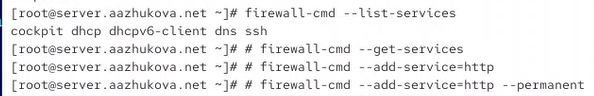{#fig-003 width=70%}

2. Добавление HTTP-сервиса в firewall:

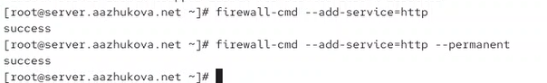{#fig-004 width=70%}

3. Активация и запуск HTTP-сервера:

{#fig-005 width=70%}


## Анализ работы HTTP-сервера

1. Запущена виртуальная машина client:

   ```bash
   vagrant up client
   ```

2. На виртуальной машине client запущен браузер и в адресной строке введен IP-адрес 192.168.1.1.

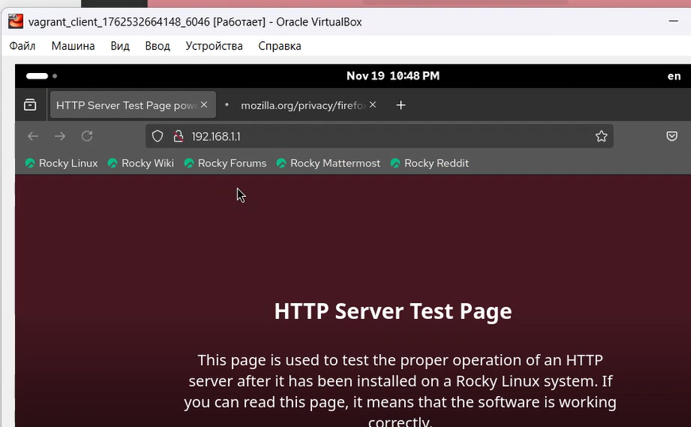{#fig-008 width=70%}

3. Просмотр лога ошибок HTTP-сервера:

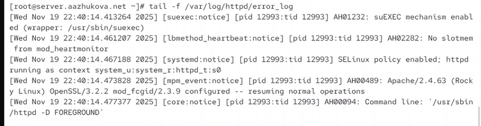{#fig-006 width=70%}

*Пояснение:* В логе виден успешный запуск Apache/2.4.63, включение SELinux и suEXEC механизма.

4. Просмотр лога доступа HTTP-сервера:

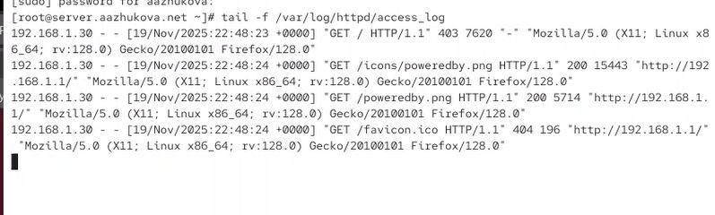{#fig-009 width=70%}

*Пояснение:* Видны HTTP-запросы от клиента 192.168.1.30: запрос главной страницы, иконок и favicon.


## Настройка виртуального хостинга для HTTP-сервера

1. Остановка DNS-сервера для внесения изменений:

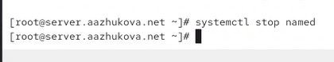{#fig-010 width=70%}

2. Добавление записи www в прямую зону DNS:
   
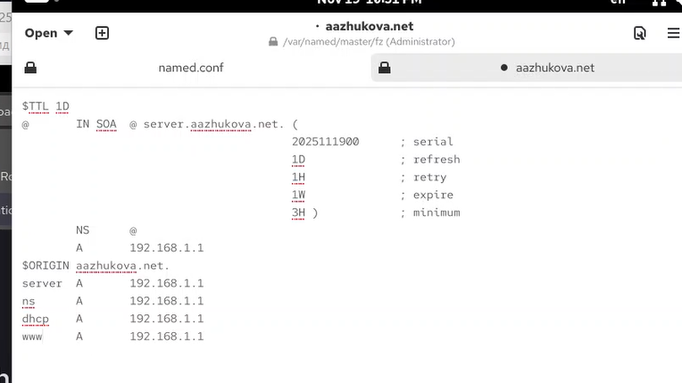{#fig-011 width=70%}

3. Добавление PTR-записи в обратную зону DNS:
   
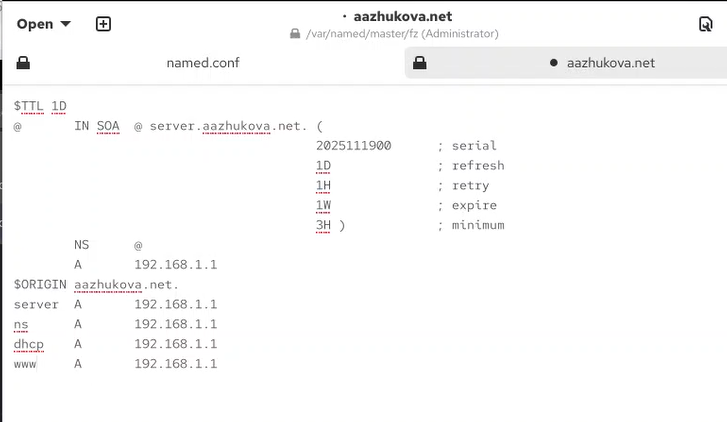{#fig-012 width=70%}

4. Обновленная обратная зона DNS:
   
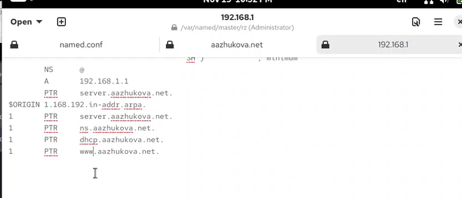{#fig-013 width=70%}

5. Запуск DNS-сервера:

{#fig-014 width=70%}

6. Создание конфигурационных файлов виртуальных хостов:

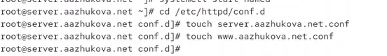{#fig-015 width=70%}

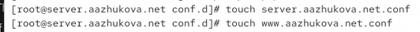{#fig-016 width=70%}

7. Конфигурация виртуального хоста server.aazhukova.net:
   
{#fig-017 width=70%}

8. Конфигурация виртуального хоста www.aazhukova.net:
   
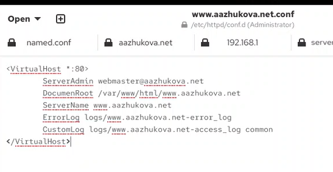{#fig-018 width=70%}

9. Создание каталога и тестовой страницы для server.aazhukova.net:

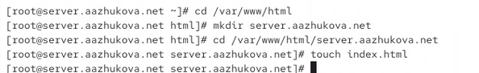{#fig-019 width=70%}

10. Содержание тестовой страницы server.aazhukova.net:
    
 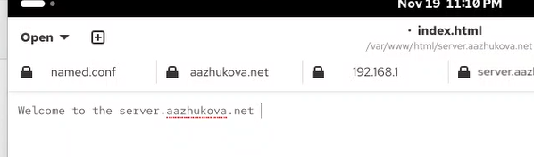{#fig-020 width=70%}

11. Создание каталога и тестовой страницы для www.aazhukova.net:
    ```bash
    cd /var/www/html
    mkdir www.aazhukova.net
    cd /var/www/html/www.aazhukova.net
    touch index.html
    ```

 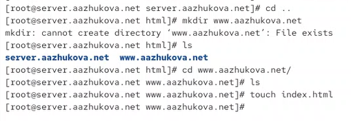{#fig-021 width=70%}

12. Содержание тестовой страницы www.aazhukova.net:
    
 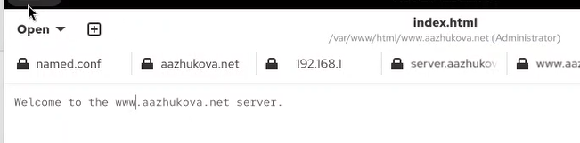{#fig-022 width=70%}

13. Настройка прав доступа к каталогам с веб-контентом и восстановление контекста безопасности SELinux:
    ```bash
    chown -R apache:apache /var/www
    restorecon -vR /etc
    restorecon -vR /var/named
    restorecon -vR /var/www
    ```

 {#fig-023 width=70%}

14. Проверка доступности виртуальных хостов с клиентской машины:

    *Для server.aazhukova.net:*
    
 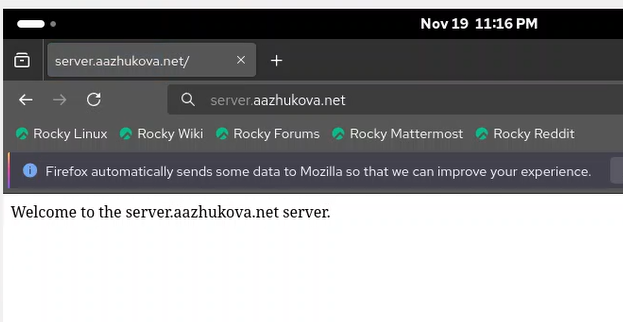{#fig-024 width=70%}

    *Для www.aazhukova.net:*
    
 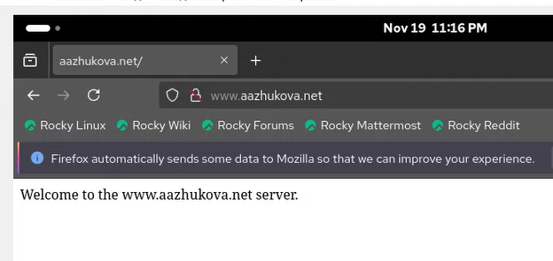{#fig-025 width=70%}

    *Пояснение:* Оба виртуальных хоста успешно доступны через браузер с клиентской машины.

## Внесение изменений в настройки внутреннего окружения виртуальной машины

1. Создание структуры каталогов для хранения конфигурационных файлов:
   ```bash
   cd /vagrant/provision/server
   mkdir -p /vagrant/provision/server/http/etc/httpd/conf.d
   mkdir -p /vagrant/provision/server/http/var/www/html
   ```

2. Копирование конфигурационных файлов HTTP-сервера:
   ```bash
   cp -R /etc/httpd/conf.d/* /vagrant/provision/server/http/etc/httpd/conf.d/
   cp -R /var/www/html/* /vagrant/provision/server/http/var/www/html/
   ```

{#fig-026 width=70%}

3. Копирование файлов конфигурации DNS-сервера:
   ```bash
   cd /vagrant/provision/server/dns/
   cp -R /var/named/* /vagrant/provision/server/dns/var/named/
   ```

{#fig-027 width=70%}

4. Создание скрипта автоматизации настройки http.sh:
   ```bash
   cd /vagrant/provision/server
   touch http.sh
   chmod +x http.sh
   ```

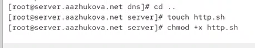{#fig-028 width=70%}

5. Содержание скрипта http.sh:
    
{#fig-029 width=70%}


6. Добавление вызова скрипта в Vagrantfile:
    
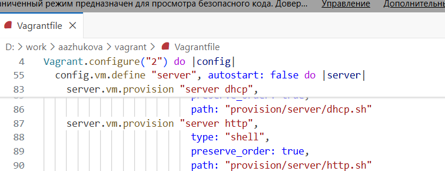{#fig-030 width=70%}


# Выводы

В результате выполнения лабораторной работы:

1. Установлен пакет "Basic Web Server", включающий HTTP-сервер Apache версии 2.4.63 и сопутствующие утилиты.

2. Выполнена базовая настройка веб-сервера:
   - Изучены конфигурационные файлы в каталогах `/etc/httpd/conf` и `/etc/httpd/conf.d`
   - Настроен firewall для разрешения HTTP-трафика
   - Служба `httpd` успешно активирована и запущена

3. Проанализирована работа сервера:
   - Проверены логи ошибок (`error_log`) и доступа (`access_log`)
   - Подтверждена корректная работа через тестовую страницу Apache

4. Настроен виртуальный хостинг:
   - Добавлены DNS-записи для `server.aazhukova.net` и `www.aazhukova.net`
   - Созданы конфигурационные файлы виртуальных хостов
   - Созданы тестовые веб-страницы для каждого виртуального хоста
   - Настроены права доступа и контекст безопасности SELinux
   - Подтверждена доступность обоих виртуальных хостов через браузер

5. Автоматизирована настройка:
   - Создан скрипт `http.sh` для автоматической установки и настройки HTTP-сервера
   - Конфигурационные файлы сохранены в структурированном виде
   - Добавлен вызов скрипта в конфигурацию Vagrant для автоматического применения настроек

Получены практические навыки установки, базовой конфигурации, настройки виртуального хостинга веб-сервера Apache и автоматизации процесса развертывания в среде Rocky Linux с использованием Vagrant.

# Контрольные вопросы

1. **Через какой порт по умолчанию работает Apache?**
   - Apache по умолчанию работает через порт 80 для HTTP и порт 443 для HTTPS.

2. **Под каким пользователем запускается Apache и к какой группе относится этот пользователь?**
   - В Rocky Linux/RHEL-подобных системах Apache запускается под пользователем `apache` и относится к группе `apache`.

3. **Где располагаются лог-файлы веб-сервера? Что можно по ним отслеживать?**
   - Лог-файлы располагаются в `/var/log/httpd/`:
     - `access_log` — журнал обращений (IP-адреса клиентов, запрашиваемые ресурсы, коды ответов)
     - `error_log` — журнал ошибок (проблемы запуска, ошибки обработки запросов)
   - По ним можно отслеживать активность пользователей, диагностировать проблемы, анализировать безопасность.

4. **Где по умолчанию содержится контент веб-серверов?**
   - По умолчанию контент располагается в `/var/www/html/`. Для виртуальных хостов могут создаваться отдельные каталоги внутри этой директории.

5. **Каким образом реализуется виртуальный хостинг? Что он даёт?**
   - Виртуальный хостинг реализуется через директиву `<VirtualHost>` в конфигурационных файлах Apache.
   - Он позволяет обслуживать несколько доменных имен на одном IP-адресе и порту, используя разные `DocumentRoot` и настройки для каждого домена.
   - Преимущества: экономия IP-адресов, изоляция сайтов, гибкость в управлении.
