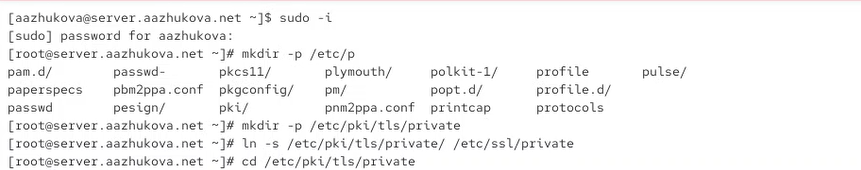
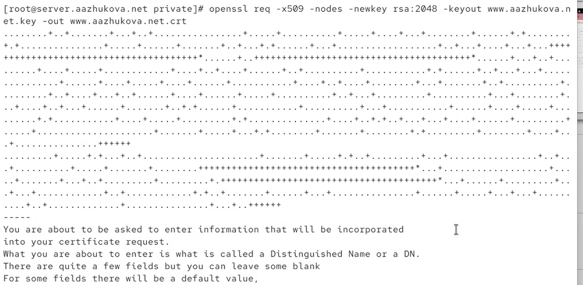
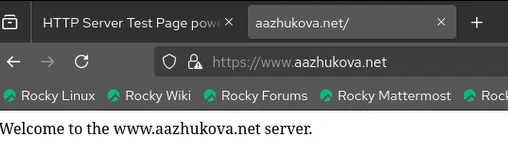
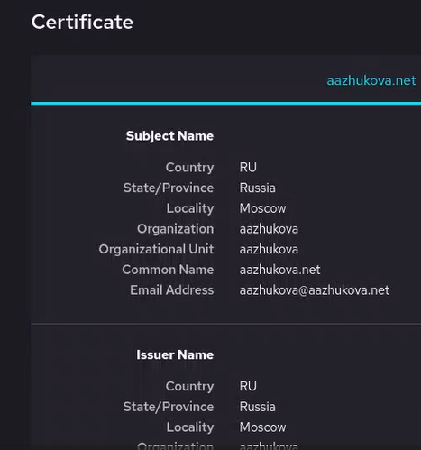
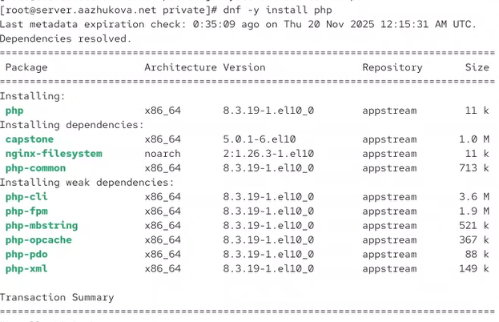
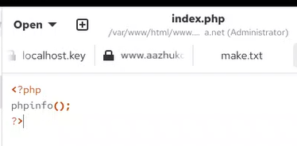
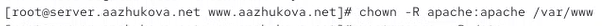
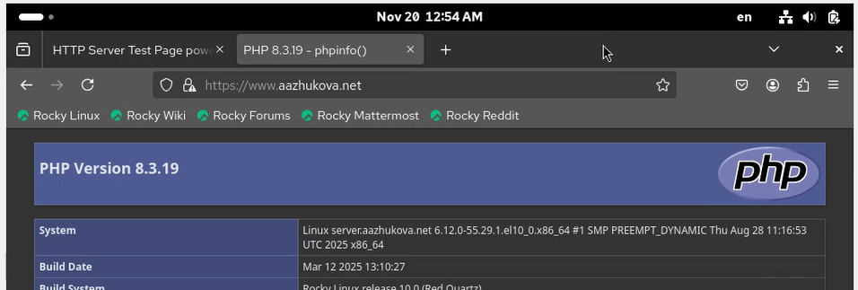
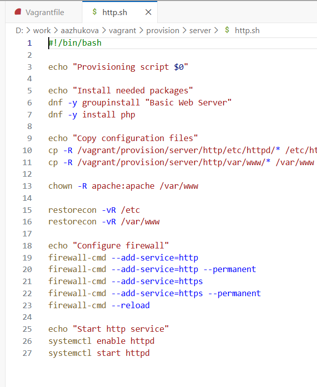

---
# Author
author:
  name: Жукова Арина Александровна
  degrees: студентка 3 курса
  orcid: 0000-0002-0877-7063
  email: 1132239120@rudn.ru
  affiliation:
    - name: Российский университет дружбы народов
      country: Российская Федерация
      postal-code: 117198
      city: Москва
      address: ул. Миклухо-Маклая, д. 6

# Title
title: Лабораторная работа №5
subtitle: Расширенная настройка HTTP-сервера Apache
license: CC BY
date: today
date-format: "YYYY-MM-DD"
---

# Информация

## Докладчик

:::::::::::::: {.columns align=center}
::: {.column width="70%"}

  * Жукова Арина Александровна
  * студентка 3 курса
  * направление: Прикладная информатика
  * Российский университет дружбы народов им. П. Лумумбы
  * [1132239120@rudn.ru](mailto:1132239120@rudn.ru)

:::
::: {.column width="30%"}


:::
::::::::::::::

# Вводная часть

## Актуальность

- Безопасность веб-коммуникаций — критически важный аспект современного интернета
- HTTPS стал стандартом для всех современных веб-сайтов
- Поддержка PHP необходима для динамических веб-приложений
- Автоматизация настройки повышает надёжность и воспроизводимость

## Объект и предмет исследования

- **Объект**: HTTP-сервер Apache с поддержкой HTTPS и PHP
- **Предмет**: Процесс настройки безопасного соединения и интеграции серверных скриптов

## Цели и задачи

**Цель**: Приобретение практических навыков по расширенному конфигурированию HTTP-сервера Apache для работы через HTTPS и с поддержкой PHP.

**Задачи**:

1. Настроить HTTPS с использованием самоподписанного сертификата
2. Интегрировать поддержку PHP в веб-сервер
3. Автоматизировать процесс настройки через скрипты Vagrant
4. Проверить работоспособность всех компонентов

## Материалы и методы

- Виртуальные машины (Server и Client) на Rocky Linux
- ПО: Apache HTTP Server с mod_ssl, PHP 8.3
- Криптографические инструменты: OpenSSL
- Сетевые инструменты: firewalld, systemd
- Система автоматизации: Vagrant с bash-скриптами

# Настройка HTTPS

## Подготовка среды

{width=70%}

- Переход в режим суперпользователя
- Создание структуры каталогов для сертификатов
- Символическая ссылка для совместимости: `/etc/ssl/private`

## Генерация SSL-сертификата

:::::::::::::: {.columns}
::: {.column width="60%"}

**Команда генерации**
```bash
openssl req -x509 -nodes -newkey rsa:2048 \
  -keyout www.aazhukova.net.key \
  -out www.aazhukova.net.crt
```

**Параметры**:
- `-x509`: Самоподписанный сертификат
- `-nodes`: Без шифрования ключа паролем
- `-newkey rsa:2048`: 2048-битный RSA ключ
- Длина ключа соответствует современным стандартам безопасности

:::
::: {.column width="40%"}

{width=90%}

:::
::::::::::::::

## Данные сертификата

- Страна: RU (Россия)
- Область/Город: Moscow
- Организация: aazhukova
- Общее имя: `www.aazhukova.net`
- Email: `aazhukova@aazhukova.net`
- Сертификат действителен 1 год

# Конфигурация Apache для HTTPS

## Структура конфигурационного файла

:::::::::::::: {.columns}
::: {.column width="40%"}

{width=100%}

:::
::: {.column width="60%"}

**HTTP → HTTPS редирект**
```apache
    RewriteRule ^(.*)$ https://%{HTTP_HOST}$1 [R=301,L]
```

- Код 301: постоянное перенаправление
- Автоматическое преобразование URL


**HTTPS конфигурация**

- Порт 443 для HTTPS
- Указание путей к сертификату и ключу

:::
::::::::::::::

## Настройка firewall

:::::::::::::: {.columns}
::: {.column width="60%"}

{width=80%}

:::
::: {.column width="40%"}


- Проверка доступных сервисов: `firewall-cmd --list-services`
- Добавление HTTPS: `firewall-cmd --add-service=https`
- Постоянное правило: `--permanent`
- Применение изменений: `firewall-cmd --reload`

:::
::::::::::::::

## Перезапуск и проверка

:::::::::::::: {.columns}
::: {.column width="50%"}

**Перезапуск Apache**
{width=90%}

- `systemctl restart httpd`
- Проверка отсутствия ошибок
- Автоматическое применение конфигурации

:::
::: {.column width="50%"}

**Работа через HTTPS**
{width=90%}

- Автоматический редирект с HTTP на HTTPS
- Браузер показывает защищённое соединение
- Самоподписанный сертификат требует подтверждения

:::
::::::::::::::

## Просмотр сертификата

:::::::::::::: {.columns}
::: {.column width="50%"}

{width=80%}

:::
::: {.column width="50%"}

- Подробности самоподписанного сертификата
- Информация о издателе и субъекте
- Срок действия и алгоритмы подписи
- Возможность добавления в исключения браузера

:::
::::::::::::::

# Настройка поддержки PHP

## Установка PHP

:::::::::::::: {.columns}
::: {.column width="50%"}

{width=80%}

:::
::: {.column width="50%"}

- Команда: `dnf -y install php`
- Установленная версия: PHP 8.3.19
- Дополнительные модули: php-cli, php-fpm, php-mbstring, php-opcache
- Автоматическое разрешение зависимостей

:::
::::::::::::::

## Создание тестового скрипта

:::::::::::::: {.columns}
::: {.column width="50%"}

**Файл index.php**
{width=90%}

```php
<?php
phpinfo();
?>
```
- Замена стандартного index.html
- Функция `phpinfo()` выводит конфигурацию PHP
- Тест обработки PHP-скриптов сервером

:::
::: {.column width="50%"}

**Настройка прав доступа**
{width=90%}

- Установка владельца: `chown -R apache:apache /var/www`
- Обеспечение доступа веб-сервера к файлам
- Безопасное разграничение прав

:::
::::::::::::::

## Настройка SELinux

{width=80%}

- Восстановление контекста: `restorecon -vR /etc`
- Восстановление контекста: `restorecon -vR /var/www`
- Автоматическое применение правил безопасности
- Предотвращение проблем с доступом

## Проверка работы PHP

:::::::::::::: {.columns}
::: {.column width="50%"}

**Перезапуск сервера**
{width=90%}

- Применение изменений конфигурации
- Активация модуля PHP
- Проверка отсутствия ошибок

:::
::: {.column width="50%"}

**Страница phpinfo()**
{width=90%}

- Успешное выполнение PHP-скрипта
- Отображение версии PHP 8.3.19
- Информация о конфигурации и модулях
- Подтверждение работы через HTTPS

:::
::::::::::::::

# Автоматизация настройки

## Скрипт автоматизации

{width=80%}

**Структура скрипта `http.sh`:**
1. Установка Apache и PHP
2. Копирование конфигурационных файлов
3. Настройка прав доступа и SELinux
4. Конфигурация firewall для HTTP и HTTPS
5. Запуск и активация службы httpd

# Результаты

## Достигнутые результаты

1. **Настройка HTTPS**
   - Сгенерирован самоподписанный SSL-сертификат
   - Настроено автоматическое перенаправление HTTP → HTTPS
   - Подтверждена работа шифрованного соединения

2. **Интеграция PHP**
   - Установлен PHP 8.3 с необходимыми модулями
   - Настроена обработка PHP-скриптов Apache
   - Проверена работа через функцию `phpinfo()`

3. **Автоматизация процесса**
   - Создан комплексный скрипт настройки
   - Интегрированы все этапы конфигурирования
   - Обеспечена воспроизводимость развёртывания

4. **Безопасность**
   - Настроен firewall для HTTPS
   - Применены корректные права доступа
   - Настроен контекст SELinux

# Выводы

## Основные выводы

1. **Безопасность веб-сервера** — критически важна, HTTPS является обязательным стандартом
2. **Самоподписанные сертификаты** — подходят для тестирования и внутреннего использования
3. **Интеграция PHP** — значительно расширяет возможности веб-сервера
4. **Автоматизация** — существенно упрощает развёртывание и повышает надёжность

## Практическая значимость

- Получены навыки настройки защищённого веб-сервера
- Освоена работа с криптографическими инструментами (OpenSSL)
- Приобретён опыт интеграции серверных технологий
- Разработана система автоматизированного развёртывания
- Полученные знания применимы в реальных проектах веб-хостинга

