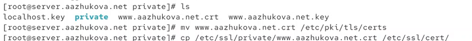
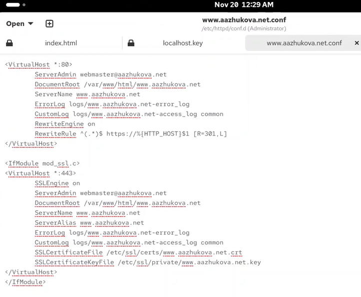
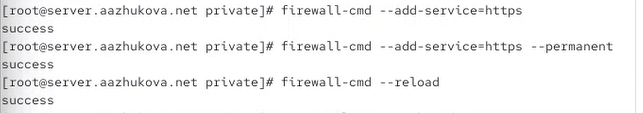
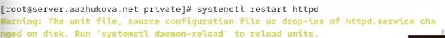
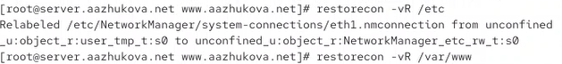
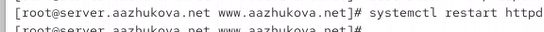

---
# Author
author:
  name: Жукова Арина Александровна
  degrees: студентка 3 курса
  orcid: 0000-0002-0877-7063
  email: 1132239120@rudn.ru
  affiliation:
    - name: Российский университет дружбы народов
      country: Российская Федерация
      postal-code: 117198
      city: Москва
      address: ул. Миклухо-Маклая, д. 6

# Title
title: "Лабораторная работа №5"
subtitle: "Расширенная настройка HTTP-сервера Apache"
license: CC BY
date: today
date-format: "YYYY-MM-DD"
---

# Цель работы

Приобретение практических навыков по расширенному конфигурированию HTTP-сервера Apache в части безопасности и возможности использования PHP.

# Задание

1. Сгенерировать криптографический ключ и самоподписанный сертификат безопасности для перехода веб-сервера с HTTP на HTTPS.
2. Настроить веб-сервер для работы с PHP.
3. Написать (скорректировать) скрипт для Vagrant, фиксирующий действия по расширенной настройке HTTP-сервера во внутреннем окружении виртуальной машины server.

# Выполнение лабораторной работы

## Конфигурирование HTTP-сервера для работы через HTTPS

1. Загружена операционная система, выполнен вход в виртуальную машину `server` и переход в режим суперпользователя.

{#fig-101 width=70%}

2. Созданы необходимые каталоги и символическая ссылка для хранения ключей и сертификатов.

```bash
mkdir -p /etc/pki/tls/private
ln -s /etc/pki/tls/private/ /etc/ssl/private
cd /etc/pki/tls/private
```

3. Сгенерирован самоподписанный сертификат и ключ с помощью `openssl`.

{#fig-102 width=70%}

4. Сертификат перемещён в каталог `/etc/pki/tls/certs`.

5. Изменён конфигурационный файл виртуального хоста `/etc/httpd/conf.d/www.aazhukova.net.conf` для поддержки HTTPS.

{#fig-103 width=70%}

**Пояснение конфигурационного файла:**
- Блок `<VirtualHost *:80>` обрабатывает HTTP-трафик и автоматически перенаправляет на HTTPS (код 301).
- Блок `<VirtualHost *:443>` настраивает HTTPS-соединение с указанием путей к сертификату и ключу.
- `SSLEngine on` включает поддержку SSL/TLS.
- `RewriteEngine on` и `RewriteRule` выполняют перенаправление с HTTP на HTTPS.

6. Настроен межсетевой экран для разрешения HTTPS-трафика.

{#fig-104 width=70%}

7. Перезапущен веб-сервер.

{#fig-105 width=70%}

8. Проверена работа HTTPS на виртуальной машине `client`. Сервер автоматически перенаправляет на защищённое соединение.

{#fig-106 width=70%}

9. Просмотрены детали самоподписанного сертификата.

{#fig-107 width=70%}

## Конфигурирование HTTP-сервера для работы с PHP

1. Установлены пакеты PHP.

{#fig-108 width=70%}

2. В каталоге `/var/www/html/www.aazhukova.net` файл `index.html` заменён на `index.php` с вызовом функции `phpinfo()`.

{#fig-109 width=70%}

3. Настроены права доступа и восстановлен контекст SELinux.

{#fig-110 width=70%}

{#fig-111 width=70%}

4. Перезапущен веб-сервер.

{#fig-112 width=70%}

5. Проверена работа PHP: в браузере отображается информация о версии PHP.

{#fig-113 width=70%}

## Внесение изменений в настройки внутреннего окружения виртуальной машины

1. Конфигурационные файлы и ключи скопированы в каталог проекта для использования в скрипте автоматизации.

2. Обновлён скрипт `http.sh`, добавлены установка PHP и настройка firewall для HTTPS.

{#fig-114 width=70%}

**Содержание скрипта `http.sh`:**

- Установка группы пакетов "Basic Web Server" и PHP.
- Копирование конфигурационных файлов Apache и веб-контента.
- Настройка прав доступа и контекста SELinux.
- Открытие портов для HTTP и HTTPS в firewall.
- Включение и запуск службы `httpd`.

# Выводы

В ходе лабораторной работы №5 были успешно выполнены следующие задачи:

1. **Настроен переход на HTTPS:**
   - Сгенерирован самоподписанный SSL-сертификат и ключ с использованием `openssl`.
   - Настроен виртуальный хост Apache для автоматического перенаправления HTTP-запросов на HTTPS (код 301).
   - В firewall добавлено разрешение для службы `https`.
   - Подтверждена работа защищённого соединения через браузер.

2. **Добавлена поддержка PHP:**
   - Установлен пакет `php` и необходимые модули.
   - Создан тестовый файл `index.php` с вызовом `phpinfo()`.
   - Настроены права доступа и контекст безопасности SELinux.
   - Подтверждена корректная обработка PHP-скриптов веб-сервером.

3. **Автоматизирована настройка:**
   - Обновлён скрипт `http.sh` для автоматической установки PHP и настройки HTTPS.
   - Скрипт теперь включает копирование SSL-сертификатов, настройку firewall и конфигурацию виртуальных хостов.

**Итог:** Получены практические навыки по настройке безопасного веб-сервера Apache с поддержкой HTTPS и PHP, а также по автоматизации процесса развёртывания с помощью скриптов.

# Ответы на контрольные вопросы

1. **В чём отличие HTTP от HTTPS?**
   - HTTP передаёт данные в открытом виде, HTTPS использует шифрование (SSL/TLS).
   - HTTPS обеспечивает конфиденциальность, целостность данных и аутентификацию сервера.
   - По умолчанию HTTP использует порт 80, HTTPS — порт 443.

2. **Каким образом обеспечивается безопасность контента веб-сервера при работе через HTTPS?**
   - За счёт шифрования данных с помощью симметричных и асимметричных алгоритмов.
   - Использование сертификатов для аутентификации сервера.
   - Обеспечение целостности данных с помощью кодов аутентичности (MAC).

3. **Что такое сертификационный центр (CA)? Приведите пример.**
   - Это организация, которая выпускает и подписывает цифровые сертификаты, подтверждая подлинность открытых ключей.
   - Примеры: Let's Encrypt, DigiCert, GlobalSign.
   - В работе использовался самоподписанный сертификат (без участия внешнего CA).
