---
# Author
author:
  name: Жукова Арина Александровна
  degrees: студентка 3 курса
  orcid: 0000-0002-0877-7063
  email: 1132239120@rudn.ru
  affiliation:
    - name: Российский университет дружбы народов
      country: Российская Федерация
      postal-code: 117198
      city: Москва
      address: ул. Миклухо-Маклая, д. 6

# Title
title: Лабораторная работа №6
subtitle: Установка и настройка системы управления базами данных MariaDB
license: CC BY
date: today
date-format: "YYYY-MM-DD"
---

# Информация

## Докладчик

:::::::::::::: {.columns align=center}
::: {.column width="70%"}

  * Жукова Арина Александровна
  * студентка 3 курса
  * направление: Прикладная информатика
  * Российский университет дружбы народов им. П. Лумумбы
  * [1132239120@rudn.ru](mailto:1132239120@rudn.ru)

:::
::: {.column width="30%"}


:::
::::::::::::::

# Вводная часть

## Актуальность

- MariaDB — одна из самых популярных систем управления базами данных с открытым исходным кодом
- Полная совместимость с MySQL делает её востребованной в веб-разработке
- Управление базами данных — ключевой навык для системных администраторов и разработчиков
- Автоматизация развёртывания БД повышает надёжность и воспроизводимость инфраструктуры

## Объект и предмет исследования

- **Объект**: Система управления базами данных MariaDB
- **Предмет**: Процесс установки, настройки и администрирования СУБД MariaDB

## Цели и задачи

**Цель**: Приобретение практических навыков по установке и конфигурированию системы управления базами данных на примере MariaDB.

**Задачи**:

1. Установить и настроить MariaDB с кодировкой UTF-8
2. Создать тестовую базу данных с таблицей и пользователем
3. Освоить работу с резервными копиями баз данных
4. Автоматизировать процесс развёртывания через скрипты Vagrant
5. Проверить работоспособность всех компонентов

## Материалы и методы

- Виртуальные машины (Server и Client) на Rocky Linux
- ПО: MariaDB Server 10.11.11, клиентские утилиты
- Язык запросов: SQL
- Инструменты администрирования: mysql, mysqlshow, mysqldump
- Система автоматизации: Vagrant с bash-скриптами

# Установка MariaDB

## Установка пакетов

:::::::::::::: {.columns}
::: {.column width="60%"}

{width=90%}

:::
::: {.column width="40%"}

- Установлены основные пакеты:
  - `mariadb` — клиентские утилиты
  - `mariadb-server` — сервер MariaDB
- Версия: 10.11.11-MariaDB
- Автоматическое разрешение зависимостей
- Установлены дополнительные модули

:::
::::::::::::::

## Архитектура конфигурации

:::::::::::::: {.columns}
::: {.column width="50%"}

**Основной файл конфигурации**
```conf
/etc/my.cnf:
[client-server]
!includedir /etc/my.cnf.d
```

- Модульная архитектура конфигурации
- Все настройки в отдельных файлах в `/etc/my.cnf.d/`
- Легкость управления и обновления

:::
::: {.column width="50%"}

**Ключевые конфигурационные файлы:**

- `mariadb-server.cnf` — настройки сервера
- `client.cnf` — настройки клиентов
- `mysql-clients.cnf` — настройки утилит
- `utf8.cnf` — настройки кодировки (создан)

:::
::::::::::::::

## Запуск и активация службы

:::::::::::::: {.columns}
::: {.column width="50%"}

{#fig-602 width=90%}

- Запуск службы: `systemctl start mariadb`
- Включение в автозагрузку: `systemctl enable mariadb`
- Создание системных символических ссылок

:::
::: {.column width="50%"}

**Проверка состояния**

{width=90%}

- Служба активна (running)
- PID процесса: 10528
- Использование памяти: 203.9M
- Время работы: 35 секунд

:::
::::::::::::::

## Настройка безопасности

:::::::::::::: {.columns}
::: {.column width="50%"}

{width=80%}

:::
::: {.column width="50%"}

- Запущен `mysql_secure_installation`
- Установлен пароль для root пользователя БД
- Удалён анонимный доступ
- Отключён удалённый root доступ
- Удалены тестовые базы данных

:::
::::::::::::::

# Настройка кодировки UTF-8

## Создание конфигурационного файла

:::::::::::::: {.columns}
::: {.column width="50%"}

{width=90%}

- Создание файла: `touch utf8.cnf`
- Расположение: `/etc/my.cnf.d/`
- Цель: установка UTF-8 как кодировки по умолчанию

:::
::: {.column width="50%"}

**Содержание файла**
{width=90%}

- Настройка для клиентов и сервера
- Поддержка кириллицы и Unicode

:::
::::::::::::::

## Применение настроек и проверка

:::::::::::::: {.columns}
::: {.column width="50%"}

**Перезапуск сервера**
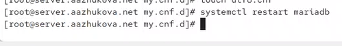{width=90%}

- Применение изменений: `systemctl restart mariadb`
- Проверка отсутствия ошибок

:::
::: {.column width="50%"}

**Проверка кодировки до настройки**
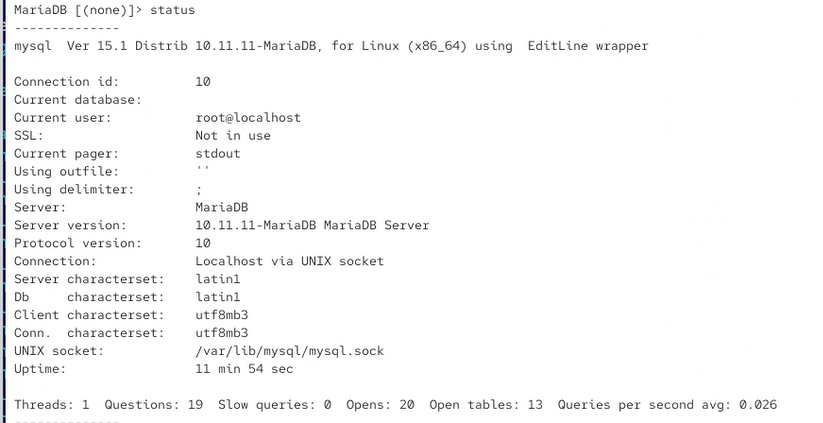{width=90%}

- Server characterset: `latin1`
- Db characterset: `latin1`
- Не поддерживает кириллицу корректно

:::
::::::::::::::

## Результат настройки кодировки

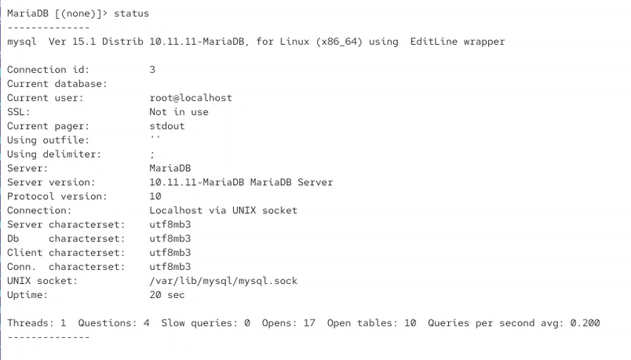{width=80%}

**Изменения после настройки:**

- Server characterset: `utf8mb3` 
- Db characterset: `utf8mb3` 
- Client characterset: `utf8mb3` 
- Полная поддержка кириллических символов
- Возможность хранения эмодзи и других Unicode-символов

# Создание базы данных

## Создание базы и таблицы

:::::::::::::: {.columns}
::: {.column width="50%"}

**Создание базы данных**
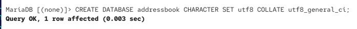{width=90%}

- Имя базы: `addressbook`
- Кодировка: UTF-8
- Сравнение: `utf8_general_ci`

:::
::: {.column width="50%"}

**Создание таблицы**
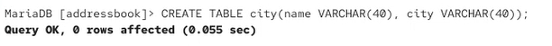{width=90%}

- Две колонки типа VARCHAR(40)
- Для хранения имени и города

:::
::::::::::::::

## Добавление тестовых данных

:::::::::::::: {.columns}
::: {.column width="50%"}

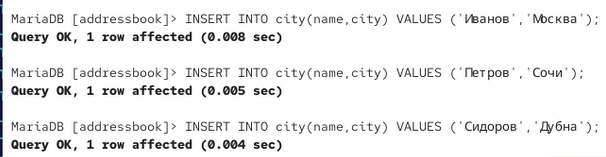{width=90%}

**SQL-запросы:**

- Три тестовые записи
- Проверка работы с кириллицей
- Подтверждение работы UTF-8

:::
::: {.column width="50%"}

**Проверка данных**
{width=90%}

- Успешное отображение кириллицы
- Все три записи корректно сохранены
- Подтверждение целостности данных

:::
::::::::::::::

## Управление пользователями

:::::::::::::: {.columns}
::: {.column width="50%"}

**Создание пользователя**
{width=90%}

- Имя пользователя: `aazhukova`
- Доступ с любого хоста: `%`
- Пароль: `123456`

:::
::: {.column width="50%"}

**Назначение прав**
{width=90%}

- Полные права на базу `addressbook`
- Возможность CRUD-операций
- Безопасное разграничение доступа

:::
::::::::::::::

## Проверка доступа

:::::::::::::: {.columns}
::: {.column width="50%"}

**Список всех баз данных**
{width=90%}


- Системные базы: `information_schema`, `mysql`, `performance_schema`, `sys`
- Созданная база: `addressbook`
- Всего 5 баз данных

:::
::: {.column width="50%"}

**Доступ пользователя aazhukova**
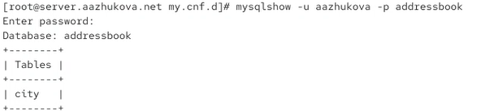{width=90%}

- Успешный доступ к базе `addressbook`
- Отображение таблицы `city`
- Подтверждение корректных прав доступа

:::
::::::::::::::

# Работа с резервными копиями

## Создание резервных копий

:::::::::::::: {.columns}
::: {.column width="50%"}

**Создание каталога для бэкапов**
{width=90%}

- Централизованное хранение резервных копий
- Структурированное управление бэкапами

:::
::: {.column width="50%"}

**SQL-дамп базы данных**
{width=90%}

- Полный дамп структуры и данных
- Текстовый формат SQL
- Возможность редактирования

:::
::::::::::::::

## Сжатые резервные копии

:::::::::::::: {.columns}
::: {.column width="50%"}

**Сжатый дамп (gzip)**
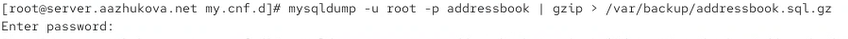{width=90%}

- Экономия места на диске
- Автоматическое сжатие потоком
- Быстрое создание и восстановление

:::
::: {.column width="50%"}

**Дамп с датой в имени**
{width=90%}

- Автоматическое именование по дате
- Ведение истории бэкапов
- Удобное восстановление на определённую дату

:::
::::::::::::::

## Восстановление из резервных копий

:::::::::::::: {.columns}
::: {.column width="50%"}

**Восстановление из SQL-дампа**
{width=90%}

- Полное восстановление структуры и данных
- Простая команда восстановления
- Проверка целостности бэкапа

:::
::: {.column width="50%"}

**Восстановление из сжатого дампа**
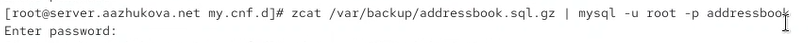{width=90%}

- Распаковка на лету
- Экономия времени и места
- Удобство работы с большими базами

:::
::::::::::::::

# Автоматизация развёртывания

## Подготовка конфигурации

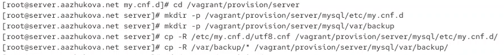{width=80%}

**Копирование конфигурационных файлов:**

- Сохранение настроек кодировки UTF-8
- Сохранение резервных копий базы данных
- Обеспечение воспроизводимости развёртывания

## Создание скрипта автоматизации

:::::::::::::: {.columns}
::: {.column width="50%"}

**Создание и настройка скрипта**
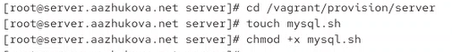{width=90%}

- Создание исполняемого файла
- Настройка прав доступа
- Подготовка к интеграции с Vagrant

:::
::: {.column width="50%"}

**Структура скрипта mysql.sh:**

1. Установка пакетов MariaDB
2. Копирование конфигурации
3. Запуск и настройка службы
4. Настройка безопасности
5. Создание базы данных
6. Восстановление из бэкапа

:::
::::::::::::::

## Интеграция с Vagrant

{width=80%}

- Автоматический запуск при развёртывании
- Сохранение порядка выполнения (после HTTP)
- Полная автоматизация процесса настройки
- Воспроизводимость окружения

# Результаты

## Достигнутые результаты

1. **Установка и настройка MariaDB**
   - Успешная установка MariaDB 10.11.11
   - Настройка кодировки UTF-8 для поддержки кириллицы
   - Базовая настройка безопасности через `mysql_secure_installation`

2. **Создание тестовой базы данных**
   - База данных `addressbook` с кодировкой UTF-8
   - Таблица `city` с тестовыми данными
   - Пользователь `aazhukova` с полными правами доступа

3. **Работа с резервными копиями**
   - Создание SQL-дампа базы данных
   - Сжатые резервные копии в формате gzip
   - Автоматическое именование бэкапов по дате
   - Успешное восстановление из резервных копий

4. **Автоматизация развёртывания**
   - Скрипт `mysql.sh` для автоматической настройки
   - Сохранение конфигурации в проекте Vagrant
   - Интеграция с системой управления виртуальными машинами
   - Полная воспроизводимость окружения

## Проверка работоспособности

- Успешный доступ к базе данных через клиентские утилиты
- Корректное отображение кириллических символов
- Работоспособность созданного пользователя
- Возможность создания и восстановления резервных копий
- Автоматическое применение конфигурации при перезапуске

# Выводы

## Основные выводы

1. **MariaDB как современная СУБД**
   - Легко устанавливается и настраивается в среде Rocky Linux
   - Полная совместимость с MySQL упрощает миграцию
   - Модульная архитектура конфигурации повышает гибкость

2. **Кодировка UTF-8 — обязательный стандарт**
   - Критически важна для поддержки кириллицы и Unicode
   - Простая настройка через конфигурационные файлы
   - Необходима проверка применения настроек

3. **Резервное копирование — критически важно**
   - Регулярные бэкапы защищают от потери данных
   - Сжатые копии экономят место на диске
   - Автоматическое именование упрощает управление историей

4. **Автоматизация — ключ к воспроизводимости**
   - Скрипты автоматизации экономят время
   - Обеспечивают консистентность окружений
   - Упрощают масштабирование и восстановление

## Практическая значимость

- Получены навыки администрирования промышленной СУБД
- Освоены ключевые операции: создание БД, управление пользователями, резервное копирование
- Приобретён опыт интеграции с системами автоматизации (Vagrant)
- Разработана система воспроизводимого развёртывания инфраструктуры
- Полученные знания применимы в реальных проектах веб-разработки и системного администрирования

