---
# Author
author:
  name: Жукова Арина Александровна
  degrees: студентка 3 курса
  orcid: 0000-0002-0877-7063
  email: 1132239120@rudn.ru
  affiliation:
    - name: Российский университет дружбы народов
      country: Российская Федерация
      postal-code: 117198
      city: Москва
      address: ул. Миклухо-Маклая, д. 6

# Title
title: "Лабораторная работа №6"
subtitle: "Установка и настройка системы управления базами данных MariaDB"
license: CC BY
date: today
date-format: "YYYY-MM-DD"
---

# Цель работы

Приобретение практических навыков по установке и конфигурированию системы управления базами данных на примере программного обеспечения MariaDB.

# Задание

1. Установить необходимые для работы MariaDB пакеты.
2. Настроить в качестве кодировки символов по умолчанию utf8 в базах данных.
3. В базе данных MariaDB создать тестовую базу addressbook, содержащую таблицу city с полями name и city.
4. Создать резервную копию базы данных addressbook и восстановить из неё данные.
5. Написать скрипт для Vagrant, фиксирующий действия по установке и настройке базы данных MariaDB во внутреннем окружении виртуальной машины server.

# Выполнение лабораторной работы

## Установка MariaDB

1. Загружена операционная система, выполнен вход в виртуальную машину `server` и переход в режим суперпользователя.

2. Установлены необходимые пакеты MariaDB.

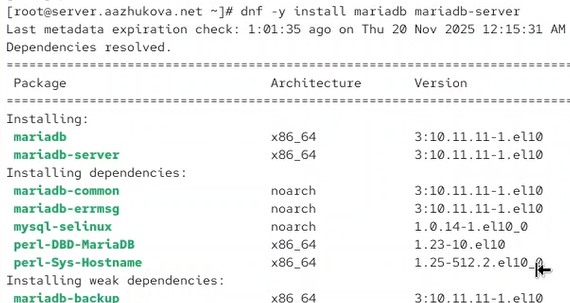{#fig-601 width=70%}

3. Просмотрены конфигурационные файлы MariaDB в каталоге `/etc/my.cnf.d` и файле `/etc/my.cnf`.

**Файл /etc/my.cnf:**
 conf
 Основной конфигурационный файл MariaDB
 Секция client-server содержит настройки для клиента и сервера
[client-server]

 Директива includedir подключает все файлы из каталога /etc/my.cnf.d
includedir /etc/my.cnf.d
 
*Пояснение:* Главный конфигурационный файл только подключает дополнительные файлы из каталога `/etc/my.cnf.d`.

**Файлы в /etc/my.cnf.d:**

**auth_gssapi.cnf:**
 conf
[mariadb]
#plugin-load-add=auth_gssapi.so
 
*Пояснение:* Конфигурация для аутентификации GSSAPI (закомментирована).

**client.cnf:**
 conf
[client]
 Общие настройки для всех клиентов MariaDB

[client-mariadb]
 Специфичные настройки только для клиентов MariaDB
 
*Пояснение:* Настройки клиентской части, включая специфичные для MariaDB параметры.

**mariadb-server.cnf:**
 conf
[server]
[mysqld]
datadir=/var/lib/mysql            Каталог с файлами БД
socket=/var/lib/mysql/mysql.sock  Сокет-файл для локальных подключений
log-error=/var/log/mariadb/mariadb.log  Файл журнала ошибок
pid-file=/run/mariadb/mariadb.pid  Файл с PID процесса

[galera]
 Настройки кластеризации Galera (закомментированы)

[embedded]
 Настройки для встроенного сервера

[mariadb]
 Специфичные настройки только для MariaDB
 
*Пояснение:* Основной конфигурационный файл сервера с путями к данным, логам и настройками кластеризации.

**mysql-clients.cnf:**
 conf
 Настройки для отдельных клиентских утилит
[mysql]
[mysql_upgrade]
[mysqladmin]
[mysqlbinlog]
[mysqlcheck]
[mysqldump]
[mysqlimport]
[mysqlshow]
[mysqlslap]
 
*Пояснение:* Индивидуальные настройки для различных клиентских утилит.

**Файлы провайдеров сжатия:**
- `provider_bzip2.cnf`, `provider_lz4.cnf`, `provider_lzo.cnf`, `provider_snappy.cnf` — настройки плагинов сжатия
- `spider.cnf` — настройки шардинга через плагин Spider (закомментирован)
- `enable_encryption.preset` — пресет для включения шифрования данных

4. Запущена и включена служба MariaDB.

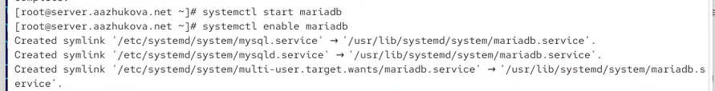{#fig-602 width=70%}

5. Проверено состояние службы MariaDB.

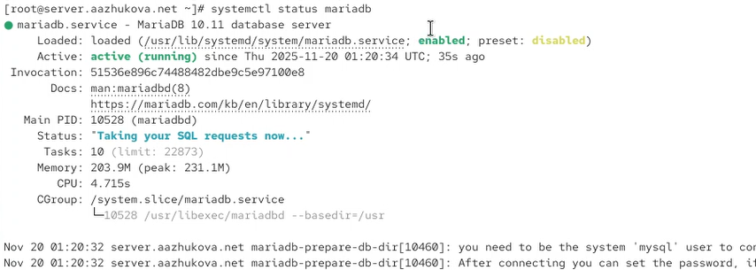{#fig-603 width=70%}

6. Выполнен скрипт настройки безопасности `mysql_secure_installation`.

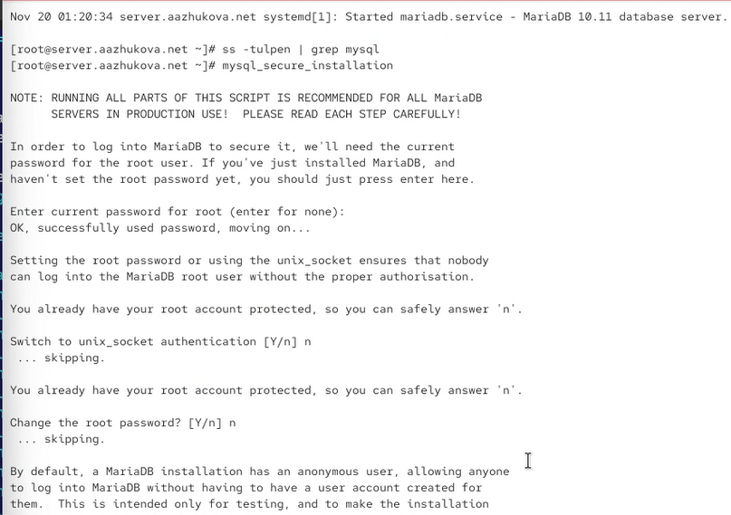{#fig-604 width=70%}

7. Вход в MariaDB с правами администратора.

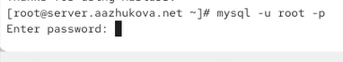{#fig-605 width=70%}

8. Просмотрены доступные команды в оболочке MariaDB.

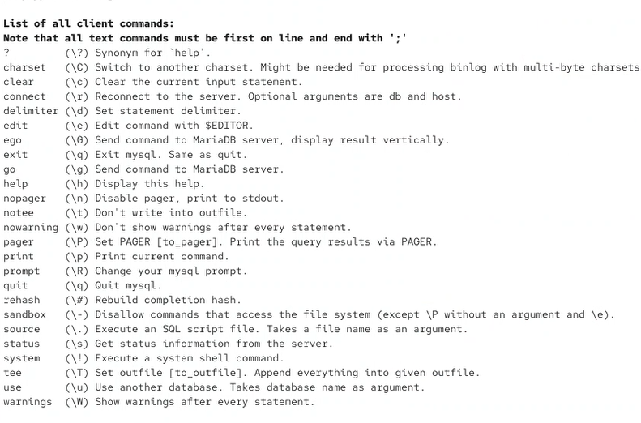{#fig-606 width=70%}

9. Просмотрены доступные базы данных.

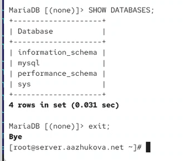{#fig-607 width=70%}

## Конфигурация кодировки символов

1. Создан файл `/etc/my.cnf.d/utf8.cnf`:

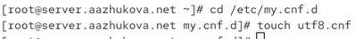{#fig-608 width=70%}

2. Содержание файла `utf8.cnf`:

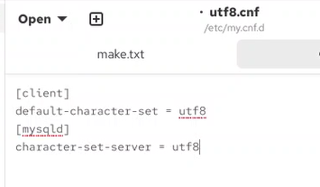{#fig-609 width=70%}

3. Перезапущен сервер MariaDB.

{#fig-610 width=70%}

4. Проверен статус MariaDB после настройки кодировки.

{#fig-611 width=70%}

*Результат:* Server characterset и Db characterset изменились с `latin1` на `utf8mb3`.

## Создание базы данных

1. Создана база данных `addressbook`:

{#fig-612 width=70%}

2. Переход к базе данных `addressbook`:

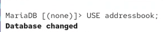{#fig-613 width=70%}

3. Проверены таблицы в базе данных (пусто):

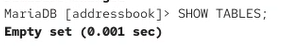{#fig-614 width=70%}

4. Создана таблица `city`:

{#fig-615 width=70%}

5. Добавлены тестовые данные:

{#fig-616 width=70%}

6. Проверены добавленные данные:

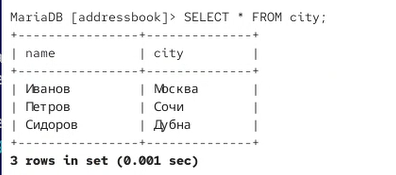{#fig-617 width=70%}

7. Создан пользователь `aazhukova` для работы с базой данных:

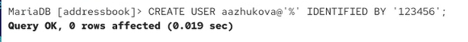{#fig-618 width=70%}

8. Предоставлены права доступа пользователю:

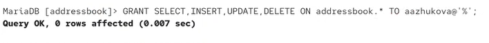{#fig-619 width=70%}

9. Выход из MariaDB и проверка доступности базы:

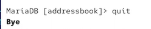{#fig-620 width=70%}

10. Просмотр списка всех баз данных:

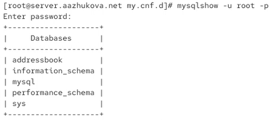{#fig-621 width=70%}

11. Проверка доступа к базе `addressbook` от имени пользователя `aazhukova`:

{#fig-622 width=70%}

## Резервные копии

1. Создан каталог для резервных копий:

{#fig-623 width=70%}

2. Создана резервная копия базы данных в формате SQL:

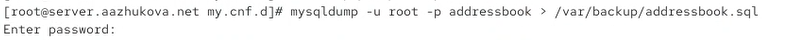{#fig-624 width=70%}

3. Создана сжатая резервная копия в формате gzip:

{#fig-625 width=70%}

4. Создана сжатая копия с указанием даты в имени файла:

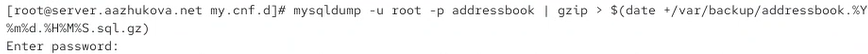{#fig-626 width=70%}

5. Восстановлена база данных из резервной копии:

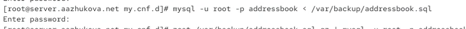{#fig-627 width=70%}

## Внесение изменений в настройки внутреннего окружения

1. Создана структура каталогов для хранения конфигурации в проекте Vagrant:

{#fig-628 width=70%}

2. Создан скрипт автоматизации `mysql.sh`:

{#fig-629 width=70%}

3. Содержание скрипта автоматизации:

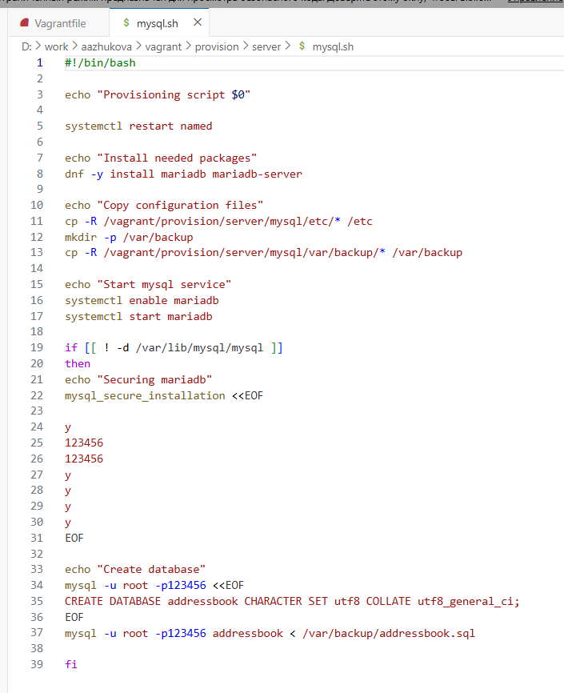{#fig-629 width=70%}

4. Добавлен вызов скрипта в Vagrantfile:

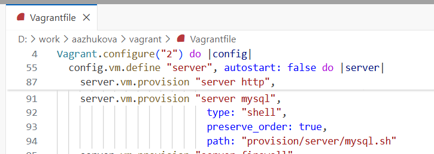{#fig-630 width=70%}

# Выводы

В ходе лабораторной работы №6 были успешно выполнены следующие задачи:

1. **Установка MariaDB:**
   - Установлены пакеты `mariadb` и `mariadb-server` версии 10.11.11.
   - Изучены конфигурационные файлы MariaDB, расположенные в `/etc/my.cnf` и `/etc/my.cnf.d/`.
   - Запущена и включена в автозагрузку служба MariaDB.
   - Выполнена базовая настройка безопасности через `mysql_secure_installation`.

2. **Настройка кодировки UTF-8:**
   - Создан конфигурационный файл `utf8.cnf` для установки UTF-8 как кодировки по умолчанию.
   - Подтверждено применение настроек: Server characterset изменился с `latin1` на `utf8mb3`.
   - Обеспечена корректная работа с кириллическими символами.

3. **Создание тестовой базы данных:**
   - Создана база данных `addressbook` с кодировкой UTF-8 и сравнением `utf8_general_ci`.
   - Создана таблица `city` с полями `name` VARCHAR(40) и `city` VARCHAR(40).
   - Добавлены тестовые данные: три записи о сотрудниках и их городах (Иванов/Москва, Петров/Сочи, Сидоров/Дубна).
   - Создан пользователь `aazhukova` с полными правами на базу данных (SELECT, INSERT, UPDATE, DELETE).

4. **Работа с резервными копиями:**
   - Создан каталог `/var/backup` для хранения резервных копий.
   - Выполнен дамп базы данных в формате SQL командой `mysqldump`.
   - Созданы сжатые резервные копии в формате gzip.
   - Реализовано создание резервных копий с указанием даты в имени файла.
   - Проверено восстановление базы данных из резервных копий.

5. **Автоматизация развёртывания:**
   - Создан скрипт `mysql.sh` для автоматической установки и настройки MariaDB.
   - Скрипт включает: установку пакетов, копирование конфигурации, настройку безопасности, создание базы данных.
   - Интеграция скрипта в Vagrantfile обеспечивает автоматическое выполнение при развёртывании виртуальной машины.
   - Реализована проверка существования базы данных для предотвращения повторной инициализации.

**Итог:** Получены практические навыки установки, настройки и администрирования СУБД MariaDB в среде Rocky Linux. Освоены ключевые операции: создание баз данных и таблиц, управление пользователями и правами доступа, работа с резервными копиями, конфигурирование параметров сервера. Разработана система автоматизированного развёртывания с использованием Vagrant, что обеспечивает воспроизводимость и консистентность окружения.

 Ответы на контрольные вопросы

1. **Какая команда отвечает за настройки безопасности в MariaDB?**
   - `mysql_secure_installation` — интерактивный скрипт для базовой настройки безопасности.

2. **Как настроить MariaDB для доступа через сеть?**
   - В файле `/etc/my.cnf.d/mariadb-server.cnf` раскомментировать строку `bind-address=0.0.0.0`.
   - Настроить права доступа для пользователей с хоста `%` (например: `CREATE USER 'user'@'%'`).
   - Открыть порт 3306 в firewall: `firewall-cmd --add-service=mysql --permanent`.

3. **Какая команда позволяет получить обзор доступных баз данных после входа в среду оболочки MariaDB?**
   - `SHOW DATABASES;` — отображает список всех баз данных.

4. **Какая команда позволяет узнать, какие таблицы доступны в базе данных?**
   - Внутри базы данных: `SHOW TABLES;`
   - Из командной строки: mysqlshow -u пользователь -p имя_базы

5. **Какая команда позволяет узнать, какие поля доступны в таблице?**
   - DESCRIBE имя_таблицы; или SHOW COLUMNS FROM имя_таблицы;

6. **Какая команда позволяет узнать, какие записи доступны в таблице?**
   - SELECT * FROM имя_таблицы; — выборка всех записей.

7. **Как удалить запись из таблицы?**
   - sDELETE FROM имя_таблицы WHERE условие;
   - Пример: DELETE FROM city WHERE name = 'Иванов';

8. **Где расположены файлы конфигурации MariaDB? Что можно настроить с их помощью?**
   - Основной файл: `/etc/my.cnf`
   - Дополнительные файлы: `/etc/my.cnf.d/*.cnf`
   - Можно настроить: пути к данным (`datadir`), сокет-файл, логи, кодировку, параметры производительности, безопасность, сетевые настройки, плагины.

9. **Где располагаются файлы с базами данных MariaDB?**
   - По умолчанию: `/var/lib/mysql/`
   - Каждая база данных — отдельный подкаталог в этой директории.

10. **Как сделать резервную копию базы данных и затем её восстановить?**
    - Резервная копия: mysqldump -u пользователь -p имя_базы > файл.sql
    - Сжатая копия: mysqldump -u пользователь -p имя_базы | gzip > файл.sql.gz
    - Восстановление: mysql -u пользователь -p имя_базы < файл.sql
    - Восстановление из сжатой копии: zcat файл.sql.gz | mysql -u пользователь -p имя_базы
