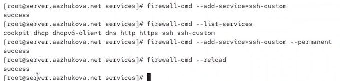
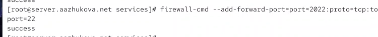
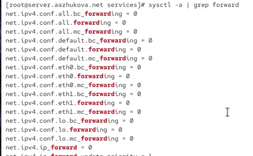
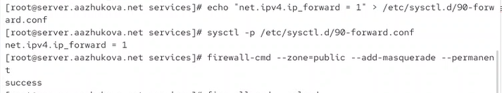
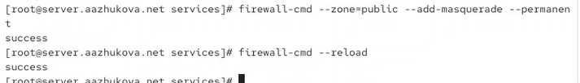
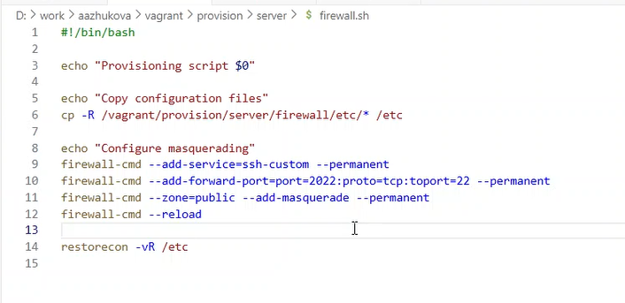
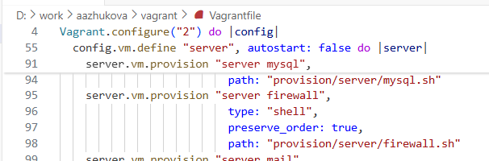

---
# Author
author:
  name: Жукова Арина Александровна
  degrees: студентка 3 курса
  orcid: 0000-0002-0877-7063
  email: 1132239120@rudn.ru
  affiliation:
    - name: Российский университет дружбы народов
      country: Российская Федерация
      postal-code: 117198
      city: Москва
      address: ул. Миклухо-Маклая, д. 6

# Title
title: Лабораторная работа №7
subtitle: Расширенные настройки межсетевого экрана
license: CC BY
date: today
date-format: "YYYY-MM-DD"
---

# Информация

## Докладчик

:::::::::::::: {.columns align=center}
::: {.column width="70%"}

  * Жукова Арина Александровна
  * студентка 3 курса
  * направление: Прикладная информатика
  * Российский университет дружбы народов им. П. Лумумбы
  * [1132239120@rudn.ru](mailto:1132239120@rudn.ru)

:::
::: {.column width="30%"}

:::
::::::::::::::

# Вводная часть

## Актуальность

- Безопасность сетевого взаимодействия — ключевой аспект системного администрирования
- Firewalld — стандартный межсетевой экран в современных дистрибутивах Linux
- Маскарадинг и переадресация портов — базовые механизмы для маршрутизации и доступа к службам
- Навыки настройки firewall необходимы для обеспечения безопасности и функциональности сетевых сервисов

## Объект и предмет исследования

- **Объект**: Межсетевой экран firewalld в Rocky Linux
- **Предмет**: Механизмы переадресации портов (Port Forwarding), маскарадинга (Masquerading) и настройки пользовательских служб

## Цели и задачи

**Цель**: Получить навыки настройки межсетевого экрана в Linux в части переадресации портов и настройки Masquerading.

**Задачи**:

1. Настроить пользовательскую службу SSH на порту 2022
2. Реализовать переадресацию портов (Port Forwarding)
3. Включить маскарадинг для доступа клиентов в Интернет
4. Автоматизировать настройку через Vagrant

## Материалы и методы

- Виртуальные машины (Server и Client) на Rocky Linux
- ПО: firewalld, sysctl, SSH, Vagrant
- Инструменты: firewall-cmd, системные утилиты Linux
- Методология: Практическая настройка сетевых правил и их автоматизация

# Создание пользовательской службы SSH

## Копирование шаблона службы

{width=80%}

- Копирование стандартного файла службы SSH
- Создание пользовательской службы `ssh-custom.xml`
- Размещение в каталоге `/etc/firewalld/services/`

## Редактирование конфигурации службы

:::::::::::::: {.columns}
::: {.column width="50%"}

{width=80%}

:::
::: {.column width="50%"}

- Изменение порта с 22 на 2022
- Добавление пользовательского описания
- Использование стандартного синтаксиса XML для служб firewalld

:::
::::::::::::::

## Активация службы в firewalld

{width=80%}

- Перезагрузка правил: `firewall-cmd --reload`
- Добавление службы: `firewall-cmd --add-service=ssh-custom`
- Постоянная активация: `firewall-cmd --add-service=ssh-custom --permanent`
- Проверка: `firewall-cmd --list-services`

# Настройка переадресации портов

## Добавление правила переадресации

{width=80%}

- Команда: `firewall-cmd --add-forward-port=port=2022:proto=tcp:toport=22`
- Логика: Перенаправление трафика с внешнего порта 2022 на внутренний порт 22
- Результат: SSH становится доступен через порт 2022

## Механизм работы

:::::::::::::: {.columns}
::: {.column width="50%"}

**До настройки:**
- Клиент → порт 22 → SSH сервер
- Стандартный доступ

:::
::: {.column width="50%"}

**После настройки:**
- Клиент → порт **2022** → Firewall → порт 22 → SSH сервер
- Дополнительный уровень абстракции

:::
::::::::::::::

## Практическое применение

- Повышение безопасности (нестандартный порт)
- Обход ограничений на использование порта 22
- Организация доступа через разные порты для разных пользователей

# Настройка IP-форвардинга и маскарадинга

## Проверка текущих настроек

{width=80%}

- Команда: `sysctl -a | grep forward`
- Результат: `net.ipv4.ip_forward = 0` (отключено)
- Анализ всех сетевых интерфейсов (eth0, eth1, lo)

## Включение IP-форвардинга

{width=80%}

- Создание конфигурационного файла: `/etc/sysctl.d/90-forward.conf`
- Содержимое: `net.ipv4.ip_forward = 1`
- Применение: `sysctl -p /etc/sysctl.d/90-forward.conf`
- Проверка: `sysctl net.ipv4.ip_forward`

## Настройка маскарадинга

{width=80%}

- Команда: `firewall-cmd --zone=public --add-masquerade --permanent`
- Перезагрузка правил: `firewall-cmd --reload`
- Результат: Активация NAT для всей зоны public

## Теоретическая основа

**Маскарадинг (Masquerading) vs NAT:**

:::::::::::::: {.columns}
::: {.column width="50%"}

**NAT:**
- Общий механизм преобразования адресов
- Может быть статическим или динамическим
- Принципы: 1:1, 1:N, N:1

:::
::: {.column width="50%"}

**Маскарадинг:**
- Частный случай NAT
- N:1 преобразование
- Использование портов для различения соединений
- Динамическая подстановка адреса интерфейса

:::
::::::::::::::

# Автоматизация настройки

## Структурирование конфигурационных файлов

{width=80%}

- Создание каталогов для хранения конфигурации:
  - `/vagrant/provision/server/firewall/etc/firewalld/services/`
  - `/vagrant/provision/server/firewall/etc/sysctl.d/`
- Копирование созданных файлов конфигурации

## Разработка скрипта автоматизации

{width=80%}

## Интеграция с Vagrant

{width=80%}

- Добавление в Vagrantfile:

- Автоматический запуск при provision виртуальной машины
- Сохранение порядка выполнения скриптов

# Результаты

## Достигнутые результаты

1. **Пользовательская служба SSH:**
   - Создана служба `ssh-custom` на порту 2022
   - Корректно интегрирована в firewalld
   - Проверена активация через `firewall-cmd --list-services`

2. **Переадресация портов:**
   - Настроено перенаправление порта 2022 → 22
   - Реализован доступ к SSH через нестандартный порт
   - Проверена работоспособность подключения

3. **Маскарадинг и IP-форвардинг:**
   - Активирована переадресация IP-пакетов
   - Включен маскарадинг в зоне public
   - Обеспечена возможность NAT для клиентов

4. **Автоматизация:**
   - Создана воспроизводимая конфигурация
   - Разработан скрипт автоматической настройки
   - Интегрировано с системой управления виртуальными машинами

## Верификация работы

:::::::::::::: {.columns}
::: {.column width="50%"}

**Проверка служб:**
{width=90%}

- `ssh-custom` в списке активных служб
- Корректное отображение через firewall-cmd

:::
::: {.column width="50%"}

**Проверка IP-форвардинга:**
- До: `net.ipv4.ip_forward = 0`
- После: `net.ipv4.ip_forward = 1`
- Успешное применение через sysctl

:::
::::::::::::::

# Выводы

## Основные выводы

1. **Практическое освоение firewalld:**
   - Получены навыки работы с пользовательскими службами
   - Освоено управление зонами и правилами межсетевого экрана
   - Изучен синтаксис XML-файлов служб firewalld

2. **Реализация сетевых механизмов:**
   - Успешно настроена переадресация портов (Port Forwarding)
   - Активирован маскарадинг для организации NAT
   - Включена переадресация IP-пакетов на уровне ядра

3. **Автоматизация процессов:**
   - Разработан скрипт для воспроизведения конфигурации
   - Интегрирована настройка в процесс provisioning Vagrant
   - Обеспечена воспроизводимость и консистентность развертывания

4. **Понимание сетевых концепций:**
   - Усвоены различия между NAT и маскарадингом
   - Понят принцип работы переадресации портов
   - Освоено взаимодействие между различными компонентами сетевой подсистемы

## Практическая значимость

- Навыки настройки межсетевого экрана востребованы в системном администрировании
- Возможность организации безопасного доступа к службам через нестандартные порты
- Умение настраивать маскарадинг необходимо для развертывания шлюзов и маршрутизаторов
- Автоматизация процесса настройки упрощает масштабирование и управление инфраструктурой
- Полученный опыт может быть применен в реальных сценариях развертывания серверов и сетевого оборудования
