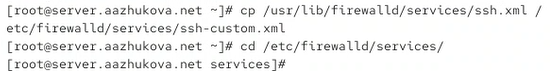
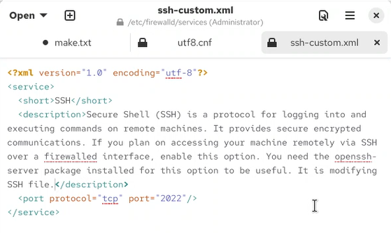
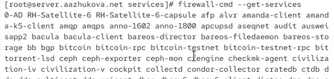
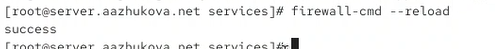
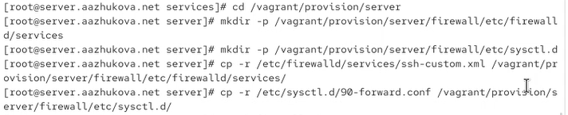
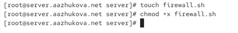

---
# Author
author:
  name: Жукова Арина Александровна
  degrees: Студент 3 курса
  orcid: 0000-0002-0877-7063
  email: 1132239120@rudn.ru
  affiliation:
    - name: Российский университет дружбы народов
      country: Российская Федерация
      postal-code: 117198
      city: Москва
      address: ул. Миклухо-Маклая, д. 6

# Title
title: "Лабораторная работа №7"
subtitle: "Расширенные настройки межсетевого экрана"
license: "CC BY"

---

# Цель работы

Получить навыки настройки межсетевого экрана в Linux в части переадресации портов и настройки Masquerading.

# Задание

1. Настроить межсетевой экран виртуальной машины server для доступа к серверу по протоколу SSH не через 22-й порт, а через порт 2022.
2. Настроить Port Forwarding на виртуальной машине server.
3. Настроить маскарадинг на виртуальной машине server для организации доступа клиента к сети Интернет.
4. Написать скрипт для Vagrant, фиксирующий действия по расширенной настройке межсетевого экрана, и внести изменения в Vagrantfile.

# Выполнение лабораторной работы

## Создание пользовательской службы firewalld

1. На виртуальной машине server создан пользовательский файл службы SSH на основе стандартного шаблона:

   {#fig-001 width=70%}

2. Содержимое файла `ssh-custom.xml` после редактирования:

   {#fig-002 width=70%}

   *Пояснение:* В файле службы:
   - `<short>` — краткое имя службы.
   - `<description>` — описание службы.
   - `<port protocol="tcp" port="2022"/>` — указание протокола и порта, который будет использоваться.

3. Просмотр списка доступных служб firewalld:

Новая служба `ssh-custom` пока не отображается в списке.

   {#fig-003 width=70%}

4. После перезагрузки правил межсетевого экрана служба `ssh-custom` появляется в списке.

   {#fig-004 width=70%}

5. Добавление новой службы в firewalld и её активация, а также включение службы на постоянной основе:

   {#fig-005 width=70%}

   Служба успешно добавлена и отображается в списке активных служб.

## Настройка переадресации портов

1. Организована переадресация с порта 2022 на порт 22:

   {#fig-006 width=70%}

   *Пояснение:* Теперь SSH-запросы, приходящие на порт 2022, будут перенаправляться на внутренний порт 22.

## Настройка Port Forwarding и Masquerading

1. Проверка активации перенаправления IPv4-пакетов:

   {#fig-007 width=70%}

   Параметр `net.ipv4.ip_forward` установлен в 0 (отключено).

2. Включение IP-форвардинга:

   {#fig-008 width=70%}

   Параметр `net.ipv4.ip_forward` изменён на 1.

3. Включение маскарадинга в зоне public:

   {#fig-009 width=70%}

## Внесение изменений в настройки внутреннего окружения виртуальной машины

1. Создание структуры каталогов для хранения конфигурационных файлов:

2. Копирование конфигурационных файлов:

   {#fig-019 width=70%}

3. Создание скрипта автоматизации настройки `firewall.sh`:

   {#fig-011 width=70%}

4. Содержание скрипта `firewall.sh`:

   {#fig-012 width=70%}

5. Добавление вызова скрипта в Vagrantfile:

   {#fig-013 width=70%}

# Выводы

В результате выполнения лабораторной работы:

1. Создана пользовательская служба `ssh-custom` в firewalld, изменяющая порт SSH с 22 на 2022. XML-файл службы размещён в `/etc/firewalld/services/` и корректно загружен.

2. Настроена переадресация портов (Port Forwarding) с порта 2022 на порт 22 с использованием команды `firewall-cmd --add-forward-port`.

3. Активирован IP-форвардинг на уровне ядра через параметр `net.ipv4.ip_forward = 1` в файле `/etc/sysctl.d/90-forward.conf`.

4. Включен маскарадинг (Masquerading) в зоне public для обеспечения трансляции сетевых адресов (NAT), что позволяет организовать доступ клиентов к внешним сетям через сервер.

5. Автоматизирована настройка межсетевого экрана:
   - Создан скрипт `firewall.sh`, который копирует конфигурационные файлы, применяет настройки служб, переадресации портов и маскарадинга, а также восстанавливает контекст безопасности SELinux.
   - Скрипт интегрирован в Vagrantfile для автоматического выполнения при provision виртуальной машины server.

Получены практические навыки настройки межсетевого экрана firewalld, работы с пользовательскими службами, переадресацией портов, маскарадингом и автоматизацией развёртывания конфигурации в среде Rocky Linux с использованием Vagrant.

# Контрольные вопросы

1. **Где хранятся пользовательские файлы firewalld?**  
   Пользовательские файлы firewalld хранятся в каталоге `/etc/firewalld/`. Например, пользовательские службы — в `/etc/firewalld/services/`.

2. **Какую строку надо включить в пользовательский файл службы, чтобы указать порт TCP 2022?**  
   `<port protocol="tcp" port="2022"/>`

3. **Какая команда позволяет вам перечислить все службы, доступные в настоящее время на вашем сервере?**  
   `firewall-cmd --get-services`

4. **В чем разница между трансляцией сетевых адресов (NAT) и маскарадингом (masquerading)?**  
   NAT — это общий механизм преобразования IP-адресов. Маскарадинг — это частный случай NAT, при котором внутренние адреса преобразуются в один внешний IP-адрес маршрутизатора с использованием динамического сопоставления портов. Маскарадинг обычно используется для доступа множества внутренних хостов в Интернет через один публичный адрес.

5. **Какая команда разрешает входящий трафик на порт 4404 и перенаправляет его в службу ssh по IP-адресу 10.0.0.10?**  
   `firewall-cmd --add-forward-port=port=4404:proto=tcp:toaddr=10.0.0.10:toport=22`

6. **Какая команда используется для включения маскарадинга IP-пакетов для всех пакетов, выходящих в зону public?**  
   `firewall-cmd --zone=public --add-masquerade --permanent`
