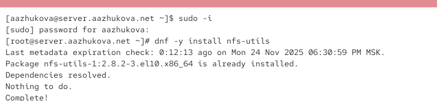
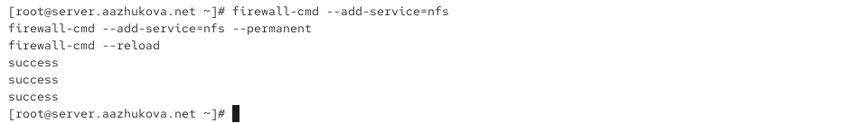
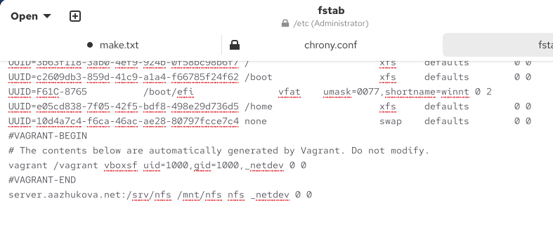
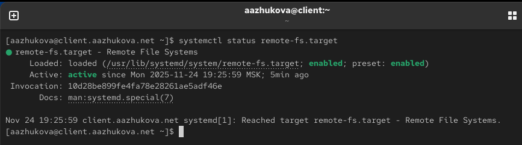
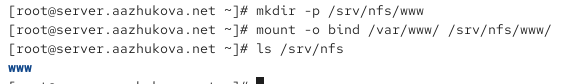
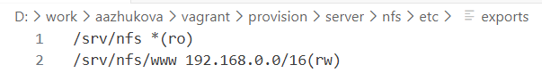
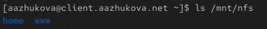

---
## Author
author:
  name: Жукова Арина Александровна
  degrees: Студентка 3 курса
  orcid: 0000-0002-0877-7063
  email: 1132239120@rudn.ru
  affiliation:
    - name: Российский университет дружбы народов
      country: Российская Федерация
      postal-code: 117198
      city: Москва
      address: ул. Миклухо-Маклая, д. 6
## Title
title: Лабораторная работа №13
subtitle: Настройка NFS
license: CC BY
date: today
date-format: "YYYY-MM-DD"
---

# Информация

## Докладчик

:::::::::::::: {.columns align=center}
::: {.column width="70%"}

  * Жукова Арина Александровна
  * Студентка 3 курса
  * Российский университет дружбы народов им. П. Лумумбы
  * 1132239120@rudn.ru

:::
::: {.column width="30%"}

:::
::::::::::::::

# Вводная часть

## Цель и задачи

**Цель:** Приобретение навыков настройки сервера NFS для удалённого доступа к ресурсам

**Задачи:**

- Установить и настроить сервер NFSv4

- Подмонтировать удалённый ресурс на клиенте  

- Подключить каталоги веб-сервера и пользователей к дереву NFS

- Автоматизировать процесс развёртывания через Vagrant

# Выполнение работы

## Настройка сервера NFS

:::::::::::::: {.columns align=center}
::: {.column width="50%"}

**Основные этапы:**

- Установка nfs-utils

- Создание корневого каталога

- Настройка экспорта

- Конфигурация безопасности

:::
::: {.column width="50%"}

{width=90%}

:::
::::::::::::::

## Конфигурация экспорта и безопасности

:::::::::::::: {.columns align=center}
::: {.column width="50%"}

{width=90%}

:::
::: {.column width="50%"}

{width=90%}

:::
::::::::::::::

## Настройка сетевой безопасности

:::::::::::::: {.columns align=center}
::: {.column width="50%"}

{width=90%}

:::
::: {.column width="50%"}

{width=90%}

:::
::::::::::::::

## Настройка клиента

:::::::::::::: {.columns align=center}
::: {.column width="50%"}

**Действия на клиенте:**

- Установка nfs-utils

- Проверка доступности ресурсов

- Монтирование NFS

- Настройка автоматического монтирования

:::
::: {.column width="50%"}

{width=90%}

:::
::::::::::::::

## Монтирование и проверка

:::::::::::::: {.columns align=center}
::: {.column width="50%"}

{width=90%}

:::
::: {.column width="50%"}

{width=90%}

:::
::::::::::::::

## Автоматическое монтирование

:::::::::::::: {.columns align=center}
::: {.column width="50%"}

{width=90%}

:::
::: {.column width="50%"}

{width=90%}

:::
::::::::::::::

## Интеграция веб-сервера

:::::::::::::: {.columns align=center}
::: {.column width="50%"}

{width=90%}

:::
::: {.column width="50%"}

{width=90%}

:::
::::::::::::::

## Пользовательские каталоги

:::::::::::::: {.columns align=center}
::: {.column width="50%"}

{width=90%}

:::
::: {.column width="50%"}

{width=90%}

:::
::::::::::::::

## Автоматизация с Vagrant

:::::::::::::: {.columns align=center}
::: {.column width="50%"}

{width=90%}

:::
::: {.column width="50%"}

{width=90%}

:::
::::::::::::::

# Результаты

## Достигнутые результаты

**Успешно выполнено:**

- Настроен сервер NFSv4 с экспортом ресурсов

- Обеспечен удалённый доступ с клиентской машины

- Интегрированы каталоги веб-сервера и пользователей

- Решены проблемы сетевой безопасности

- Автоматизирован процесс развёртывания

## Ключевые показатели

::: incremental

- **Доступность**: Сервер NFS успешно экспортирует ресурсы

- **Безопасность**: Настроены правила firewall и SELinux

- **Автоматизация**: Реализовано автоматическое монтирование

- **Интеграция**: Веб-сервер и пользовательские каталоги подключены к NFS

- **Воспроизводимость**: Созданы скрипты для Vagrant

:::

# Выводы

## Итоги работы

::: incremental

- Освоены практические навыки настройки NFSv4

- Изучены принципы работы сетевых файловых систем

- Приобретён опыт решения типичных проблем доступа

- Реализована интеграция NFS с существующими сервисами

- Создана автоматизированная система развёртывания

:::

## Практическая значимость

**Полученные компетенции:**

- Настройка сервера NFS

- Управление сетевыми ресурсами

- Работа с сетевыми протоколами

- Автоматизация развёртывания

- Решение проблем безопасности

## Благодарности

:::::::::::::: {.columns align=center}
::: {.column width="70%"}

**Благодарю за внимание!**

**Контакты:**

- 1132239120@rudn.ru

:::
::: {.column width="30%"}

:::
::::::::::::::

