---
## Author
author:
  name: Жукова Арина Александровна
  degrees: 3rd year student
  orcid: 0000-0002-0877-7063
  email: 1132239120@rudn.ru
  affiliation:
    - name: Российский университет дружбы народов
      country: Российская Федерация
      postal-code: 117198
      city: Москва
      address: ул. Миклухо-Маклая, д. 6

## Title
title: "Лабораторная работа №13"
subtitle: "Настройка NFS"
license: "CC BY"
---

# Цель работы

Приобретение навыков настройки сервера NFS для удалённого доступа к ресурсам.

# Задание

1. Установить и настроить сервер NFSv4.
2. Подмонтировать удалённый ресурс на клиенте.
3. Подключить каталог с контентом веб-сервера к дереву NFS.
4. Подключить каталог для удалённой работы пользователя к дереву NFS.
5. Написать скрипты для Vagrant, фиксирующие действия по установке и настройке сервера NFSv4.

# Теоретическое введение

NFS (Network File System) — это протокол сетевого доступа к файловым системам, позволяющий монтировать удалённые файловые системы через сеть. Работает по клиент-серверной архитектуре. Клиенты получают прозрачный доступ к ресурсам сервера, отправляя RPC-запросы.

Основные компоненты:
- Сервер NFS экспортирует каталоги через файл `/etc/exports`
- Клиенты монтируют эти каталоги в своём пространстве имён
- Протокол монтирования (mountd) управляет процессом монтирования
- Для безопасности используются опции like `root_squash` и `all_squash`

# Выполнение лабораторной работы

## Настройка сервера NFSv4

1. Установка nfs-utils на сервере ([рис. @fig-001]):

{#fig-001 width=70%}

2. Создание корневого каталога NFS ([рис. @fig-002]):

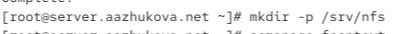{#fig-002 width=70%}

3. Настройка экспорта в файле `/etc/exports` ([рис. @fig-003]):

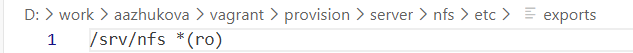{#fig-003 width=70%}

4. Настройка SELinux контекста безопасности.

5. Применение изменений SELinux ([рис. @fig-004]):

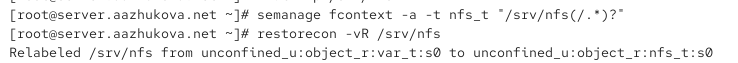{#fig-004 width=70%}

5. Запуск службы NFS ([рис. @fig-006]):

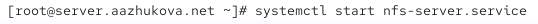{#fig-006 width=70%}

7. Включение автозапуска NFS ([рис. @fig-007]):

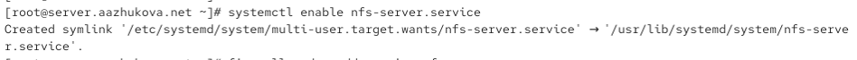{#fig-007 width=70%}

8. Настройка firewall для службы NFS ([рис. @fig-008]):

{#fig-008 width=70%}

9. Установка nfs-utils на клиенте ([рис. @fig-011]):

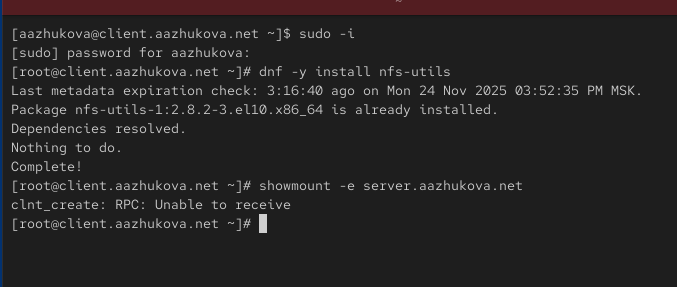{#fig-011 width=70%}

10. Проверка экспортируемых ресурсов с клиента ([рис. @fig-012]):

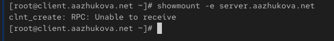{#fig-012 width=70%}

**Пояснения:** При выполнении команды showmount -e server.aazhukova.net возникает ошибка: `clnt_create: RPC: Unable to receive`.

Данная ошибка указывает на то, что клиент не может установить RPC-соединение с сервером NFS

11. Остановка firewall на сервере ([рис. @fig-013]):

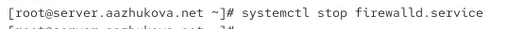{#fig-013 width=70%}

12. Повторная проверка экспорта после отключения firewall ([рис. @fig-014]):

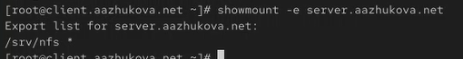{#fig-014 width=70%}

**Пояснение:** После отключения firewall на сервере команда `showmount -e server.aazhukova.net` успешно выполнилась и показала список экспортируемых ресурсов:
```
Export list for server.aazhukova.net:
/srv/nfs *
```

Это подтверждает, что проблема с доступом к NFS-серверу была именно в настройках межсетевого экрана. После отключения firewall RPC-запросы смогли свободно достигать сервера, и клиент получил информацию об экспортируемых каталогах.

13. Запуск firewall на сервере ([рис. @fig-015]):

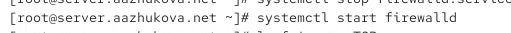{#fig-015 width=70%}

14. Просмотр используемых TCP служб ([рис. @fig-016]):

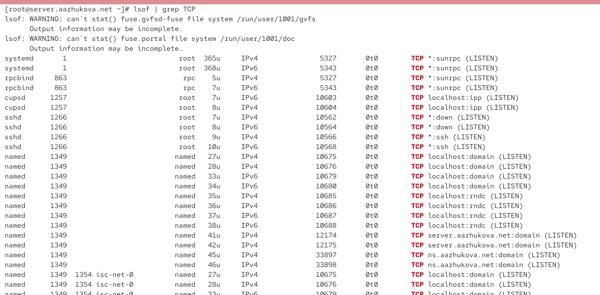{#fig-016 width=70%}

15. Просмотр используемых UDP служб ([рис. @fig-017]):

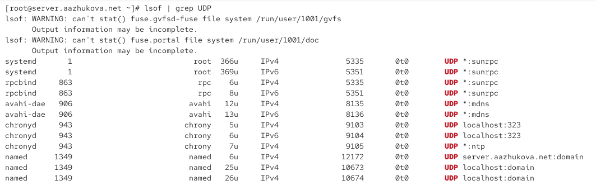{#fig-017 width=70%}

16. Добавление службы rpc-bind и mountd в настройки межсетевого экрана на сервере ([рис. @fig-018]):

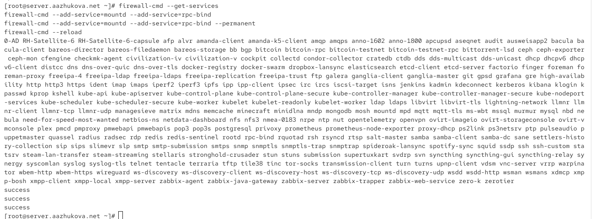{#fig-018 width=70%}

17. Проверка подключения удаленного ресурса ([рис. @fig-022]):

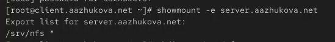{#fig-022 width=70%}

## Монтирование NFS на клиенте

1. Создание точки монтирования на клиенте ([рис. @fig-023]):

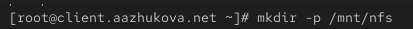{#fig-023 width=70%}

2. Монтирование удаленного ресурса ([рис. @fig-024]):

{#fig-024 width=70%}

3. Проверка монтирования командой mount ([рис. @fig-025]):

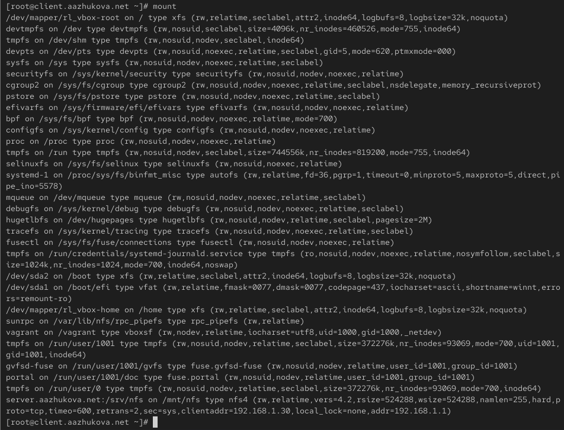{#fig-025 width=70%}

4. Добавление записи в `/etc/fstab` на клиенте ([рис. @fig-026]):

{#fig-026 width=70%}

5. Проверка статуса remote-fs.target ([рис. @fig-027]):

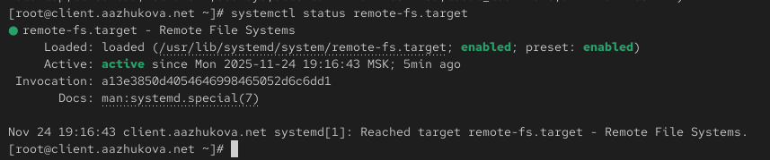{#fig-027 width=70%}

6. Перезагрузка клиента 

7. Проверка автоматического монтирования после перезагрузки ([рис. @fig-029]):

{#fig-029 width=70%}

## Подключение каталогов к дереву NFS

1. Создание каталога для веб-контента. Bind-монтирование каталога веб-сервера. Проверка содержимого каталога на сервере ([рис. @fig-030]):

{#fig-030 width=70%}

2. Проверка содержимого на клиенте ([рис. @fig-033]):

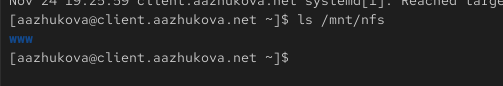{#fig-033 width=70%}

3. Добавление экспорта каталога веб-сервера ([рис. @fig-034]):

{#fig-034 width=70%}

4. Обновление экспортируемых каталогов ([рис. @fig-035]):

{#fig-035 width=70%}

5. Проверка каталога на клиенте после экспорта ([рис. @fig-036]):

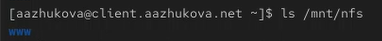{#fig-036 width=70%}

6. Добавление записи в fstab сервера для bind-монтирования ([рис. @fig-037]):

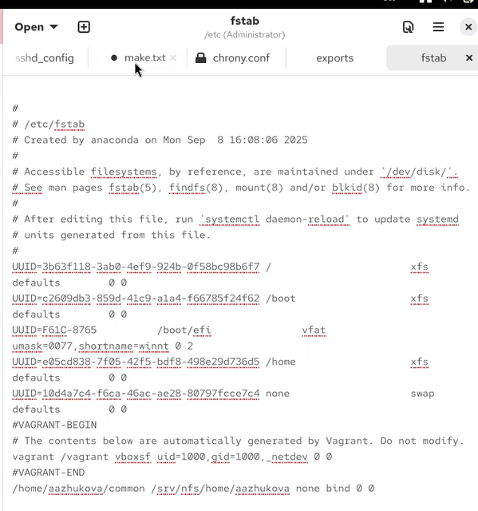{#fig-037 width=70%}

7. Повторный экспорт каталогов ([рис. @fig-038]):

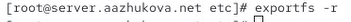{#fig-038 width=70%}

8. Финальная проверка каталога на клиенте ([рис. @fig-039]):

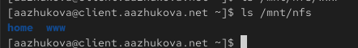{#fig-039 width=70%}

## Подключение каталогов для работы пользователей

1. Создание личного каталога пользователя. Создание тестового файла на сервере. Создание общего каталога для пользователя в NFS ([рис. @fig-040]):

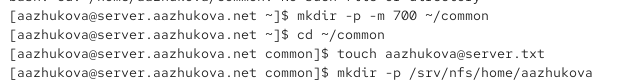{#fig-040 width=70%}

2. Bind-монтирование пользовательского каталога ([рис. @fig-043]):

{#fig-043 width=70%}

3. Добавление экспорта пользовательского каталога ([рис. @fig-044]):

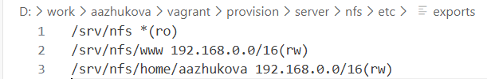{#fig-044 width=70%}

4. Добавление bind-монтирования в fstab сервера ([рис. @fig-045]):

{#fig-045 width=70%}

5. Обновление экспортируемых каталогов ([рис. @fig-046]):

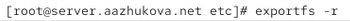{#fig-046 width=70%}

6. Проверка пользовательского каталога на клиенте ([рис. @fig-047]):

{#fig-047 width=70%}

7. Создание файла на клиенте под пользователем. Попытка создания файла под root на клиенте ([рис. @fig-048]):

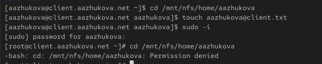{#fig-048 width=70%}

8. Проверка изменений на сервере ([рис. @fig-050]):

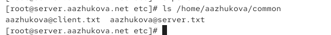{#fig-050 width=70%}

## Настройка Vagrant

1. Создаём каталоги для конфигурации на сервере. Копирование конфигурационных файлов. Создание исполняемого скрипта на сервере.  ([рис. @fig-051]):

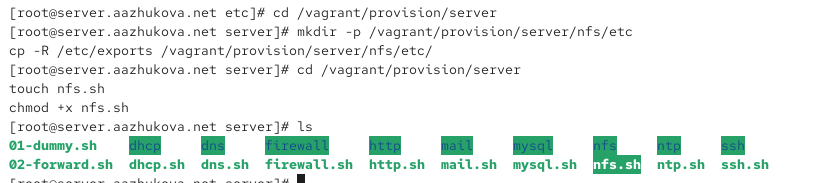{#fig-051 width=70%}

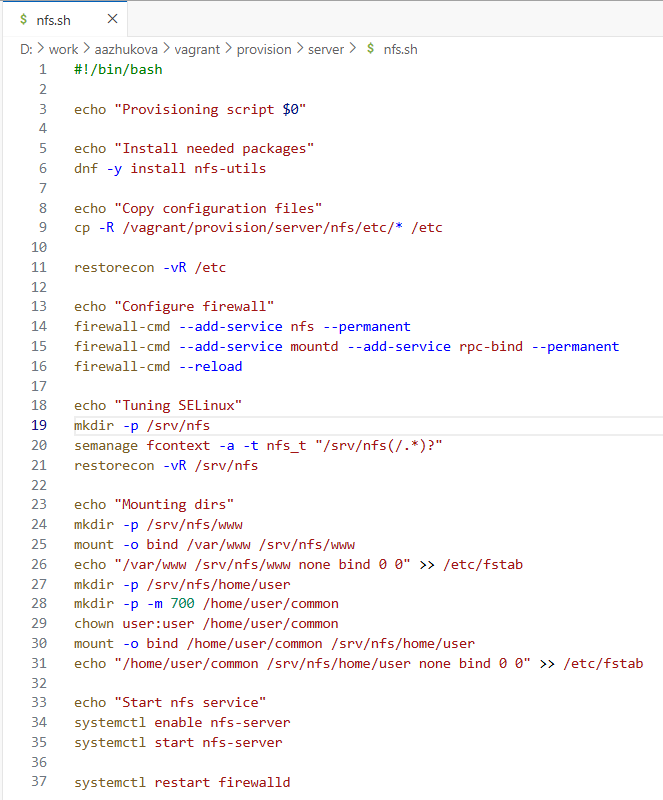{#fig-053 width=70%}

2. Создание каталога для клиентской конфигурации. Создание исполняемого скрипта на клиенте ([рис. @fig-055]):

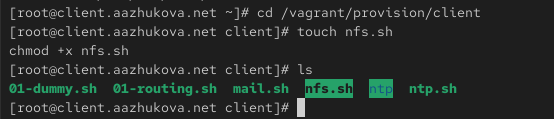{#fig-055 width=70%}

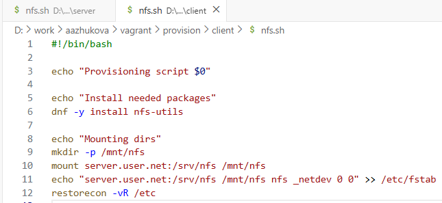{#fig-054 width=70%}

3. Добавление конфигурации в Vagrantfile ([рис. @fig-056]):

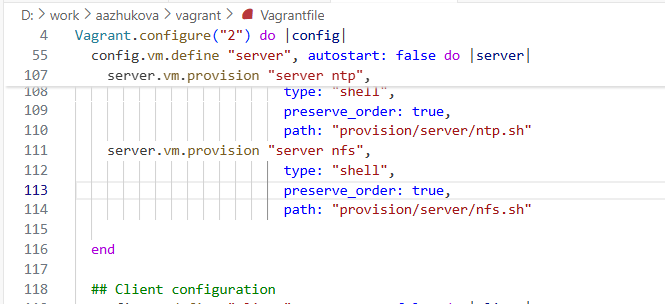{#fig-056 width=70%}

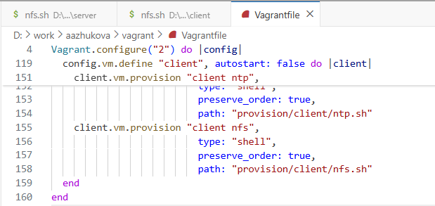{#fig-057 width=70%}

# Выводы

В ходе лабораторной работы были приобретены практические навыки настройки сервера NFSv4. Освоены:
- Установка и базовая настройка NFS-сервера
- Настройка прав доступа и экспорта каталогов
- Монтирование удалённых ресурсов на клиенте
- Интеграция с веб-сервером и пользовательскими каталогами
- Автоматизация развёртывания через Vagrant

# Контрольные вопросы

1. Файл конфигурации, содержащий общие ресурсы NFS — `/etc/exports`
2. Для полного доступа к серверу NFS в брандмауэре должны быть открыты порты для служб: nfs, mountd, rpc-bind
3. В `/etc/fstab` следует использовать опцию `_netdev` для автоматического монтирования NFS-ресурсов при загрузке

