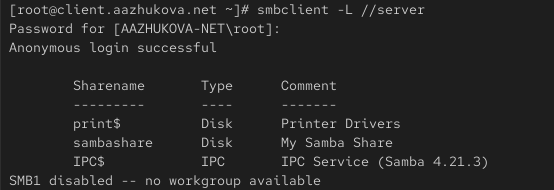
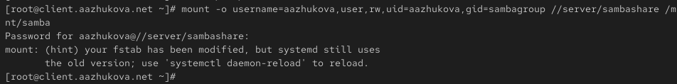
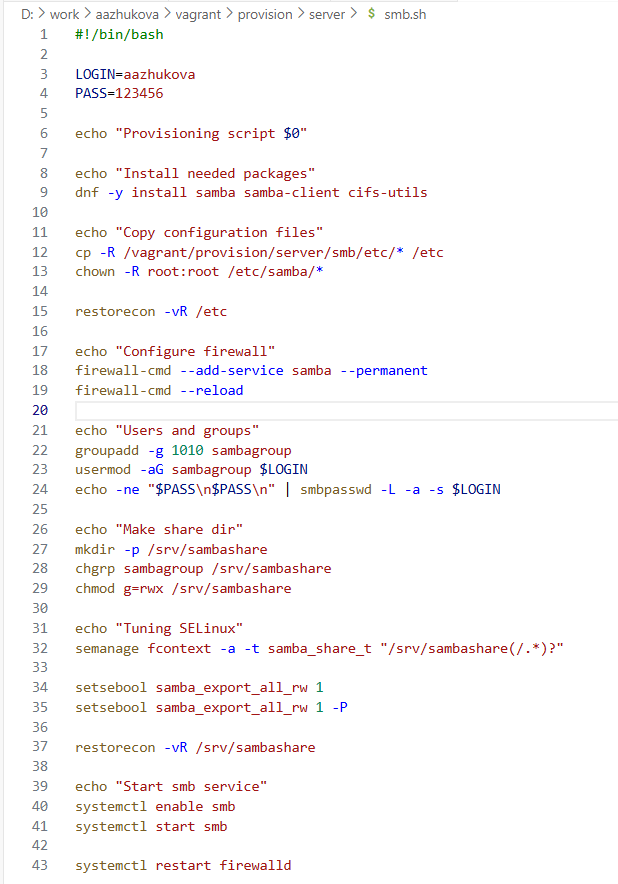

---
## Author
author:
  name: Жукова Арина Александровна
  degrees: Студентка 3 курса
  orcid: 0000-0002-0877-7063
  email: 1132239120@rudn.ru
  affiliation:
    - name: Российский университет дружбы народов
      country: Российская Федерация
      postal-code: 117198
      city: Москва
      address: ул. Миклухо-Маклая, д. 6
## Title
title: Лабораторная работа №14
subtitle: Настройка файловых служб Samba
license: CC BY
date: today
date-format: "YYYY-MM-DD"
---

# Информация

## Докладчик

:::::::::::::: {.columns align=center}
::: {.column width="70%"}

  * Жукова Арина Александровна
  * Студентка 3 курса
  * Российский университет дружбы народов им. П. Лумумбы
  * 1132239120@rudn.ru

:::
::: {.column width="30%"}

:::
::::::::::::::

# Вводная часть

## Актуальность

* Протокол SMB — стандарт для организации сетевого доступа к файлам и принтерам
* Необходим навык настройки совместного доступа между ОС Linux и другими системами
* Samba — ключевое решение для интеграции Unix/Linux-систем в сети Windows

## Объект и предмет исследования

* **Объект:** Файловый сервер Samba
* **Предмет:** Настройка общего доступа к ресурсам по протоколу SMB в изолированной виртуальной среде

## Цель работы

Приобретение практических навыков настройки доступа групп пользователей к общим сетевым ресурсам с использованием сервера Samba.

# Задание и метод выполнения

## Задачи работы

1. **Установить и настроить** сервер Samba на виртуальной машине `server`
2. **Настроить клиентский доступ** к общим ресурсам на машине `client`
3. **Автоматизировать** процесс развёртывания с помощью `Vagrant` и скриптов

## План выполнения (Метод)

* Ручная настройка сервера Samba и клиента для понимания процесса
* Проверка доступности ресурсов и прав доступа
* Настройка безопасности (firewalld, SELinux)
* Автоматизация через скрипты Bash и интеграция в `Vagrantfile`

# Ход работы

## Настройка сервера Samba (1)

* Установка необходимых пакетов
* Создание группы `sambagroup` (GID 1010) и добавление пользователя

{width=100%}

## Настройка сервера Samba (2)

:::::::::::::: {.columns align=center}
::: {.column width="60%"}

* Создание общего каталога `/srv/sambashare`
* Конфигурация файла `/etc/samba/smb.conf`
* Проверка синтаксиса утилитой `testparm`

:::
::: {.column width="40%"}

{width=100%}

:::
::::::::::::::

## Настройка безопасности

* Запуск и настройка службы `smb`
* Открытие портов в `firewalld`
* Настройка контекста безопасности SELinux для каталога

{width=80%}

## Настройка клиента

* Установка клиентских пакетов (`samba-client`, `cifs-utils`)
* Настройка рабочей группы
* Проверка доступности ресурсов сервера

{width=80%}

## Монтирование общего ресурса

* Создание точки монтирования `/mnt/samba`
* Ручное монтирование с аутентификацией
* Настройка автоматического монтирования через `/etc/fstab`

{width=100%}

# Результаты

## Автоматизация настройки

:::::::::::::: {.columns align=center}
::: {.column width="60%"}

* Созданы скрипты `smb.sh` для сервера и клиента
* Скрипты автоматически выполняют всю необходимую настройку
* Интеграция скриптов в `Vagrantfile

:::
::: {.column width="40%"}

{width=100%}

:::
::::::::::::::

## Проверка работоспособности

* Успешный доступ к ресурсу `//server/sambashare` с клиента
* Возможность чтения и записи файлов под учётной записью пользователя
* Автоматическое монтирование ресурса при загрузке

{width=80%}

# Итоговый слайд

## Выводы

В ходе лабораторной работы **успешно**:

* Настроен сервер Samba с общим ресурсом
* Обеспечен безопасный доступ с учетом `firewalld` и `SELinux`
* Настроен клиентский доступ с ручным и автоматическим монтированием
* Процесс настройки **автоматизирован** с помощью `Vagrant` и скриптов

**Приобретены практические навыки** администрирования файловых служб в гетерогенной сети.

