---
## Author
author:
  name: Жукова Арина Александровна
  degrees: 3rd year student
  orcid: 0000-0002-0877-7063
  email: 1132239120@rudn.ru
  affiliation:
    - name: Российский университет дружбы народов
      country: Российская Федерация
      postal-code: 117198
      city: Москва
      address: ул. Миклухо-Маклая, д. 6

## Title
title: "Лабораторная работа №14"
subtitle: "Настройка файловых служб Samba"
license: "CC BY"
---

# Цель работы

Приобретение навыков настройки доступа групп пользователей к общим ресурсам по протоколу SMB.

# Задание

1. Установить и настроить сервер Samba.
2. Настроить на клиенте доступ к разделяемым ресурсам.
3. Написать скрипты для Vagrant, фиксирующие действия по установке и настройке сервера Samba для доступа к разделяемым ресурсам во внутреннем окружении виртуальных машин server и client. Соответствующим образом внести изменения в Vagrantfile.

# Теоретическое введение

Протокол Server Message Block (SMB) предназначен для организации межпроцессорного взаимодействия, а также удалённого доступа к разделяемым сетевым ресурсам (файлам, принтерам и др.). SMB выполняет функции, аналогичные NFS, но лучше подходит для организации взаимодействия между узлами Unix/Linux и Windows. Основные различия касаются информации о владельцах ресурсов, поддержки блокирования ресурсов и информации о правах доступа.

Пакет Samba представляет собой свободную реализацию протокола SMB и позволяет Unix/Linux узлам взаимодействовать с сетями на основе Windows. Samba имеет клиент-серверную архитектуру и работает поверх TCP/IP. Основной файл конфигурации — `/etc/samba/smb.conf`.

# Выполнение лабораторной работы

## Настройка сервера Samba

1. Установлены необходимые пакеты: `dnf -y install samba samba-client cifs-utils` ([рис. @fig-001]).

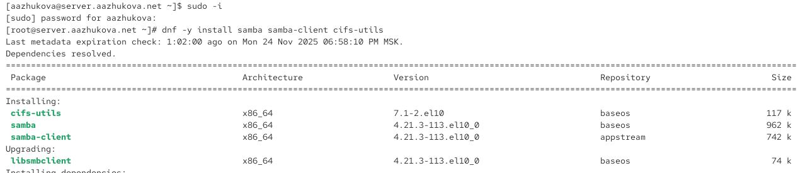{#fig-001 width=70%}

2. Создана группа `sambagroup` с GID 1010 ([рис. @fig-002]).

{#fig-002 width=70%}

3. Пользователь `user` добавлен в группу `sambagroup` ([рис. @fig-003]).

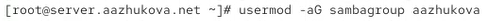{#fig-003 width=70%}

4. Создан общий каталог `/srv/sambashare` ([рис. @fig-004]).

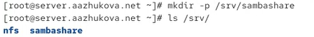{#fig-004 width=70%}

5. В файле `/etc/samba/smb.conf`:
   - Изменён параметр рабочей группы на `USER-NET`.
   - Добавлен раздел `[sambashare]` с указанием пути и списком записи ([рис. @fig-005]).

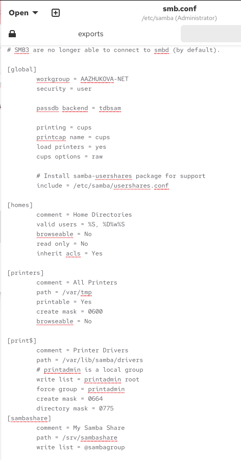{#fig-005 width=70%}

6. Проверка синтаксиса файла `smb.conf` с помощью `testparm` ([рис. @fig-006]).

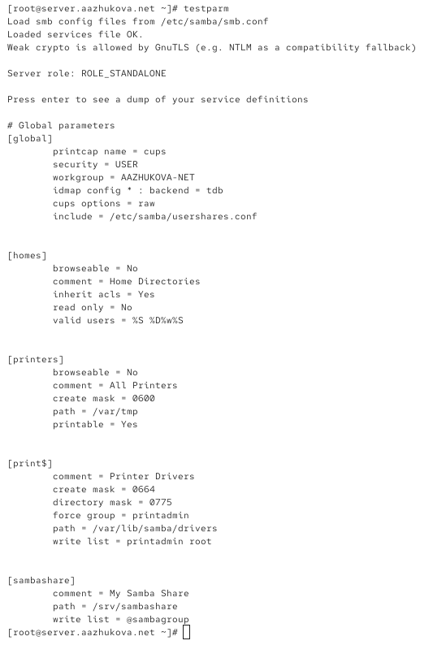{#fig-006 width=70%}

7. Запущен демон Samba и проверен его статус ([рис. @fig-007]).

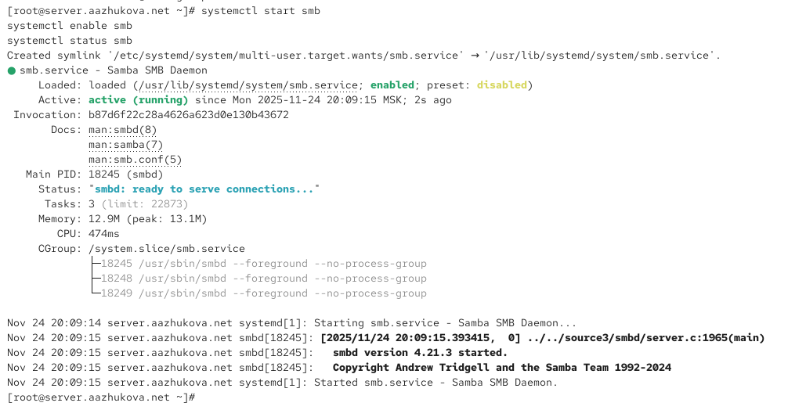{#fig-007 width=70%}

8. Проверен общий доступ с помощью `smbclient -L //server` ([рис. @fig-008]).

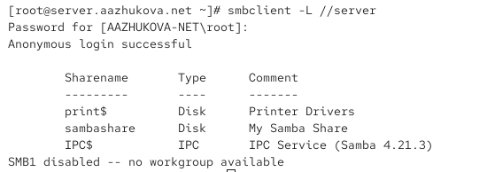{#fig-008 width=70%}

9. Просмотрен файл конфигурации межсетевого экрана для Samba ([рис. @fig-009]).

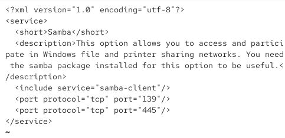{#fig-009 width=70%}

10. Настроен межсетевой экран для работы с Samba ([рис. @fig-010]).

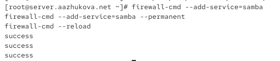{#fig-010 width=70%}

11. Настроены права доступа для каталога `/srv/sambashare` ([рис. @fig-011]).

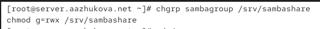{#fig-011 width=70%}

12. Просмотрен контекст безопасности SELinux ([рис. @fig-012]).

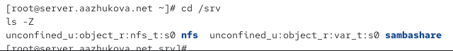{#fig-012 width=70%}

13. Настроен контекст безопасности SELinux для каталога ([рис. @fig-013]).

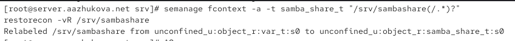{#fig-013 width=70%}

14. Проверено изменение контекста безопасности ([рис. @fig-014]).

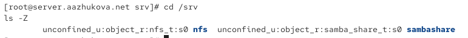{#fig-014 width=70%}

15. Разрешён экспорт ресурсов для чтения и записи ([рис. @fig-015]).

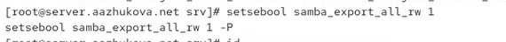{#fig-015 width=70%}

16. Просмотрены UID и группы пользователя ([рис. @fig-016]).

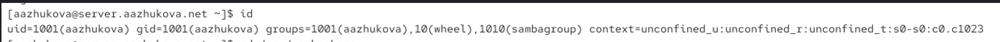{#fig-016 width=70%}

17. Создан тестовый файл на разделяемом ресурсе ([рис. @fig-017]).

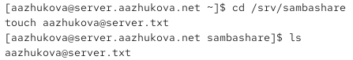{#fig-017 width=70%}

18. Пользователь добавлен в базу Samba ([рис. @fig-018]).

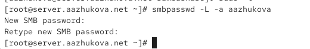{#fig-018 width=70%}

## Монтирование файловой системы Samba на клиенте

1. На клиенте установлены пакеты `samba-client` и `cifs-utils` ([рис. @fig-019]).

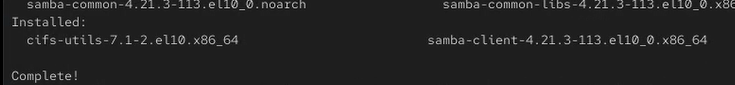{#fig-019 width=70%}

2. Просмотрен файл конфигурации межсетевого экрана для клиента Samba ([рис. @fig-020]).

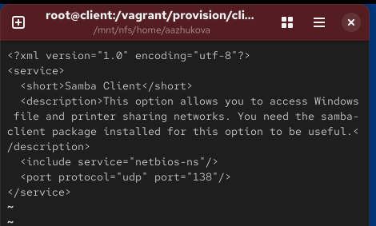{#fig-020 width=70%}

3. Настроен межсетевой экран ([рис. @fig-021]).

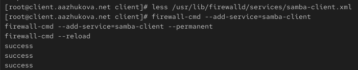{#fig-021 width=70%}

4. Создана группа `sambagroup` и добавлен пользователь ([рис. @fig-022]).

{#fig-022 width=70%}

5. Изменён параметр рабочей группы в `smb.conf` ([рис. @fig-023]).

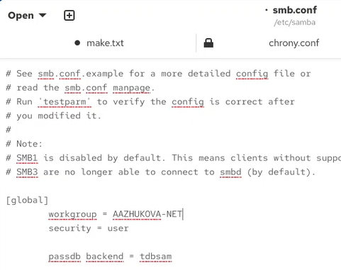{#fig-023 width=70%}

6. Проверен доступ к ресурсам сервера с помощью `smbclient` ([рис. @fig-024]).

{#fig-024 width=70%}

7. Подключение к серверу под учётной записью пользователя ([рис. @fig-025]).

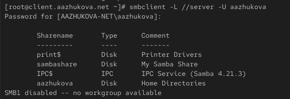{#fig-025 width=70%}

8. Создана точка монтирования `/mnt/samba` ([рис. @fig-026]).

{#fig-026 width=70%}

9. Ресурс смонтирован с помощью `mount` ([рис. @fig-027]).

{#fig-027 width=70%}

10. Проверена возможность записи файлов ([рис. @fig-028]).

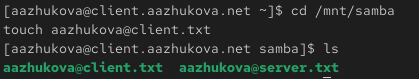{#fig-028 width=70%}

11. Ресурс отмонтирован ([рис. @fig-029]).

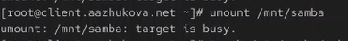{#fig-029 width=70%}

12. Создан файл учётных данных `/etc/samba/smbusers` ([рис. @fig-030]-[рис. @fig-0301]).

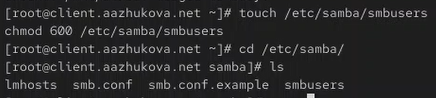{#fig-030 width=70%}

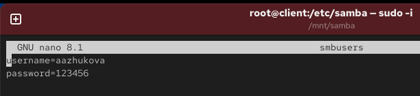{#fig-0301 width=70%}

13. Добавлена запись в `/etc/fstab` для автоматического монтирования ([рис. @fig-031]).

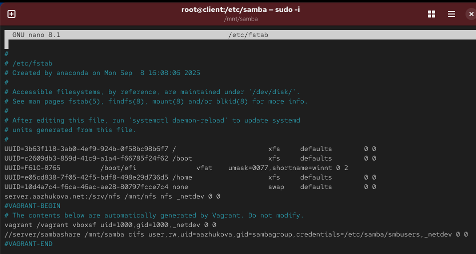{#fig-031 width=70%}

14. Проверено автоматическое монтирование ([рис. @fig-032]).

{#fig-032 width=70%}

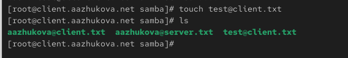{#fig-0321 width=70%}

## Внесение изменений в настройки внутреннего окружения виртуальных машин

1. На сервере создан каталог для конфигурационных файлов и скопирован `smb.conf` ([рис. @fig-033]).

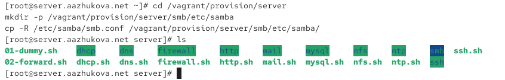{#fig-033 width=70%}

2. Создан скрипт `smb.sh` для автоматической настройки сервера ([рис. @fig-0341]-[рис. @fig-034]).

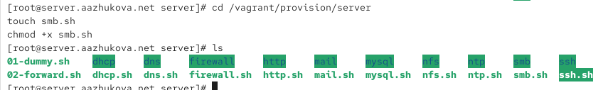{#fig-0341 width=70%}

{#fig-034 width=70%}

3. На клиенте созданы каталоги и скопированы конфигурационные файлы ([рис. @fig-035]).

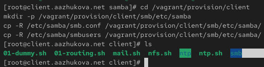{#fig-035 width=70%}

4. Создан скрипт `smb.sh` для настройки клиента ([рис. @fig-0361]-[рис. @fig-036]).

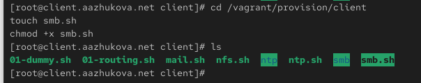{#fig-0361 width=70%}

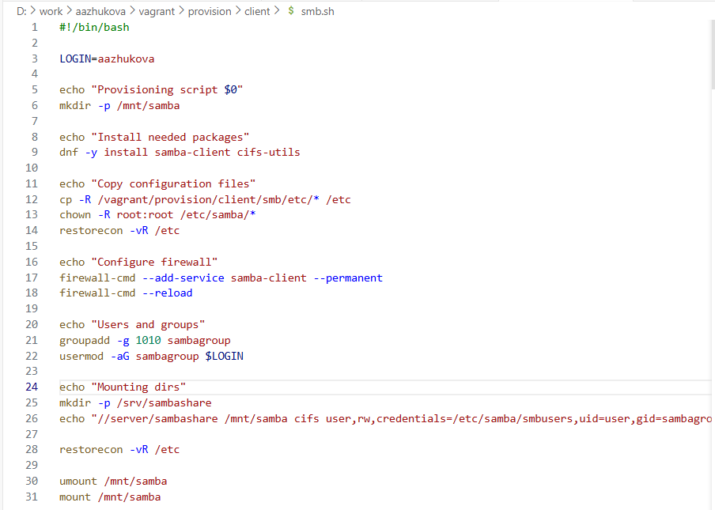{#fig-036 width=70%}

5. В `Vagrantfile` добавлены вызовы скриптов для сервера и клиента ([рис. @fig-037]-[рис. @fig-0371]).

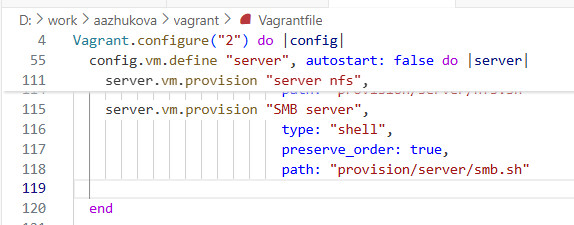{#fig-037 width=70%}

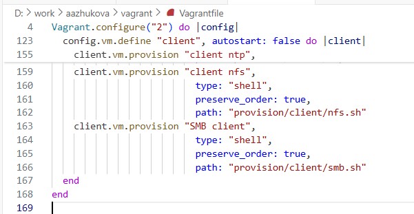{#fig-0371 width=70%}

# Выводы

В ходе выполнения лабораторной работы были приобретены практические навыки настройки файлового сервера Samba и организации доступа к общим ресурсам между узлами Linux. Были настроены: сервер Samba, клиентский доступ, межсетевой экран, SELinux, а также автоматизирована настройка с помощью Vagrant-скриптов. 

# Ответы на контрольные вопросы

1. Минимальная конфигурация в `smb.conf`:

   ```
   [share]
   path = /data
   browseable = yes
   ```

2. Для предоставления доступа на запись всем пользователям с правами в файловой системе:

   ```
   writable = yes
   ```

3. Ограничение доступа на запись членам группы:

   ```
   write list = @groupname
   ```

4. Для доступа к домашним каталогам через SMB используется переключатель SELinux:

   ```
   setsebool -P samba_enable_home_dirs 1
   ```

5. Ограничение доступа по сети:

   ```
   hosts allow = 192.168.10.0/24
   ```

6. Команда для отображения пользователей Samba:

   ```
   pdbedit -L
   ```

7. Для доступа к многопользовательскому ресурсу пользователь должен быть добавлен в базу Samba (`smbpasswd -a`).

8. Установка общего ресурса с минимальной учётной записью:

   ```
   guest account = alice
   ```

9. Чтобы скрыть учётные данные в `/etc/fstab`, следует использовать файл с правами 600 и указать его в опциях монтирования через `credentials=`.

10. Команда для перечисления ресурсов:

    ```
    smbclient -L //server -U user
    ```

# Список литературы{.unnumbered}

::: {#refs}
:::

