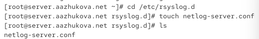
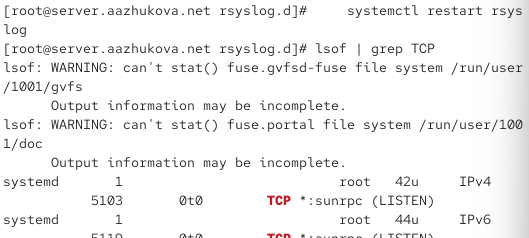
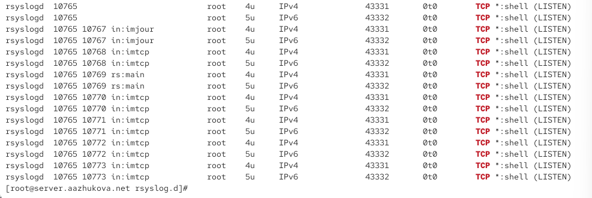
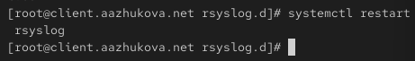
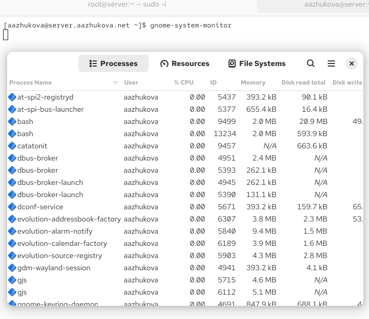
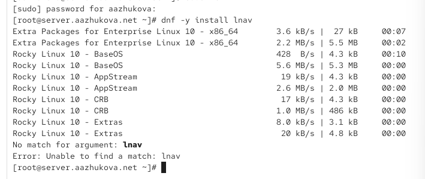
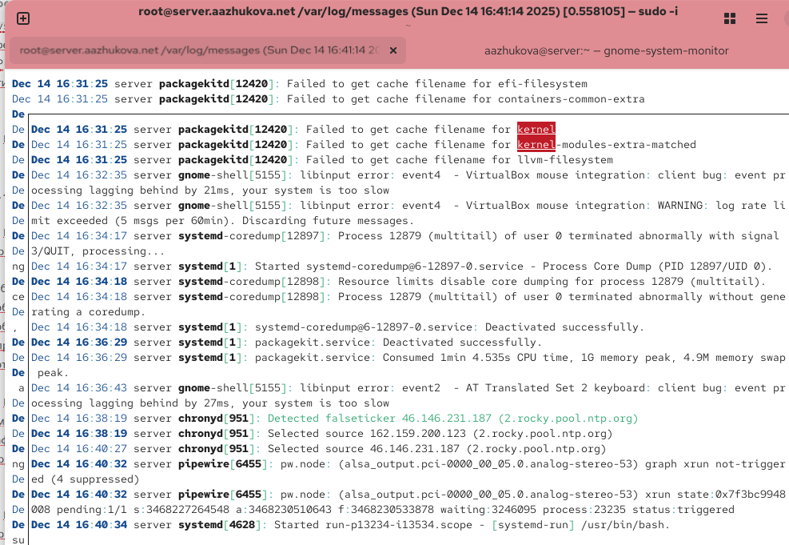
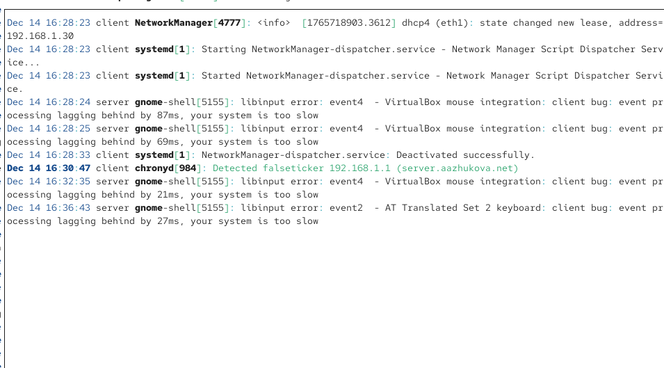
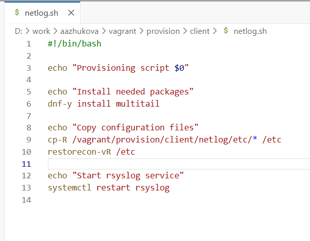
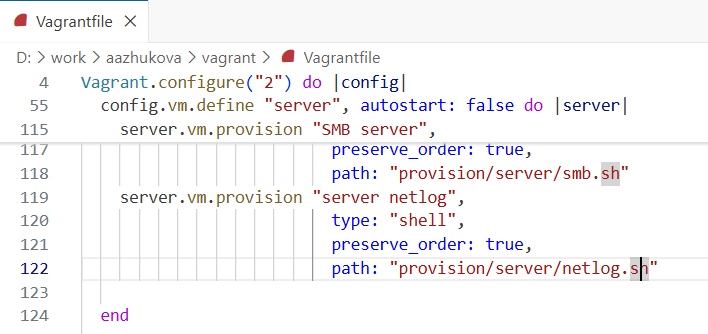

---
## Author
author:
  name: Жукова Арина Александровна
  degrees: 3rd year student
  orcid: 0000-0002-0877-7063
  email: 1132239120@rudn.ru
  affiliation:
    - name: Российский университет дружбы народов
      country: Российская Федерация
      postal-code: 117198
      city: Москва
      address: ул. Миклухо-Маклая, д. 6
## Title
title: Лабораторная работа №15
subtitle: Настройка сетевого журналирования
license: CC BY
date: today
date-format: "YYYY-MM-DD" # Example: 2025-09-06
---

# Информация

## Докладчик

:::::::::::::: {.columns align=center}
::: {.column width="70%"}

  * Жукова Арина Александровна
  * Направление прикладная информатика
  * Студентка 3 курса
  * Группа НПИбд-01-23
  * Российский университет дружбы народов им. П. Лумумбы
  * 1132239120@rudn.ru

:::
::: {.column width="30%"}


:::
::::::::::::::

# Вводная часть

## Актуальность

- Централизованное журналирование — важная часть администрирования сетей
- Упрощает мониторинг и анализ системных событий
- Повышает безопасность и целостность лог-сообщений
- Упрощает управление дисковым пространством

## Цели и задачи

**Цель:** Получение навыков по работе с журналами системных событий

**Задачи:**

1. Настроить сервер сетевого журналирования
2. Настроить клиент для передачи сообщений
3. Освоить методы просмотра журналов
4. Автоматизировать настройку через Vagrant

## Материалы и методы

- Операционная система: Rocky Linux 10
- Служба журналирования: rsyslog
- Межсетевой экран: firewalld
- Утилиты просмотра: tail, multitail
- Виртуализация: Vagrant с VirtualBox

# Настройка сервера сетевого журнала

## Создание конфигурационного файла

```bash
cd /etc/rsyslog.d
touch netlog-server.conf
```

{width=80%}

## Настройка приёма сообщений по TCP

```bash
# netlog-server.conf
$ModLoad imtcp
$InputTCPServerRun 514
```

{width=80%}

## Запуск службы и проверка портов

```bash
systemctl restart rsyslog
lsof | grep TCP
```

:::::::::::::: {.columns align=center}
::: {.column width="40%"}

{width=90%}

:::
::: {.column width="60%"}

{width=100%}

:::
::::::::::::::

## Настройка межсетевого экрана

```bash
firewall-cmd --add-port=514/tcp
firewall-cmd --add-port=514/tcp --permanent
```

{width=80%}

# Настройка клиента сетевого журнала

## Создание конфигурационного файла клиента

```bash
cd /etc/rsyslog.d
touch netlog-client.conf
```

{width=80%}

## Настройка перенаправления логов на сервер

```bash
# netlog-client.conf
*.* @@server.aazhukova.net:514
```

{width=80%}

## Перезапуск службы rsyslog на клиенте

```bash
systemctl restart rsyslog
```

{width=80%}

# Просмотр журналов

## Просмотр логов в реальном времени

:::::::::::::: {.columns align=center}
::: {.column width="40%"}

{width=90%}

:::
::: {.column width="60%"}

```bash
tail -f /var/log/messages
```

- Запись содержит имя хоста-источника (client)
- Сообщение успешно передано и сохранено на сервере
- Формат временных меток сохранён

:::
::::::::::::::


## Графический просмотрщик журналов

```bash
gnome-system-monitor
```

{width=80%}

## Установка альтернативных просмотрщиков

Попытка установки lnav

```bash
dnf -y install lnav
```

{width=80%}

## Установка multitail

Установка multitail вместо lnav

```bash
dnf -y install multitail
```

{width=80%}

## Просмотр логов через multitail

```bash
multitail /var/log/messages
```

:::::::::::::: {.columns align=center}
::: {.column width="50%"}

{width=90%}

:::
::: {.column width="50%"}

{width=90%}

:::
::::::::::::::

# Автоматизация настройки

## Подготовка файлов конфигурации

```bash
cd /vagrant/provision/server
mkdir -p /vagrant/provision/server/netlog/etc/rsyslog.d
cp -R /etc/rsyslog.d/netlog-server.conf \
  /vagrant/provision/server/netlog/etc/rsyslog.d
```

{width=80%}

## Создание скрипта настройки для сервера

```bash
cd /vagrant/provision/server
touch netlog.sh
chmod +x netlog.sh
```

:::::::::::::: {.columns align=center}
::: {.column width="50%"}

{width=90%}

:::
::: {.column width="50%"}

{width=90%}

:::
::::::::::::::

## Создание скрипта настройки для клиента

:::::::::::::: {.columns align=center}
::: {.column width="50%"}

{width=90%}

:::
::: {.column width="50%"}

{width=90%}

:::
::::::::::::::

## Интеграция скриптов в Vagrantfile

```ruby
server.vm.provision "server netlog",
  type: "shell",
  preserve_order: true,
  path: "provision/server/netlog.sh"
client.vm.provision "client netlog",
  type: "shell",
  preserve_order: true,
  path: "provision/client/netlog.sh"
```

:::::::::::::: {.columns align=center}
::: {.column width="50%"}

{width=90%}

:::
::: {.column width="50%"}

{width=90%}

:::
::::::::::::::

# Результаты

## Подтверждение работы сетевого журналирования

- В логах сервера присутствуют записи от клиента
- Клиент успешно отправляет системные сообщения на сервер
- Все службы работают корректно после настройки

# Выводы

## Итоги проделанной работы

::: incremental

- Получены практические навыки настройки сетевого журналирования
- Сервер успешно настроен для приёма логов по TCP-порту 514
- Клиент корректно перенаправляет системные сообщения на сервер
- Освоены различные методы просмотра журналов (tail, multitail)
- Созданы скрипты для автоматизации настройки через Vagrant

:::

## Преимущества централизованного журналирования

::: incremental

- Упрощение анализа логов с нескольких узлов
- Повышение безопасности хранения лог-сообщений
- Централизованное управление дисковым пространством
- Удобство администрирования и мониторинга

:::

# Итоговый слайд

## Главные достижения работы

::: incremental

- Освоен процесс настройки централизованного журналирования
- Получены практические навыки работы с rsyslog
- Достигнута автоматизация процесса настройки
- Подтверждена работоспособность конфигурации
- Готовность к применению полученных знаний в реальных условиях

:::

