---
## Author
author:
  name: Жукова Арина Александровна
  degrees: 3rd year student
  orcid: 0000-0002-0877-7063
  email: 1132239120@rudn.ru
  affiliation:
    - name: Российский университет дружбы народов
      country: Российская Федерация
      postal-code: 117198
      city: Москва
      address: ул. Миклухо-Маклая, д. 6

## Title
title: "Лабораторная работа №15"
subtitle: "Настройка сетевого журналирования"
license: "CC BY"
---

# Цель работы

Получение навыков по работе с журналами системных событий, настройка сервера и клиента сетевого журналирования, а также освоение методов просмотра и анализа лог-файлов.

# Задание

1. Настроить сервер сетевого журналирования событий.
2. Настроить клиент для передачи системных сообщений в сетевой журнал на сервере.
3. Просмотреть журналы системных событий с помощью нескольких программ. При наличии сообщений о некорректной работе сервисов исправить ошибки в настройках соответствующих служб.
4. Написать скрипты для Vagrant, фиксирующие действия по установке и настройке сетевого сервера журналирования.

# Теоретическое введение

Журналирование системных событий — важная часть администрирования Unix/Linux-систем. Оно заключается в фиксации сообщений об ошибках и состоянии работы процессов в лог-файлах, которые обычно располагаются в каталоге `/var/log`. Для управления логированием используется служба `syslog` или её модификация `rsyslog`. Настройки `rsyslog` хранятся в файле `/etc/rsyslog.conf` и дополнительных файлах в каталоге `/etc/rsyslog.d/`.

Сетевой журнал (централизованный сервер логов) позволяет собирать журналы с нескольких узлов сети на одном сервере, что упрощает анализ, повышает безопасность и облегчает управление дисковым пространством. Для передачи логов по сети используется TCP-порт 514.

# Выполнение лабораторной работы

## Настройка сервера сетевого журнала

1. На сервере создан файл конфигурации сетевого хранения журналов ([рис. @fig-001]):

   ```bash
   cd /etc/rsyslog.d
   touch netlog-server.conf
   ```

{#fig-001 width=70%}

2. В файл конфигурации добавлены строки для приёма записей журнала по TCP-порту 514 ([рис. @fig-002]):

   ```
   $ModLoad imtcp
   $InputTCPServerRun 514
   ```

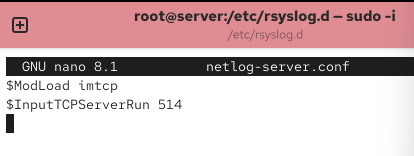{#fig-002 width=70%}

3. Перезапущена служба `rsyslog` и проверены прослушиваемые порты ([рис. @fig-003 - @fig-0031]):

   ```bash
   systemctl restart rsyslog
   lsof | grep TCP
   ```

{#fig-003 width=70%}

{#fig-0031 width=70%}


4. Настроен межсетевой экран для приёма сообщений по TCP-порту 514 ([рис. @fig-004]):

   ```bash
   firewall-cmd --add-port=514/tcp
   firewall-cmd --add-port=514/tcp --permanent
   ```

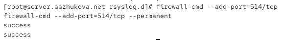{#fig-004 width=70%}

## Настройка клиента сетевого журнала

1. На клиенте создан файл конфигурации сетевого хранения журналов ([рис. @fig-005]):

   ```bash
   cd /etc/rsyslog.d
   touch netlog-client.conf
   ```

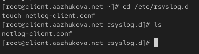{#fig-005 width=70%}

2. В файл конфигурации добавлена строка для перенаправления сообщений журнала на сервер ([рис. @fig-006]):

   ```
   *.* @@server.aazhukova.net:514
   ```

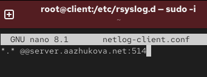{#fig-006 width=70%}

3. Перезапущена служба `rsyslog` ([рис. @fig-007]):

   ```bash
   systemctl restart rsyslog
   ```

{#fig-007 width=70%}

## Просмотр журнала

1. На сервере просмотрен файл журнала `/var/log/messages` с помощью команды `tail -f` ([рис. @fig-008]). В логах видны записи как от сервера, так и от клиента, что подтверждает корректную настройку сетевого журналирования.

   ```bash
   tail -f /var/log/messages
   ```

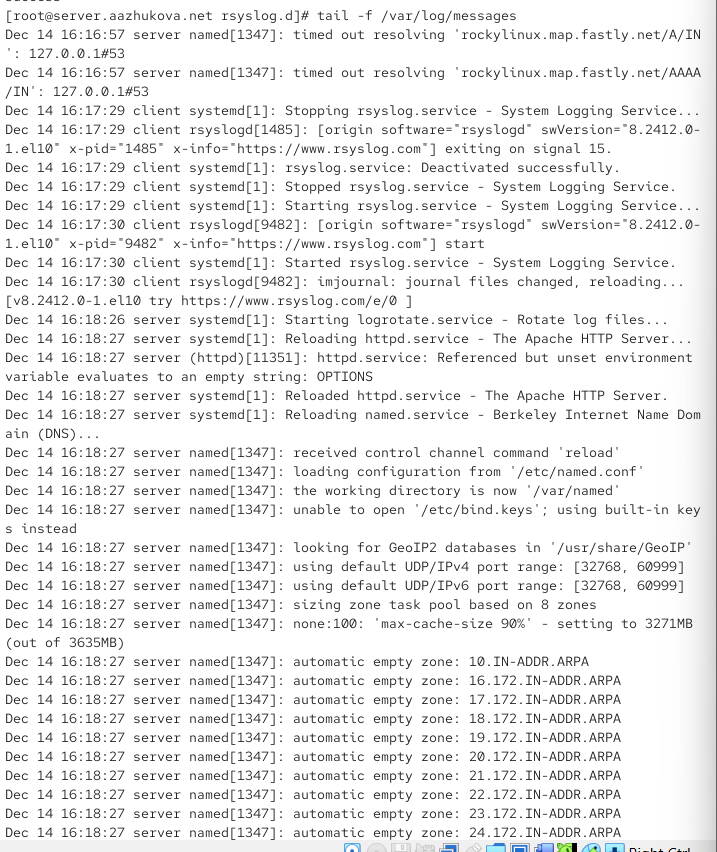{#fig-008 width=70%}

2. На сервере под пользователем aazhukova запущена графическая программа для просмотра журналов ([рис. @fig-0019]):

   ```bash
   gnome-system-monitor
   ```
{#fig-0019 width=70%}

2. Попытка установки просмотрщика журналов `lnav` не удалась, так как пакет отсутствует в стандартных репозиториях Rocky Linux 10 ([рис. @fig-009]):

   ```bash
   dnf -y install lnav
   ```

{#fig-009 width=70%}

3. Вместо `lnav` установлен пакет `multitail` для удобного просмотра логов ([рис. @fig-010]):

   ```bash
   dnf -y install multitail
   ```

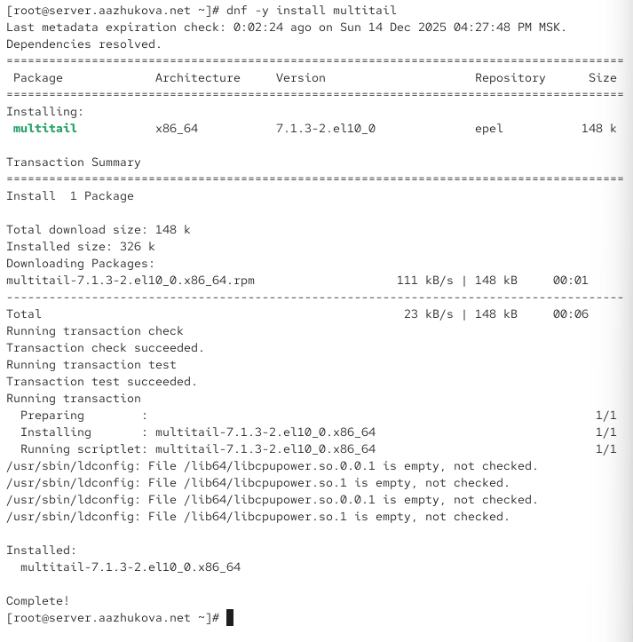{#fig-010 width=70%}

4. Логи просмотрены с помощью `multitail`. На рис. @fig-011 видны записи от клиента, пересланные на сервер, что подтверждает работу сетевого журналирования ([рис. @fig-011 - @fig-0111]).

   ```bash
   multitail /var/log/messages
   ```

{#fig-011 width=70%}

{#fig-0111 width=70%}

## Внесение изменений в настройки внутреннего окружения виртуальных машин

1. На виртуальной машине server созданы каталоги и скопированы конфигурационные файлы ([рис. @fig-012]):

   ```bash
   cd /vagrant/provision/server
   mkdir -p /vagrant/provision/server/netlog/etc/rsyslog.d
   cp -R /etc/rsyslog.d/netlog-server.conf /vagrant/provision/server/netlog/etc/rsyslog.d
   ```

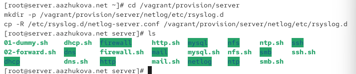{#fig-012 width=70%}

2. Создан исполняемый файл `netlog.sh` для сервера ([рис. @fig-013-@fig-0131]):

   ```bash
   cd /vagrant/provision/server
   touch netlog.sh
   chmod +x netlog.sh
   ```

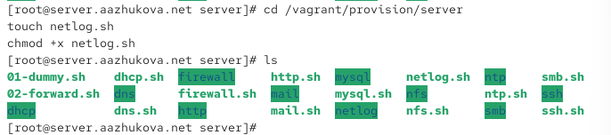{#fig-013 width=70%}

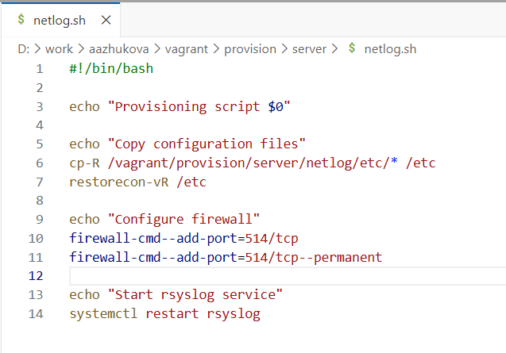{#fig-0131 width=70%}


3. Аналогичные действия выполнены на клиенте. Создан файл `netlog.sh` для клиента ([рис. @fig-014-@fig-0141]):

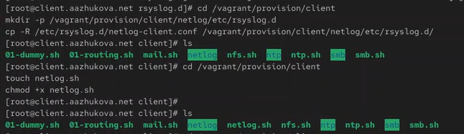{#fig-014 width=70%}

{#fig-0141 width=70%}


4. В конфигурационный файл `Vagrantfile` добавлены строки для автоматического выполнения скриптов при загрузке виртуальных машин ([рис. @fig-015 - @fig-0151]):


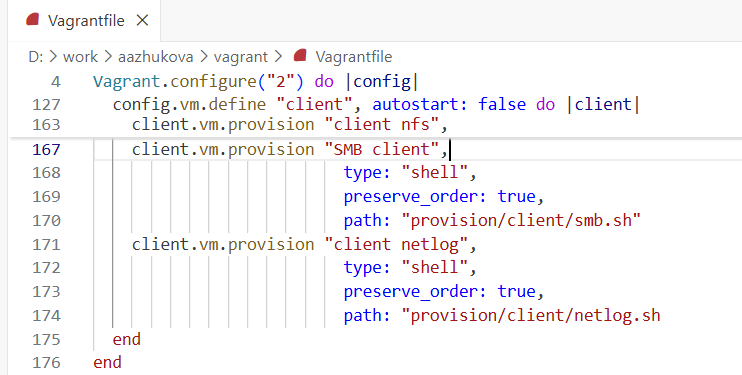{#fig-015 width=70%}

{#fig-0151 width=70%}

# Выводы

В ходе лабораторной работы были получены практические навыки по настройке сетевого журналирования. Успешно настроен сервер для приёма логов по TCP-порту 514 и клиент для отправки системных сообщений на сервер. Проверена работоспособность конфигурации: в логах сервера присутствуют записи как от сервера, так и от клиента. Освоены различные способы просмотра журналов (tail, multitail). Также созданы скрипты для автоматизации настройки с использованием Vagrant, что позволяет быстро развёртывать конфигурацию сетевого журналирования.

# Ответы на контрольные вопросы

**1. Какой модуль rsyslog вы должны использовать для приёма сообщений от journald?**
   
   Для приёма сообщений от journald в rsyslog используется модуль `imjournal`. Этот модуль позволяет rsyslog получать сообщения из systemd journal.

**2. Как называется устаревший модуль, который можно использовать для включения приёма сообщений журнала в rsyslog?**

   Устаревший модуль называется `imuxsock`. Он использовался для приёма сообщений через Unix-сокет, но в современных системах рекомендуется использовать `imjournal`.

**3. Чтобы убедиться, что устаревший метод приёма сообщений из journald в rsyslog не используется, какой дополнительный параметр следует использовать?**

   Следует использовать параметр `UseJournal` со значением `on` или `off` в файле `/etc/rsyslog.conf`. Если установить `UseJournal off`, то rsyslog будет использовать устаревший метод, но рекомендуется оставить `UseJournal on` для использования imjournal.

**4. В каком конфигурационном файле содержатся настройки, которые позволяют вам настраивать работу журнала?**

   Основные настройки журнала находятся в файле `/etc/rsyslog.conf`. Дополнительные конфигурационные файлы могут быть в каталоге `/etc/rsyslog.d/`.

**5. Каким параметром управляется пересылка сообщений из journald в rsyslog?**

   Пересылка сообщений из journald в rsyslog управляется параметром `ForwardToSyslog` в файлах конфигурации journald (обычно `/etc/systemd/journald.conf` или файлах в `/etc/systemd/journald.conf.d/`).

**6. Какой модуль rsyslog вы можете использовать для включения сообщений из файла журнала, не созданного rsyslog?**

   Для включения сообщений из внешних файлов журналов, не созданных rsyslog, используется модуль `imfile`. Он позволяет мониторить текстовые файлы и отправлять их содержимое в rsyslog.

**7. Какой модуль rsyslog вам нужно использовать для пересылки сообщений в базу данных MariaDB?**

   Для пересылки сообщений в базу данных MariaDB используется модуль `ommysql` (output module for MySQL/MariaDB). Он позволяет записывать логи непосредственно в таблицы базы данных.

**8. Какие две строки вам нужно включить в rsyslog.conf, чтобы позволить текущему журнальному серверу получать сообщения через TCP?**

   Для приёма сообщений через TCP необходимо добавить следующие строки в конфигурацию rsyslog:
   ```
   $ModLoad imtcp
   $InputTCPServerRun 514
   ```

**9. Как настроить локальный брандмауэр, чтобы разрешить приём сообщений журнала через порт TCP 514?**

   Для настройки брандмауэра firewalld в Rocky Linux/RHEL используются следующие команды:
   ```bash
   firewall-cmd --add-port=514/tcp
   firewall-cmd --add-port=514/tcp --permanent
   ```
   Первая команда добавляет правило на текущую сессию, вторая — делает его постоянным (сохраняет после перезагрузки).

# Список литературы{.unnumbered}


