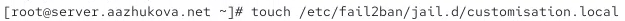
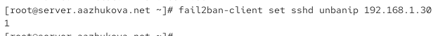

---
## Author
author:
  name: Жукова Арина Александровна
  degrees: 3rd year student
  orcid: 0000-0002-0877-7063
  email: 1132239120@rudn.ru
  affiliation:
    - name: Российский университет дружбы народов
      country: Российская Федерация
      postal-code: 117198
      city: Москва
      address: ул. Миклухо-Маклая, д. 6
## Title
title: "Отчёт по лабораторной работе №16"
subtitle: "Базовая защита от атак типа «brute force»"
license: "CC BY"
date: today
---

#  Информация

## Докладчик

:::::::::::::: {.columns align=center}
::: {.column width="70%"}

  * Жукова Арина Александровна
  * Направление прикладная информатика
  * Студентка 3 курса
  * Группа НПИбд-01-23
  * Российский университет дружбы народов им. П. Лумумбы
  * 1132239120@rudn.ru

:::
::: {.column width="30%"}


:::
::::::::::::::

# Вводная часть

## Актуальность

*   Атаки типа «brute force» (перебор паролей) остаются одной из самых распространённых угроз для серверов, доступных из сети Интернет.
*   Неудачные попытки подбора пароля создают высокую нагрузку на службы (SSH, HTTP) и маскируют другие виды атак.
*   Автоматизированная блокировка источников атак критически важна для поддержания безопасности и доступности сервисов.

## Цели и задачи

**Цель работы:** Получить практические навыки работы с программным средством Fail2ban для обеспечения базовой защиты от атак типа «brute force».

**Задачи:**

1.  Установить и настроить Fail2ban для отслеживания работы установленных на сервере служб.
2.  Проверить работу Fail2ban посредством попыток несанкционированного доступа с клиента на сервер через SSH.
3.  Написать скрипт для Vagrant, фиксирующий действия по установке и настройке Fail2ban.

## Материалы и методы

*   **Операционная система:** Rocky Linux 10
*   **Программное обеспечение:**
    *   `fail2ban` — система обнаружения и блокировки атак.
    *   `firewalld` / `iptables` — межсетевой экран для применения блокировок.
    *   `ssh`, `apache`, `postfix`, `dovecot` — защищаемые службы.
*   **Методология:** Поэтапная настройка защиты, практическое тестирование блокировок, автоматизация процесса с помощью скриптов.

# Настройка защиты с помощью Fail2ban

## Установка и базовый запуск

:::::::::::::: {.columns align=center}
::: {.column width="50%"}

Установка пакета

`dnf -y install fail2ban`

Запуск и добавление в автозагрузку

```systemctl start fail2ban
systemctl enable fail2ban```

Мониторинг логов в реальном времени
```
tail -f /var/log/fail2ban.log
```

:::
::: {.column width="50%"}


:::
::::::::::::::

## Создание локального конфигурационного файла



## Настройка защиты службы SSH

:::::::::::::: {.columns align=center}
::: {.column width="60%"}

В файл `/etc/fail2ban/jail.d/customisation.local` добавлены настройки для SSH:

*   Время блокировки (`bantime`) установлено на 1 час (3600 секунд).
*   Защита для стандартного порта SSH и порта 2022.
*   Активированы фильтры для защиты от DDoS и с учетом политик SELinux.

:::
::: {.column width="40%"}


:::
::::::::::::::

## Настройка защиты веб-сервера (HTTP/HTTPS)

В тот же файл добавлены правила для защиты сервисов Apache от различных типов атак, таких как атаки на аутентификацию, боты, попытки выполнения скриптов и переполнения буфера.


## Настройка защиты почтовых сервисов

Добавлена конфигурация для мониторинга и блокировки атак на почтовые серверы Postfix и Dovecot.


# Проверка работы Fail2ban

## Проверка статуса и настройка параметров

:::::::::::::: {.columns align=center}
::: {.column width="50%"}

Общий статус fail2ban

`fail2ban-client status`

Статус конкретной "тюрьмы" для sshd

`fail2ban-client status sshd`

Изменение параметра для sshd

`fail2ban-client set sshd maxretry 2`

:::
::: {.column width="50%"}


:::
::::::::::::::

## Тестирование блокировки при неудачных попытках входа

:::::::::::::: {.columns align=center}
::: {.column width="50%"}

1.  С клиентской машины выполняются попытки подключения по SSH с неверным паролем.
2.  После превышения лимита попыток (`maxretry`) IP-адрес клиента блокируется.
3.  Командой `fail2ban-client status sshd` можно убедиться в наличии блокировки.

:::
::: {.column width="50%"}


:::
::::::::::::::

## Разблокировка IP-адреса и добавление в исключения

:::::::::::::: {.columns align=center}
::: {.column width="60%"}

Ручная разблокировка IP
`fail2ban-client set sshd unbanip <client_ip>` 

Для постоянного исключения IP-адреса (например, доверенной сети) его нужно добавить в параметр `ignoreip` в конфигурационном файле.

```ini
[DEFAULT]
bantime = 3600
ignoreip = 127.0.0.1/8 <client_ip>
```

:::
::: {.column width="40%"}



:::
::::::::::::::

# Автоматизация развёртывания

## Создание скрипта автоматической настройки

:::::::::::::: {.columns align=center}
::: {.column width="60%"}

Создан скрипт `protect.sh`, который устанавливает fail2ban и копирует подготовленные конфигурационные файлы. Это позволяет быстро разворачивать защиту на новых серверах.

:::
::: {.column width="40%"}


:::
::::::::::::::

## Интеграция скрипта с Vagrant для автоматического provision

Конфигурационный скрипт добавлен в `Vagrantfile`. Это гарантирует, что при создании виртуальной машины защита Fail2ban будет настроена автоматически.


# Результаты

## Подтверждение работоспособности

*   **Fail2ban успешно установлен и работает как служба.**
*   **Настроена защита ключевых сервисов:** SSH, Apache, Postfix, Dovecot.
*   **Механизм блокировки работает корректно:** IP-адрес атакующего блокируется после заданного количества неудачных попыток.
*   **Функционал управления подтверждён:** Ручная разблокировка IP и добавление адресов в белый список (`ignoreip`) работают штатно.
*   **Достигнута автоматизация:** Созданный скрипт и его интеграция с Vagrant позволяют воспроизводить конфигурацию на любом новом стенде.

# Выводы

## Итоги проделанной работы

::: incremental

*   **Получены практические навыки** по установке, настройке и администрированию системы Fail2ban.
*   **Настроен и проверен комплекс правил** для защиты основных сетевых служб (SSH, HTTP, почта) от атак подбора учётных данных.
*   **Освоены ключевые операции:** мониторинг логов, проверка статуса блокировок, ручное управление (бан/разбан IP).
*   **Реализован процесс автоматизации** с помощью скрипта на Bash и его интеграции в Vagrant, что соответствует современным практикам DevOps.
*   **Создана готовая к использованию конфигурация**, которую можно применять для базовой защиты реальных серверов.

:::

## Значение для обеспечения безопасности

::: incremental

*   Fail2ban является **эффективным и легковесным** инструментом для отражения массовых автоматизированных атак.
*   **Снижение нагрузки** на системные логи и сами службы за счёт ранней блокировки источников атак.
*   **Централизованное управление** безопасностью на уровне межсетевого экрана на основе анализа поведения.
*   **Гибкость настройки** позволяет адаптировать уровень защиты под конкретные требования и политики безопасности.

:::
