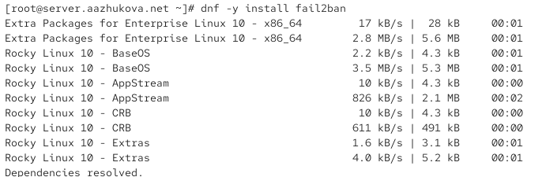
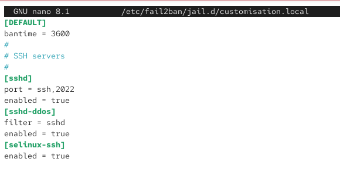
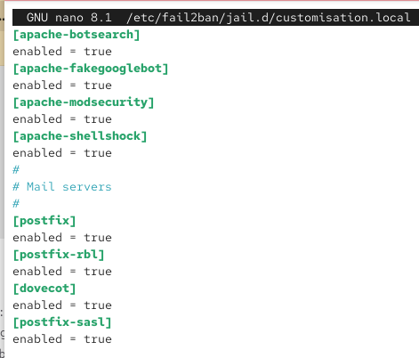
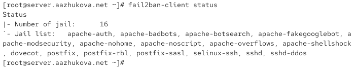

---
## Author
author:
  name: Жукова Арина Александровна
  degrees: 3rd year student
  orcid: 0000-0002-0877-7063
  email: 1132239120@rudn.ru
  affiliation:
    - name: Российский университет дружбы народов
      country: Российская Федерация
      postal-code: 117198
      city: Москва
      address: ул. Миклухо-Маклая, д. 6
## Title
title: "Отчёт по лабораторной работе №16"
subtitle: "Базовая защита от атак типа «brute force»"
license: "CC BY"
date: today
---

#  Информация

## Докладчик

:::::::::::::: {.columns align=center}
::: {.column width="70%"}

  * Жукова Арина Александровна
  * Направление прикладная информатика
  * Студентка 3 курса
  * Группа НПИбд-01-23
  * Российский университет дружбы народов им. П. Лумумбы
  * 1132239120@rudn.ru

:::
::: {.column width="30%"}


:::
::::::::::::::

# Вводная часть

## Цель и задачи работы

**Цель:** Получить навыки работы с программным средством Fail2ban для обеспечения базовой защиты от атак типа «brute force».

**Задачи:**

1. Установить и настроить Fail2ban для отслеживания работы установленных на сервере служб
2. Проверить работу Fail2ban посредством попыток несанкционированного доступа с клиента на сервер через SSH
3. Написать скрипт для Vagrant, фиксирующий действия по установке и настройке Fail2ban

# Защита с помощью Fail2ban

## Установка и запуск Fail2ban

:::::::::::::: {.columns align=center}
::: {.column width="40%"}

```bash
dnf -y install fail2ban
systemctl start fail2ban
systemctl enable fail2ban
tail -f /var/log/fail2ban.log
```

:::
::: {.column width="60%"}



:::
::::::::::::::

# Настройка защиты SSH

## Создание конфигурационного файла

:::::::::::::: {.columns align=center}
::: {.column width="40%"}

```bash
touch /etc/fail2ban/jail.d\
/customisation.local
```

### Настройки SSH

```ini
[DEFAULT]
bantime = 3600

[sshd]
port = ssh,2022
enabled = true
```

:::
::: {.column width="60%"}



:::
::::::::::::::

# Настройка защиты HTTP

## Добавление защиты Apache

:::::::::::::: {.columns align=center}
::: {.column width="60%"}

```ini
[apache-auth]
enabled = true
[apache-badbots]
enabled = true
[apache-noscript]
enabled = true
```

:::
::: {.column width="40%"}


:::
::::::::::::::

# Настройка защиты почтовых служб

## Добавление защиты Postfix и Dovecot

:::::::::::::: {.columns align=center}
::: {.column width="60%"}

```ini
[postfix]
enabled = true
[postfix-rbl]
enabled = true
[dovecot]
enabled = true
[postfix-sasl]
enabled = true
```

:::
::: {.column width="40%"}



:::
::::::::::::::

# Проверка работы Fail2ban

## Статус и настройки

:::::::::::::: {.columns align=center}
::: {.column width="60%"}

## Проверка статуса и настройка параметров

```bash
fail2ban-client status
fail2ban-client status sshd
fail2ban-client set sshd maxretry 2
```

:::
::: {.column width="40%"}



:::
::::::::::::::

# Тестирование блокировки

## Попытка входа с неправильным паролем

:::::::::::::: {.columns align=center}
::: {.column width="60%"}

1. Попытка SSH-подключения с неверными данными
2. Проверка блокировки IP-адреса
3. Разблокировка адреса

:::
::: {.column width="40%"}


:::
::::::::::::::

# Настройка игнорирования IP

## Добавление IP в ignoreip

:::::::::::::: {.columns align=center}
::: {.column width="60%"}

```ini
[DEFAULT]
bantime = 3600
ignoreip = 127.0.0.1/8 <client_ip>
```

:::
::: {.column width="40%"}


:::
::::::::::::::

# Автоматизация развёртывания

## Создание скрипта provision

:::::::::::::: {.columns align=center}
::: {.column width="60%"}

### Скрипт для автоматической установки

```bash
#!/bin/bash
echo "Install needed packages"
dnf -y install fail2ban
echo "Copy configuration files"
cp -R /vagrant/provision/server/protect/etc/* /etc
echo "Start fail2ban service"
systemctl enable fail2ban
systemctl start fail2ban
```

:::
::: {.column width="40%"}


:::
::::::::::::::

## Интеграция с Vagrant

:::::::::::::: {.columns align=center}
::: {.column width="60%"}

### Добавление в Vagrantfile

```ruby
server.vm.provision "server protect",
  type: "shell",
  preserve_order: true,
  path: "provision/server/protect.sh"
```

:::
::: {.column width="40%"}


:::
::::::::::::::

# Выводы

:::::::::::::: {.columns align=center}
::: {.column width="100%"}

- Получены практические навыки работы с Fail2ban
- Настроена защита служб SSH, HTTP и почтовых сервисов
- Проверена работа блокировки и разблокировки IP-адресов
- Создан скрипт автоматизации развёртывания конфигурации
- Отработаны методы защиты от атак типа «brute force»

:::
::::::::::::::


