---
## Author
author:
  name: Жукова Арина Александровна
  degrees: 3rd year student
  orcid: 0000-0002-0877-7063
  email: 1132239120@rudn.ru
  affiliation:
    - name: Российский университет дружбы народов
      country: Российская Федерация
      postal-code: 117198
      city: Москва
      address: ул. Миклухо-Маклая, д. 6

## Title
title: "Отчёт по лабораторной работе №16"
subtitle: "Базовая защита от атак типа «brute force»"
license: "CC BY"
---

# Цель работы

Получить навыки работы с программным средством Fail2ban для обеспечения базовой защиты от атак типа «brute force».

# Задание

1. Установить и настроить Fail2ban для отслеживания работы установленных на сервере служб.
2. Проверить работу Fail2ban посредством попыток несанкционированного доступа с клиента на сервер через SSH.
3. Написать скрипт для Vagrant, фиксирующий действия по установке и настройке Fail2ban.

# Теоретическое введение

Fail2ban — это программное средство для защиты серверов от атак типа «brute force». Оно отслеживает логи сервисов (например, SSH, Apache, Postfix) и автоматически блокирует IP-адреса, с которых поступают подозрительные запросы (например, множественные неудачные попытки входа). Блокировка осуществляется путём добавления правил в фаервол (например, iptables или firewalld).

Основные параметры конфигурации Fail2ban:
- `ignoreip` — IP-адреса, которые не будут блокироваться.
- `bantime` — время блокировки в секундах.
- `findtime` — интервал времени, за который анализируются попытки доступа.
- `maxretry` — количество неудачных попыток до блокировки.

Конфигурационные файлы:
- `/etc/fail2ban/fail2ban.conf` — основные настройки демона.
- `/etc/fail2ban/jail.conf` — глобальные настройки блокировок.
- `/etc/fail2ban/jail.d/*.local` — локальные переопределения настроек.

# Выполнение лабораторной работы

## Защита с помощью Fail2ban

1. Устанавливаем пакет fail2ban с помощью менеджера пакетов dnf:
```bash
dnf -y install fail2ban
```


3. Запускаем и включаем автозагрузку сервиса:

```bash
systemctl start fail2ban
systemctl enable fail2ban
```

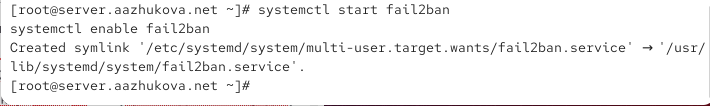

3. В отдельном терминале запускаем мониторинг логов:

```bash
tail -f /var/log/fail2ban.log
```

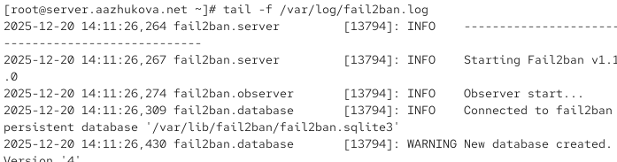

4. Создаём файл для локальных настроек:

```bash
touch /etc/fail2ban/jail.d/customisation.local
```


5. Редактируем файл `/etc/fail2ban/jail.d/customisation.local`:

```ini
[DEFAULT]
bantime = 3600

[sshd]
port = ssh,2022
enabled = true

[sshd-ddos]
filter = sshd
enabled = true

[selinux-ssh]
enabled = true
```


6. Применяем изменения:

```bash
systemctl restart fail2ban
```

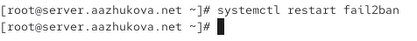

7. Просмотр журнала после настройки SSH

```bash
tail -f /var/log/fail2ban.log
```

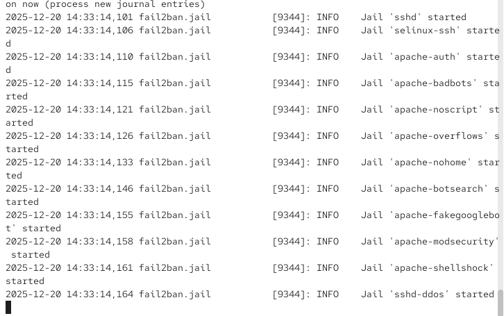

8. Добавляем в тот же файл секции для защиты Apache:

```ini
[apache-auth]
enabled = true
[apache-badbots]
enabled = true
[apache-noscript]
enabled = true
[apache-overflows]
enabled = true
[apache-nohome]
enabled = true
[apache-botsearch]
enabled = true
[apache-fakegooglebot]
enabled = true
[apache-modsecurity]
enabled = true
[apache-shellshock]
enabled = true
```
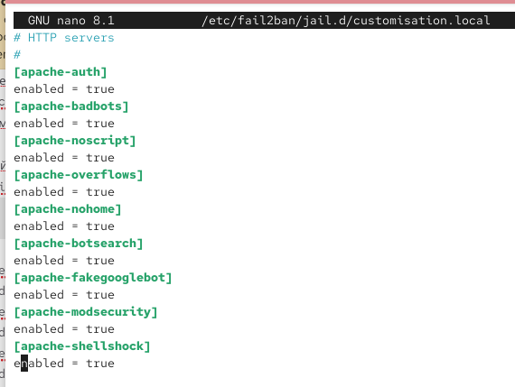

Перезапуск fail2ban после настройки HTTP

9. Просмотр журнала после настройки HTTP

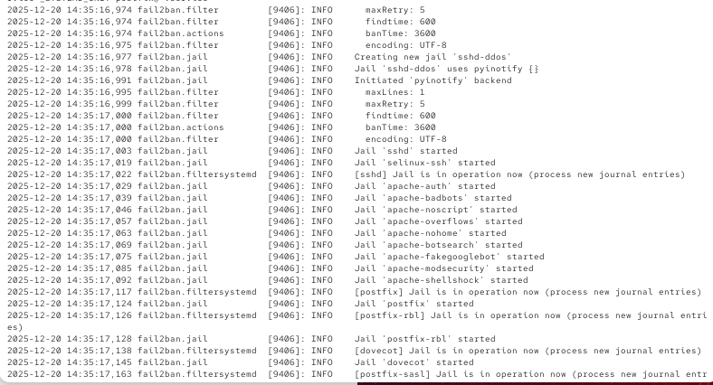

10. Добавляем секции для Postfix и Dovecot:
```ini
[postfix]
enabled = true
[postfix-rbl]
enabled = true
[dovecot]
enabled = true
[postfix-sasl]
enabled = true
```


Перезапускаем fail2ban после настройки почты

11. Просмотр журнала после настройки почты

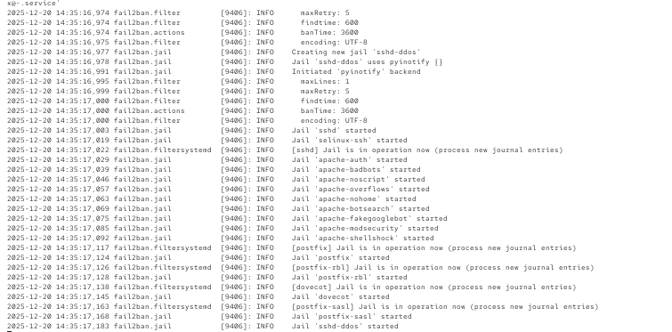

## Проверка работы Fail2ban

1. Проверка статуса fail2ban


2. Проверка статуса защиты SSH

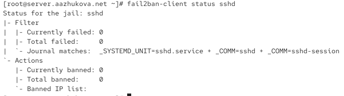

3. Установка максимального количества ошибок для SSH

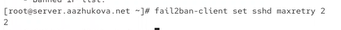

4. Попытка входа с клиента с неправильным паролем

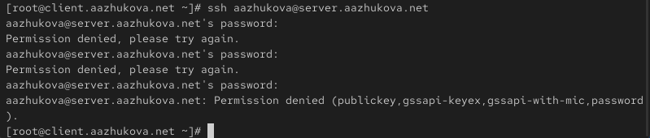

5. Проверка блокировки IP-адреса клиента

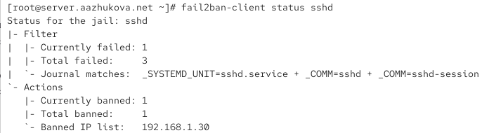

6. Разблокировка IP-адреса клиента


7. Проверка снятия блокировки

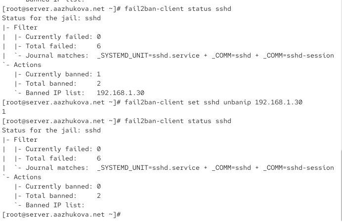

8. Добавление IP-адреса клиента в ignoreip. Редактируем `/etc/fail2ban/jail.d/customisation.local`:

```ini
[DEFAULT]
bantime = 3600
ignoreip = 127.0.0.1/8 <client_ip>
```

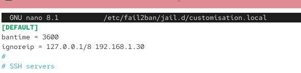

Перезапуск fail2ban

9. Повторная попытка входа с клиента и проверка статуса После нескольких неудачных попыток:

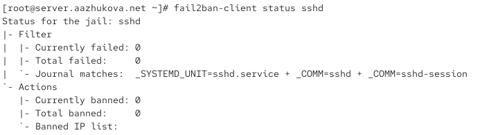

## Внесение изменений в настройки внутреннего окружения виртуальных машин

1. Копирование конфигурационных файлов. Создаём файл `/vagrant/provision/server/protect.sh`. Делаем его исполняемым

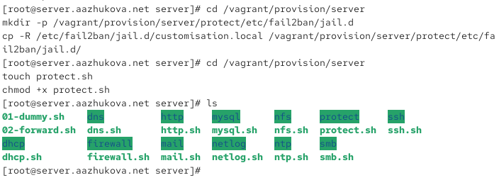

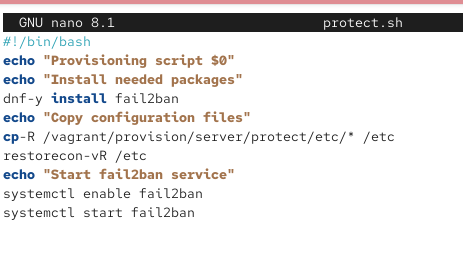

2. Добавление скрипта в Vagrantfile

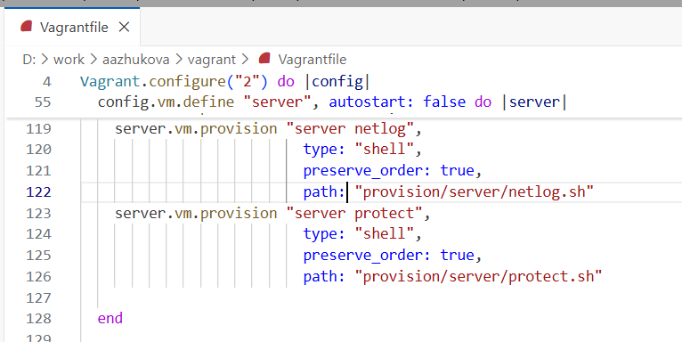

# Выводы

В ходе выполнения лабораторной работы были получены практические навыки установки, настройки и использования Fail2ban для защиты сервера от атак типа «brute force». Были настроены правила для защиты служб SSH, HTTP и почтовых сервисов, проверена работа блокировки и разблокировки IP-адресов, а также создан скрипт автоматизации развёртывания конфигурации Fail2ban для виртуальных машин.

# Ответы на контрольные вопросы

1. **Принцип работы Fail2ban**: Fail2ban анализирует логи служб, ищет признаки атак (например, неудачные попытки входа) и автоматически добавляет правила в фаервол для блокировки IP-адресов на заданное время.
2. **Приоритет файлов**: Настройки в `jail.local` и файлах в `jail.d/` имеют приоритет над `jail.conf`.
3. **Оповещение администратора**: Можно настроить через параметр `action` в конфигурации, указав отправку email или выполнение произвольного скрипта.
4. **Настройки для веб-службы в jail.conf**: Секции вида `[apache-auth]` содержат параметры `enabled`, `port`, `filter`, `logpath`, `maxretry`, `bantime` и др.
5. **Настройки для почтовой службы в jail.conf**: Секции `[postfix]`, `[dovecot]` аналогично содержат параметры для мониторинга логов и блокировки.
6. **Действия при обнаружении атаки**: Блокировка IP, отправка уведомления, запуск скрипта. Описания действий находятся в `/etc/fail2ban/action.d/`.
7. **Список действующих правил**: `fail2ban-client status`
8. **Статистика заблокированных адресов**: `fail2ban-client status <jail>` или просмотр логов.
9. **Разблокировка IP**: `fail2ban-client set <jail> unbanip <IP>`

# Список литературы{.unnumbered}

1. Сайт Fail2ban. — URL: https://www.fail2ban.org
```
