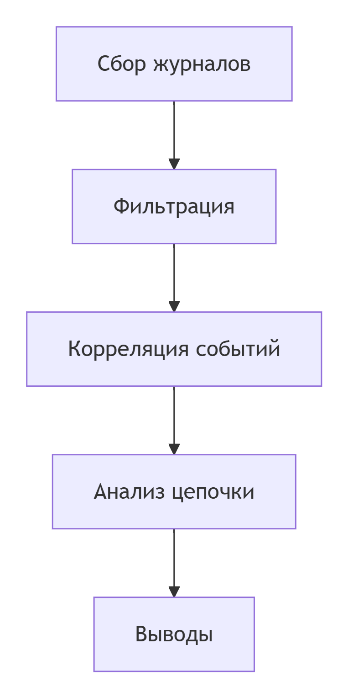

---
## Author
author:
  name: Арина Александровна Жукова
  degrees: 3rd year student
  orcid: 0000-0002-0877-7063
  email: 1132239120@rudn.ru
  affiliation:
    - name: Российский университет дружбы народов
      country: Российская Федерация
      postal-code: 117198
      city: Москва
      address: ул. Миклухо-Маклая, д. 6
## Title
title: Журналирование в операционной системе Windows
subtitle: Администрирование сетевых подсистем 
license: CC BY
date: today
date-format: "YYYY-MM-DD"
---

# Информация

## Докладчик

:::::::::::::: {.columns align=center}
::: {.column width="70%"}

  * Жукова Арина Александровна
  * Студент бакалавриата, 3 курс
  * группа: НПИбд-01-23
  * Российский университет дружбы народов
  * [1132239120@rudn.ru](mailto:1132239120@rudn.ru)

:::
::: {.column width="30%"}


:::
::::::::::::::

# Вводная часть

## Актуальность

- Windows — ключевая платформа для корпоративных и персональных систем
- Логи — основной источник данных для:

  - Расследования инцидентов безопасности
  - Диагностики сбоев и оптимизации
  - Аудита соответствия требованиям регуляторов

- **Проблема:** большой объём данных, сложность анализа без системного подхода

## Объект и предмет исследования

- **Объект:** система журналирования Windows
- **Предмет:**
  - Архитектура и компоненты
  - Методы сбора и анализа
  - Практическое применение для безопасности

## Цели и задачи

**Цель:** разработать подход к эффективному использованию журналирования Windows для задач безопасности и диагностики.

**Задачи:**

1. Проанализировать архитектуру системы журналирования
2. Определить ключевые компоненты и их взаимодействие
3. Разработать методику анализа журналов
4. Предложить практические рекомендации по настройке

## Материалы и методы

**Материалы:**

    - Документация Microsoft
    - Специализированные издания по кибербезопасности
    - Практические кейсы анализа инцидентов

**Методы:**

    - Системный анализ
    - Практическое тестирование
    - Сравнительный анализ инструментов

# Создание системы анализа

## Архитектура журналирования Windows

:::::::::::::: {.columns}
::: {.column width="50%"}

**Уровень приложений:**

    - Журналы событий (Event Log)
    - Стандартные журналы
    - Журналы приложений

:::
::: {.column width="50%"}

**Системный уровень:**

    - ETW (Event Tracing for Windows)
    - Аудит безопасности
    - Диагностическая трассировка

:::
::::::::::::::

## Ключевые компоненты

1. **Служба журналов событий**
    - Централизованное хранение
    - API для доступа

2. **Windows Event Forwarding**
    - Централизованный сбор
    - Агрегация данных

3. **Event Tracing for Windows**
    - Высокая производительность
    - Детальная трассировка

## Формат данных

```xml
<Event>
  <System>
    <Provider Name="Microsoft-Windows-Security-Auditing"/>
    <EventID>4625</EventID>
    <Level>0</Level>
  </System>
  <EventData>
    <Data Name="TargetUserName">Administrator</Data>
  </EventData>
</Event>
```

## Инструменты анализа

- **Event Viewer** — базовый просмотр
- **PowerShell** — автоматизация
- **WEVTUTIL** — управление журналами
- **SIEM-системы** — корпоративный анализ

# Результаты

## Классификация событий безопасности

:::::::::::::: {.columns}
::: {.column width="50%"}

**Критические события:**

    - 4625 — неудачный вход
    - 4688 — создание процесса
    - 4663 — доступ к объекту

:::
::: {.column width="50%"}

**Информационные события:**

    - 4624 — успешный вход
    - 4634 — выход из системы
    - 4648 — вход с явными данными

:::
::::::::::::::

## Схема анализа инцидента

:::::::::::::: {.columns align=center}
::: {.column width="70%"}



:::
::::::::::::::

## Практические рекомендации

::: incremental

    - Настраивайте минимально необходимый набор событий
    - Используйте централизованный сбор
    - Реализуйте автоматический анализ
    - Храните журналы безопасно
    - Регулярно тестируйте процедуры

:::

## Эффективность предложенного подхода

- **Скорость обнаружения:** уменьшение с часов до минут
- **Полнота данных:** охват всех ключевых событий
- **Масштабируемость:** работа в распределённых системах

# Заключение

## Главный результат

Разработан системный подход к использованию журналирования Windows, позволяющий:

1. Эффективно обнаруживать инциденты безопасности
2. Оперативно диагностировать проблемы
3. Обеспечивать соответствие требованиям регуляторов

## Перспективы развития

- Интеграция с системами машинного обучения
- Развитие автоматического реагирования
- Создание специализированных шаблонов анализа

## Итоговый слайд

**Журналирование Windows — это не просто сбор данных, а основа системы безопасности.** Правильная настройка и анализ позволяют превратить пассивное хранение информации в активный инструмент защиты.

